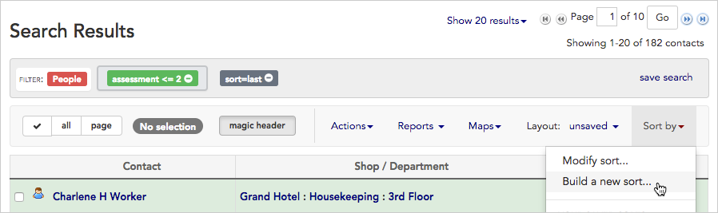
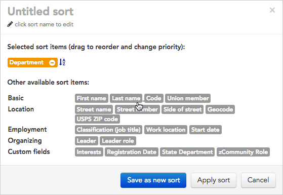
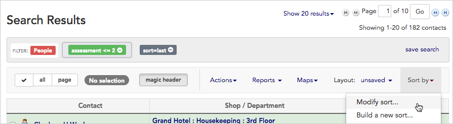
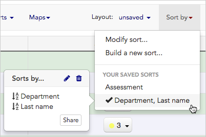
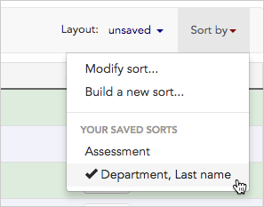
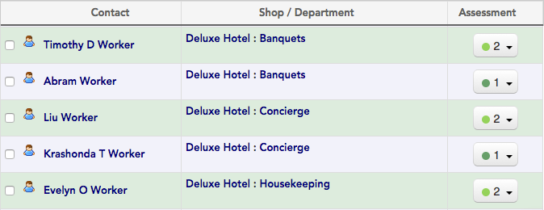

\[et\_pb\_section bb\_built="1" admin\_label="section"\]\[et\_pb\_row admin\_label="row" background\_position="top\_left" background\_repeat="repeat" background\_size="initial" \_builder\_version="3.0.105"\]\[et\_pb\_column type="4\_4"\]\[et\_pb\_text background\_position="top\_left" background\_repeat="repeat" background\_size="initial" \_builder\_version="3.0.105" background\_layout="light"\]

## Sort search results

Sometimes a search brings back the records you need, but they're hard to make sense of because of the way they're ordered. For example, in a search for workers with signed cards, you may be given results ordered by last name, when what you really want to see is workers grouped together by department first, and then by last name.

Broadstripes makes it simple to build custom sorts like this. You can even save and share a sort with other users in your project.

## Create your sort

1. Click the **Sort by** link located just above your search results on the right-hand side of the page.
2. Choose to **Build a new sort...**
3. A sort-building tool will open.
4. Using the sort builder, **click once on any field** to include it in your sort. Each field you choose will be added to the upper portion of the sort builder. We'll choose **Department** for our main sort and then click **Last name** for our secondary sort.
    
    \[caption id="attachment\_2573" align="aligncenter" width="559"\] Single-click on a sort item to include it in your sort.\[/caption\]

1. Once you've chosen all the fields you want to use in your sort, you can manipulate them to refine your sort.
    - **drag and drop fields** to change the search priority (the field at the top will be sorted first, with each field below acting as a sub-sort)
    - click the **A-Z icon**  to toggle between ascending and descending order
2. When your sort meets your needs, give it a **name** and click **Save as new sort.** (If you just want to run the sort once, and don't want to save it, click **Apply sort.**)
3. Clicking either button will **re-sort and display your search results** according to your new sort.

## Modify a sort

1. If you want to make changes to a saved sort, click the **Sort by** link again.
2. Choose to **Modify sort...** and make changes, just like you did when you first created it above.
3. Once your sort is modified, you can either choose to run the new sort, or save and run it.
    - Click **Apply without saving** to run the sort on your current search results. This will re-sort and display the results, but won't save any of the changes you've made to the sort.
    - Click **Save changes** to overwrite the saved sort with the modifications you've just made.

## Use your saved sorts again with new searches

1. To sort another set of search results using saved sort criteria, start by clicking the **Sort by**link.
2. Your saved sorts will appear in the lower half of the drop-down menu under the words YOUR SAVED SORTS.
3. **Hovering over the name** of any saved sort will open a pop-up box. From this pop-up box you can:
    - see **details about the sort**, including which specific fields are included in the sort as well as details about sort order.
    - click to **edit**  or **delete**  the saved sort.
    - click to **Share** the sort with other users. Sharing the sort will make it available to them in their own **Sort by** drop-down menu.
4. If you want to apply a saved sort to your search results, **click on the name** of the saved sort. This applies the sort and displays your search results using the new sort order.
    
    \[caption id="attachment\_2576" align="aligncenter" width="297"\] Click the name of a saved sort to instantly sort your search results.\[/caption\]
5. Your records are now sorted according to **department** and then by **last name**.

\[/et\_pb\_text\]\[/et\_pb\_column\]\[/et\_pb\_row\]\[/et\_pb\_section\]
