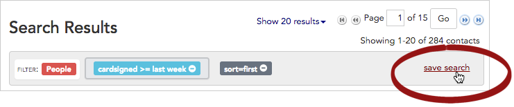
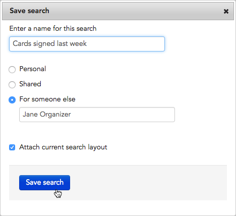
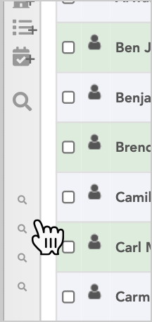
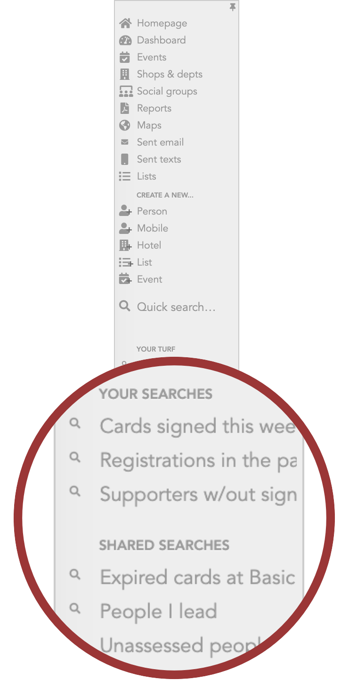

\[et\_pb\_section fb\_built="1" admin\_label="section" \_builder\_version="3.22"\]\[et\_pb\_row admin\_label="row" \_builder\_version="3.25" background\_size="initial" background\_position="top\_left" background\_repeat="repeat"\]\[et\_pb\_column type="4\_4" \_builder\_version="3.25" custom\_padding="|||" custom\_padding\_\_hover="|||"\]\[et\_pb\_text \_builder\_version="4.4.8" background\_size="initial" background\_position="top\_left" background\_repeat="repeat" hover\_enabled="0"\]

## Intro

When you've built a useful search that you think you might want to run again, you can choose to save it. You can also share your saved searches with a single user, or all users in your project.

## Save (or share) a search

In this example, we'll save a search and share it with another organizer, Jane.

1. Start by [running a search](https://help.broadstripes.com/help-articles/using-broadstripes/search/search-builder-build-an-advanced-search/). From the **Search Results** panel, click the "**save search**" link in the upper right corner of the page.
2. Give your search a **name**.
3. Next, choose whether you want to share the search. You can:
    - Save it for your own use only (select **Personal**)
    - Share it with all Broadstripes users on the project (select **Shared**)
    - Share it with a specific user (select **For someone else**, then type the user's name). Note that when you save for someone else, it will _only_ appear in that designated user's list. If you want a copy of the search for yourself, save it first as a **personal** search, then repeat the process and choose to save it for that other user.  
        
4. We'll choose this option to share the search with Jane.
5. Last, check "**Attach current search layout**" if you want Broadstripes to display exactly the same _columns_ of data you are looking at now each time the search is run in the future (for instance, Contact name, Job title, and Assessment code). This is called "embedding a layout" in the search. If you want to learn more, check out the articles [Create and save a layout](https://help.broadstripes.com/help-articles/using-broadstripes/customize/save-a-layout/) and [Embed a layout with a saved search](https://help.broadstripes.com/help-articles/using-broadstripes/customize/embed-a-layout-with-a-saved-search/).
6. Click **Save search** to save. The search will now appear in Jane's **YOUR SEARCHES** list in the menu on the left-hand side of her Broadstripes page.

## Where are searches saved?

In the previous step, you learned how to save and share searches. If you want to retrieve a saved search, you'll need to know where to find it. Searches are saved in the left-hand Broadstripes menu, ordered by how they were saved or shared:

- **Personal**: Personal saved searches will appear under **YOUR SEARCHES** in the left-hand Broadstripes menu.
- **Shared** (with all users): Shared searches will be listed under **SHARED SEARCHES** in the left-hand Broadstripes menu for you and all users in your project.
- **For someone else**: These saved searches will _only_ appear under that designated user's **YOUR SEARCHES** list (in their left-hand Broadstripes menu). You will not have a copy of these shared search in your own saved searches list. (If you want a copy of the search for yourself, save it first as a **personal** search, then repeat the process and choose to save it for that other user.)

To see your searches, hover over the magnifying glass icon to expand the full menu.

\[caption id="attachment\_23467" align="aligncenter" width="117"\] Hover over to expand the saved search menu.\[/caption\]\[caption id="attachment\_23466" align="aligncenter" width="341"\] Saved searches will be listed here.\[/caption\] \[/et\_pb\_text\]\[/et\_pb\_column\]\[/et\_pb\_row\]\[/et\_pb\_section\]
