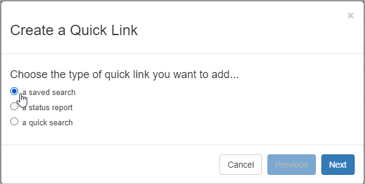
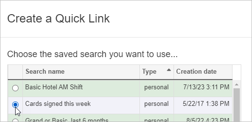
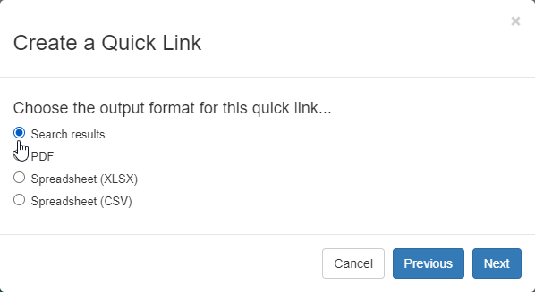
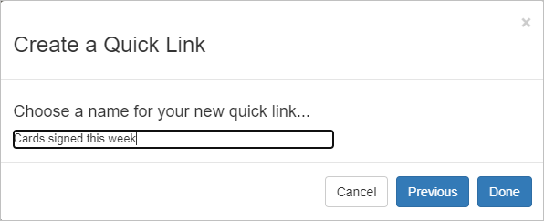
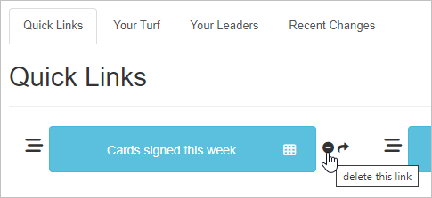

\[et\_pb\_section fb\_built="1" admin\_label="section" \_builder\_version="4.16" global\_colors\_info="{}"\]\[et\_pb\_row admin\_label="row" \_builder\_version="4.16" background\_size="initial" background\_position="top\_left" background\_repeat="repeat" global\_colors\_info="{}"\]\[et\_pb\_column type="4\_4" \_builder\_version="4.16" custom\_padding="|||" global\_colors\_info="{}" custom\_padding\_\_hover="|||"\]\[et\_pb\_text \_builder\_version="4.25.1" background\_size="initial" background\_position="top\_left" background\_repeat="repeat" global\_colors\_info="{}"\]

## Intro

If you're like other Broadstripes users, you probably have a few saved searches that you use more than the rest. With **quick links**, you can add any saved search to your quick links tab; you'll have your most important searches right at your fingertips each time you log in.

You can also choose the way you want to see the information: on-screen, or as PDF, CSV, or XLS files that you can download and use offline.

For this example, we want to add a quick link that shows us all of the people who have signed cards this week. We'll create the quick link based on a saved search we've already made, and we'll choose to see the results on-screen.

## Create a quick link for a saved search

1. Start on the quick links tab and follow the steps outlined in the article [Create quick links](https://help.broadstripes.com/help-articles/using-broadstripes/customize/create-a-quick-link/) to create your new quick link.
2. Choose **a saved search** as the type of link you want to add.
3. Click **Next**.
4. You'll see a list of all your saved searches (both personal and shared). Choose the search you want and click **Next**. (To add additional searches to your list, see the [creating saved searches](https://help.broadstripes.com/help-articles/using-broadstripes/customize/create-and-save-a-search/) article).
5. Next, choose the **output format** you want.

#### Choosing output formats

- **Search results** – records appear on-screen where you can view and edit them.
- **PDF** – records are exported as a PDF file.
- **Spreadsheet (XLS)** – records are exported as a Microsoft Excel spreadsheet file.
- **Spreadsheet (CSV)** – records are exported as a comma-separated values spreadsheet file.

1. For our example, we'll choose **Search results** because we want to view the search results on-screen, not create an export file.  
    
2. When you choose the **Search results** output option, you'll see the your records formatted according to the current layout unless the search already has an embedded layout.

#### Layout formats

- **Search results** – uses the current layout unless the search has an embedded layout.  
    _An embedded layout will dictate which columns of data appear on-screen when the search is run, and you'll see the same columns of data each time you run the search. Learn more about embedding layouts in search in the [Embed a layout with a saved search](https://help.broadstripes.com/help-articles/using-broadstripes/customize/embed-a-layout-with-a-saved-search/) article._
- **PDF,** **Spreadsheet (XLS)**, and **Spreadsheet (CSV)** – if you select one of these export options, in another step during quick link set up, you'll be prompted to apply any saved layout. _Learn more about saving layouts in the [Create and save a layout](https://help.broadstripes.com/help-articles/using-broadstripes/customize/save-a-layout/) article._

1. **Name** the quick link. This is the name that will appear on the quick link button on your dashboard. Click **Done** to save.
2. Your new quick link is now part of your dashboard. Click the new **Cards signed this week** quick link button to launch the search and see the results on-screen. The link will remain on your dashboard even after you've logged out and logged back in again.
3. If you ever need to delete this quick link, just click the  minus icon next to the button. Deleting the link will remove the link from your screen, but it won’t delete the underlying saved search.

\[/et\_pb\_text\]\[/et\_pb\_column\]\[/et\_pb\_row\]\[/et\_pb\_section\]
