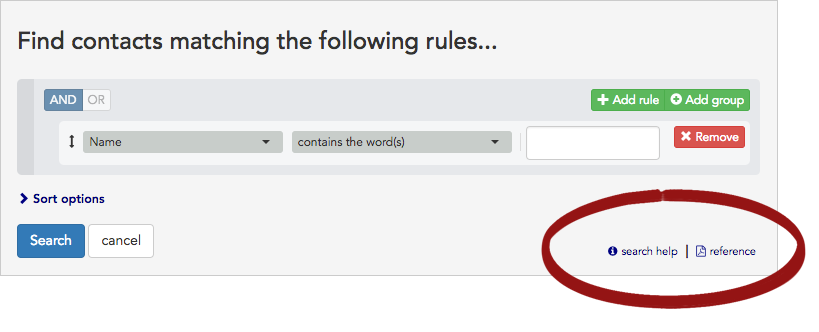
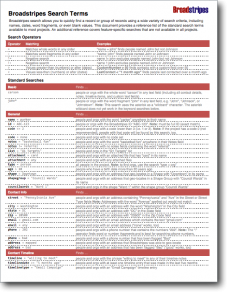

\[et\_pb\_section fb\_built="1" admin\_label="section" \_builder\_version="4.16" global\_colors\_info="{}"\]\[et\_pb\_row admin\_label="row" \_builder\_version="4.16" background\_size="initial" background\_position="top\_left" background\_repeat="repeat" global\_colors\_info="{}"\]\[et\_pb\_column type="4\_4" \_builder\_version="4.16" custom\_padding="|||" global\_colors\_info="{}" custom\_padding\_\_hover="|||"\]\[et\_pb\_text \_builder\_version="4.16" background\_size="initial" background\_position="top\_left" background\_repeat="repeat" hover\_enabled="0" global\_colors\_info="{}" sticky\_enabled="0"\]

## Overview

Broadstripes' "search builder" helps you find search terms and build complex searches.

As your familiarity with Broadstripes grows, you will likely want to filter your lists with more precision. This will mean searching by multiple criteria at once. For example, you might want to find:

- your leaders at a particular shop
- people whom you've assessed as "ones" but who haven't yet signed a card
- people who attended one of several recent events, but haven't been contacted lately

Broadstripes has a tool to help you do that. It’s called the **search builder**. Here’s a video that explains how it works:

## Video: How to search with the search builder

\[/et\_pb\_text\]\[et\_pb\_text admin\_label="How to Build a Search with the Search Builder" \_builder\_version="4.9.4" custom\_margin="||||false|false" global\_module="22571" saved\_tabs="all" global\_colors\_info="{}"\]

\[video\_lightbox\_youtube video\_id="Dx05UFMFz4k&amp;rel=0" width="640" height="520" auto\_thumb="1"\]

### Build custom searches

\[/et\_pb\_text\]\[et\_pb\_text \_builder\_version="4.19.4" hover\_enabled="0" global\_colors\_info="{}" sticky\_enabled="0"\]

If you ever get stuck while building an advanced search, you can follow these links for help:

- The  **search help** link will bring you here, to the knowledge base, where you can refresh your search-building skills.
- The  **reference** link will open a [helpful printable PDF](https://crm.broadstripes.com/broadstripes-search-reference-v1.0.pdf) that explains Broadstripes' search terms and syntax and lists the most common fields used in searches along with examples of searches you are likely to use.

\[caption id="attachment\_2643" align="aligncenter" width="229"\] Click to open the search terms PDF.\[/caption\]

## What's Next?

You're off to a great start!

Learn more about using the search builder to build additional custom searches:

- [Search with multiple rules](https://help.broadstripes.com/help-articles/using-broadstripes/search/search-with-multiple-rules/)
- [Add rule groups to your search](https://help.broadstripes.com/help-articles/using-broadstripes/search/add-rule-groups-to-your-search/)
- [Broadstripes search language](https://help.broadstripes.com/help-articles/using-broadstripes/search/search-language-reference/)

\[/et\_pb\_text\]\[/et\_pb\_column\]\[/et\_pb\_row\]\[/et\_pb\_section\]
