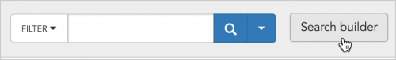
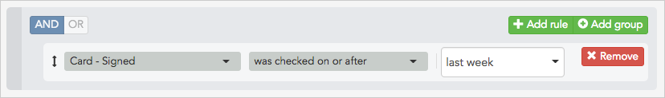
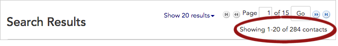

\[et\_pb\_section fb\_built="1" admin\_label="section" \_builder\_version="3.22"\]\[et\_pb\_row admin\_label="row" \_builder\_version="3.25" background\_size="initial" background\_position="top\_left" background\_repeat="repeat"\]\[et\_pb\_column type="4\_4" \_builder\_version="3.25" custom\_padding="|||" custom\_padding\_\_hover="|||"\]\[et\_pb\_text \_builder\_version="4.4.8" background\_size="initial" background\_position="top\_left" background\_repeat="repeat"\]

## Intro

Broadstripes search builder allows you to search for very specific info including who has attended a rally in the last month or signed a card in the past week. In Broadstripes, that type of information is recorded as **events** and **event steps**. Keep in mind that **events** are created and customized by users and admins, so each project will have its own unique events. (Learn more in the [creating events](https://help.broadstripes.com/help-articles/using-broadstripes/customize/create-events-to-track-goals/) article.)

In this article, we're going to show you how to do a search based on an event we've created called "**Card**" to find all the people who have signed a card in the past week.

## Build a search to capture events in time

In another article, we [built a search to look at people who had not yet signed cards](https://help.broadstripes.com/help-articles/using-broadstripes/customize/search-by-event-step/). For this article, we're going to assume it's a week later, and we want to see how many new cards have been signed since we ran that previous search. Here's how:

1. Start a new search by clicking the **Search builder button** to the right of the search box at the top of the page.
2. A **search building panel** opens below the search box.
3. Since we want to limit our search to workers who have signed a card in the last week, we'll choose the **Card - Signed** event step from the left-hand drop-down menu in the search builder.
4. In the middle drop-down box, select "**was checked on or after**."
5. In the right-hand text box type "**last week**." Note that Broadstripes search accepts natural language search terms like "last week" or "a year ago," or you can use a calendar date like "2/20/2017."\[caption id="attachment\_2406" align="aligncenter" width="828"\] The search "Card - Signed was checked on or after last week" will show any worker who signed their card some time in the last week.\[/caption\]
6. That's it.
7. Click the **Search** button to run the search. All the workers who have signed cards in the last week will display in the **Search results panel**.
8. To see a count of the **total number of contacts** in the search results at a glance, check the upper right-hand corner of the search results panel.\[caption id="attachment\_2407" align="aligncenter" width="666"\] Broadstripes shows a count of 284 total contacts returned in the search.\[/caption\]

\[/et\_pb\_text\]\[/et\_pb\_column\]\[/et\_pb\_row\]\[/et\_pb\_section\]
