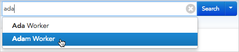
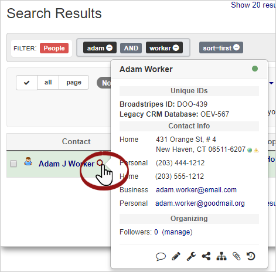

\[et\_pb\_section fb\_built="1" admin\_label="section" \_builder\_version="3.22.3"\]\[et\_pb\_row admin\_label="row" \_builder\_version="3.22.3" background\_size="initial" background\_position="top\_left" background\_repeat="repeat"\]\[et\_pb\_column type="4\_4" \_builder\_version="3.0.47"\]\[et\_pb\_text \_builder\_version="3.0.105" background\_size="initial" background\_position="top\_left" background\_repeat="repeat"\]Much of the work you do with Broadstripes will begin with a search. Broadstripes' powerful search makes it simple to find and work with your people.

## Search by a worker's name

1. To get started, simply place the cursor in the search box at the top of the screen, just to the right of the Broadstripes logo, and begin typing the name of someone you'd like to find.
2. You'll notice that as soon as you've typed a few characters, Broadstripes will begin suggesting the names of specific people in the database who match your text.
3. When you see the person you're looking for, use your mouse or the **up-** and **down-arrow keys** to select their name, and click the **Enter** key to run the search.
4. The person's record will appear in the **Search Results** panel in the lower portion of the window.
5. From the **Search Results panel**, you can click on the person's **name** to open their complete record, or just click the  **icon** to the right of their name to pop open a window with their contact info and other key data.
6. From this pop-up box, you can also view (or edit) other details of the worker's record. At the bottom of the **contact detail pop-up box**, just click any of the icons (       ) to go directly to specific details of their record (hover over the icon before clicking to learn where it will take you).

\[/et\_pb\_text\]\[/et\_pb\_column\]\[/et\_pb\_row\]\[/et\_pb\_section\]
