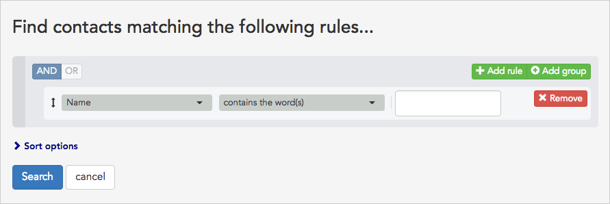
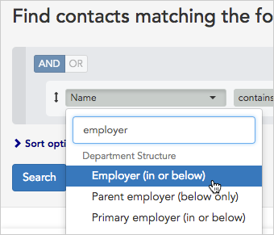
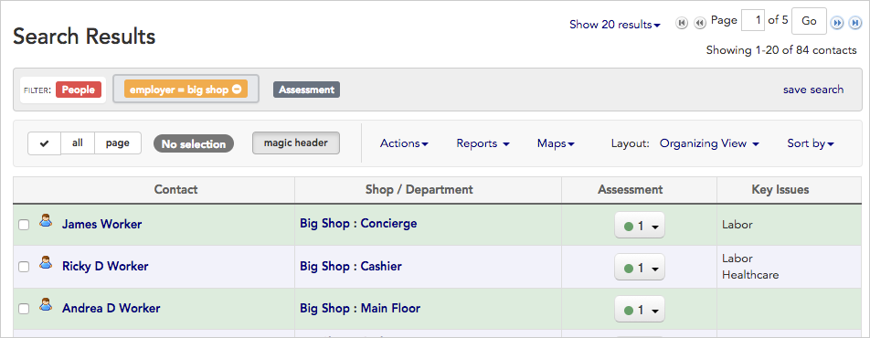

\[et\_pb\_section fb\_built="1" admin\_label="section" \_builder\_version="4.16" global\_colors\_info="{}"\]\[et\_pb\_row admin\_label="row" \_builder\_version="4.16" background\_size="initial" background\_position="top\_left" background\_repeat="repeat" global\_colors\_info="{}"\]\[et\_pb\_column type="4\_4" \_builder\_version="4.16" custom\_padding="|||" global\_colors\_info="{}" custom\_padding\_\_hover="|||"\]\[et\_pb\_text \_builder\_version="4.25.0" background\_size="initial" background\_position="top\_left" background\_repeat="repeat" hover\_enabled="0" global\_colors\_info="{}" sticky\_enabled="0"\]

## Intro

Sometimes you want to [search for a single person](https://help.broadstripes.com/help-articles/using-broadstripes/search/search-by-name/) by name; at other times, you may want to see a group of people all at once.

A common case is when you want to see the name of everyone who works in a particular store, company, shop or department. For this example, we'll search for everyone who works at "**Big Shop**." Here's how:

## Search for people by workplace

Build a simple search to find all the workers at a certain workplace (whether it's a store, company, shop or department).

1. Start your search by clicking the **Search builder** button to the right of the search box at the top of the page.

1. A **search builder** panel will appear below the search box.
2. Initially, the panel will offer to search for people by **Name**, but you can easily change that to search by employer (or any other criteria).
3. To search by employer, select "**Employer (in or below)**" from the drop-down list on the left. That choice can be found under the **Department Structure** section of the drop-down list, but you can bring the choice up even quicker by typing "**employer**" into the **Filter box** (as shown below).
4. Leave the **middle drop-down box** as it is, with "**contains the word(s)**" selected. (This drop-down box contains what's called the "**operator**". We'll cover other operator choices in more depth in another article in the knowledge base.)
5. Type the name of the employer, "**Big Shop**", into the **right-hand text box**.\[caption id="attachment\_2635" align="aligncenter" width="730"\] A completed search query for workers at "Big Shop."\[/caption\]
6. Click the **Search** button.
7. All the workers who have an employment at **Big Shop** will appear in the **Search Results** panel.
8. Congratulations on building a custom search! You can learn about creating more complex searches, including searches that combine multiple rules, in the [Build an advanced search](https://help.broadstripes.com/help-articles/using-broadstripes/search/build-an-advanced-search/) section of the knowledge base.

\[/et\_pb\_text\]\[/et\_pb\_column\]\[/et\_pb\_row\]\[/et\_pb\_section\]
