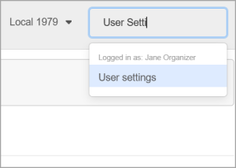
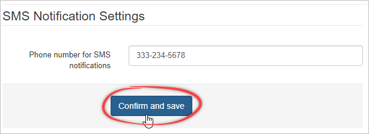
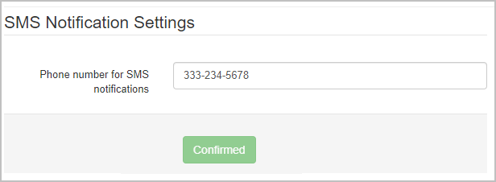

When using SMS messaging, Broadstripes will notify you when you receive a response from a worker or member. The app needs to know where to notify you, so you must register a mobile phone number to receive the notification.

This article will show you how to set up a notification number.

1. Log into the app and click **Settings** menu in the top right corner. Type "User Settings" into the menu filter box. Click the User Settings option.
2. On your personal settings page, you will enter your mobile phone number and click **Confirm and save**. 
3. You will recieve a text message from Broadstripes to confirm your SMS notification number. Reply to the message with the word "**YES**".

After you reply, Broadstripes will update and show your number as Confirmed.

Now that your SMS notification number is confirmed, you can be [provisioned a virtual number](https://help.broadstripes.com/uncategorized/provisioning-a-virtual-sms-number/) to start texting.
