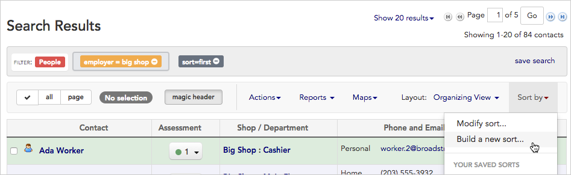
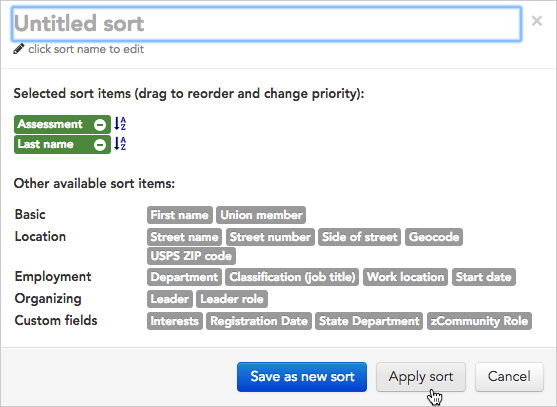

\[et\_pb\_section bb\_built="1" admin\_label="section"\]\[et\_pb\_row admin\_label="row" background\_position="top\_left" background\_repeat="repeat" background\_size="initial" \_builder\_version="3.0.105"\]\[et\_pb\_column type="4\_4"\]\[et\_pb\_text background\_position="top\_left" background\_repeat="repeat" background\_size="initial" \_builder\_version="3.0.105" background\_layout="light"\]

After running a search, you may want results to display in a certain order. For instance, if you're interested in gauging support, you'll want to sort by workers' assessment codes. With Broadstripes, sorting search results is just a few clicks away. Here's how it's done:

## Sort search results

1. Click the **Sort by** link located just above your search results on the right-hand side of the page.
2. Choose to **Build new sort...**

1. A sort-building tool will open.
2. Using this sort builder, **click once on any field** to include it in your sort. Each field you choose will be added to the upper portion of the sort builder.
3. We'll choose **Assessment** (sometimes labeled "Code") since we are interested in having the results sorted by workers' assessments, and then **Last name**, so the workers will be ordered alphabetically under each assessment code.

 Single-click on a sort item to include it in your sort.

1. Now that we've chosen the fields we want to use in the sort, we can make some adjustments:
    - **drag and drop fields** to change the search priority (the field at the top will be sorted first, with each field below acting as a sub-sort)
    - click the **A-Z icon**  to toggle between ascending and descending order
2. When your sort meets your needs click **Apply sort.**
3. Broadstripes will **re-sort and display** your search results according to your new sort.
4. Read more about modifying, saving, or sharing useful searches in the [Create and save a sort](https://help.broadstripes.com/help-articles/using-broadstripes/customize/save-a-sort/) article.

\[/et\_pb\_text\]\[/et\_pb\_column\]\[/et\_pb\_row\]\[/et\_pb\_section\]
