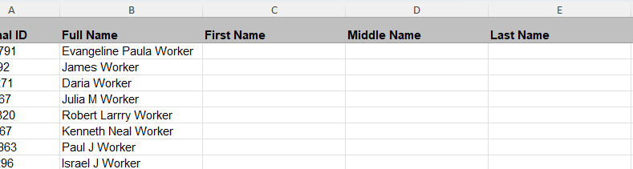
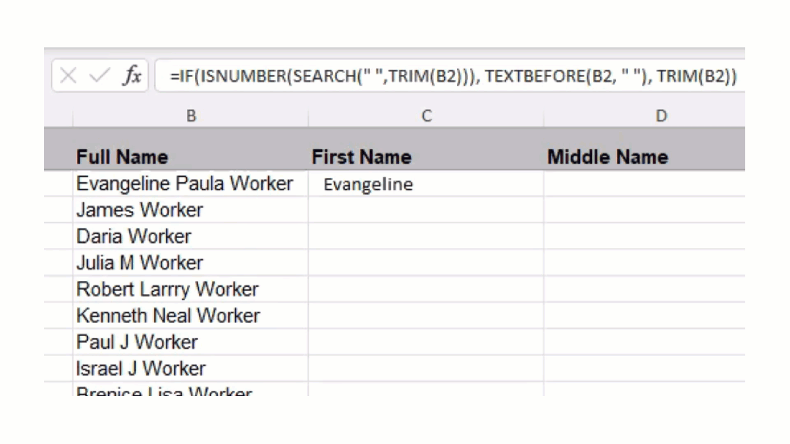
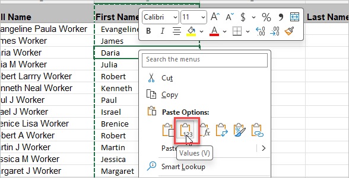

 

When importing data into Broadstripes, it is essential that your data is in "good shape" and in the correct format.

One common formatting issue is a single name column in your spreadsheet that includes the full name instead of the first name, middle name, and last name in separate columns. This formatting often occurs when data is exported from another system or database. In Broadstripes, the first, middle, and last names must be in separate columns to be imported to the correct data fields in the app.

Separating these columns manually can be tedious. However, a quick and easy way exists to split a single column into multiple columns for a successful data import.

Here's how:

1. In your spreadsheet, create three columns to the right of the column that contains the full name. The headers of these columns will be **First Name**, **Middle Name**, and **Last Name**.
    
    \[caption id="attachment\_26450" align="aligncenter" width="789"\] Insert three rows to the right of the full name column.\[/caption\]
2. In the column named **First Name,** enter the following formula into the first cell below the header:  =IF(ISNUMBER(SEARCH(" ",TRIM(B2))), TEXTBEFORE(B2, " "), TRIM(B2))  _For this example, we assume cell B2 is the cell that contains the full name._ This formula will parse the first word in the **Full Name** column into the **First Name** column. Copy the formula down the column by **double-clicking** the small square on the bottom right corner of the cell.
    
    \[caption id="attachment\_26454" align="aligncenter" width="1200"\] Double-click the square to copy the formula down the column.\[/caption\]
3. Copy all the cells in the column and paste only the values into the same column. You can paste values by right-clicking in the column and selecting **Paste Values (V)** in the **Paste Options** section**.** This will replace all formulas with the desired values in the **First Name** column. Removing formulas from your spreadsheet is essential for Broadstripes to import the appropriate data.
    
    \[caption id="attachment\_26456" align="aligncenter" width="588"\] Right-click in the same column and select Paste Values.\[/caption\]
4. In the **Middle Name** column, enter the following formula to extract the middle name/initial from the **Full Name** column:  =IF(LEN(B2)-LEN(SUBSTITUTE(B2," ","")) > 1, TEXTBEFORE(TEXTAFTER(B2, " "), " "), "")   _For this example, we assume cell B2 is the cell that contains the full name._ This formula will parse out the second word/initial in the **Full Name** column into the **Middle Name** column. Copy the formula down the column by **double-clicking** the small square on the bottom right corner of the cell. _(View column auto-fill process [here](#attachment_26454))_
5. Copy all the cells in the **Middle Name** column and paste only the values into the same column. You can paste values by right-clicking in the column and selecting **Paste Values (V)** in the **Paste Options** section**.** This will replace all formulas with the desired values in the **Middle Name** column.
6. In the **Last Name** column, enter the following formula to extract the Last Name from the **Full Name** column: \=IF(ISNUMBER(SEARCH(" ", B2)), TRIM(RIGHT(B2,LEN(B2)-(LEN(C2)+IF(ISBLANK(D2), 0, LEN(D2)+1)))), "")   _For this example, we assume cell B2 is the cell that contains the full name, C2 contains the First Name and D2 contains the Middle Name._ This formula will parse the last word(s) in the **Full Name** column into the **Last Name** column. Copy the formula down the column by **double-clicking** the small square on the bottom right corner of the cell. _(View column auto-fill process [here](#attachment_26454))_
7. Copy all the cells in the **Last Name** column and paste only the values into the same column. You can paste values by right-clicking in the column and selecting **Paste Values (V)** in the **Paste Options** section**.** This will replace all formulas with the desired values in the **Last Name** column.
8. You may need to do a bit of manual cleanup of the rows that contain last names that include a suffix or collective last names that are not hyphenated.
9. Keep the Full Name column to reference the original data later. Change the header of this column to "SKIP," so Broadstripes will ignore it during the import process.

You now have a spreadsheet appropriately formatted to import people's names into the correct data fields in Broadstripes.
