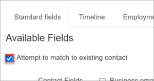
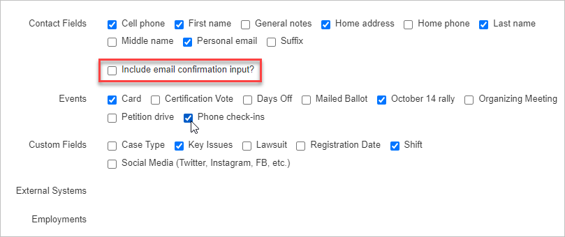
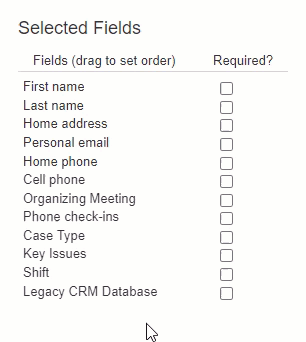

## Choosing the basic data fields for your form

It's possible to capture many different types of Broadstripes data using public forms. The **Standard fields** tab of the public form editor allows you to indicate which of your project's most common data items you want on your form.

By default, the **Standard fields** tab is open and visible when you first create a public form and each time you open it for editing after that. Let's look at what it offers.

### Match existing records?

The first option you encounter on the Standard fields tab is a checkbox labeled **Attempt to match existing contact**.

If you leave this box checked, when the form is submitted, Broadstripes will attempt to match the data in the form against all the existing records of the basic type (person or organization). This is done using the name fields and any phone and/or email info submitted with the form. The name fields and at least one of the two contact info types must match for a record match to be found. (**NOTE:** The name-matching is done using "fuzzy logic;" for example, "Thomas" will match "Tom" and "Tommy.")

If Broadstripes finds a match, the new record will be merged with the existing matched record. Any type of data that can only have one value (for example, an assessment or a custom date value) will be preserved from the new record, and the existing value will be overwritten. Data types that can support multiple values (for example, phones or email addresses) will be preserved from both merged records.

### Choose the basic data fields

Next, you can **select any fields** you want to appear on the public form with a check.

When any type of **email** is selected, you have the option of having recipients enter their email twice for accuracy by checking the **"Include email confirmation input?"** checkbox. 

### Set the order of the fields

Whenever a field is checked, it will show up at the bottom of the **Selected fields** column on the right side of the page. Once fields are in the **Selected fields** column, you can drag and drop them to **reorder** their appearance on the form as in the animation below.

### Require specific fields

Check the **"Required?"** checkbox to indicate which fields will be required to complete a submission. If a user leaves a required field blank, they will receive a warning and will be prevented from submitting the form until the required field is completed.

**NOTE:** Organizers often find that required fields prevent workers who don't know or don't want to share certain information from submitting forms. We often hear that, in the end, it's not worth it to require fields because you lose data you might otherwise receive. It's your choice — consider carefully.

### Save your work

When you've selected all of the fields you want, click **Save.** This will close the form editor. To continue customizing your public form, click the edit link again on the contact type for your public form.

**NOTE:** Instead of clicking **Save**, you can simply move on to other tabs to make additional changes to the form. Clicking **Save** will preserve the changes from all tabs at once. Be careful to do so at least once before you stop editing the form or allow your Broadstripes session to time out.

Here are links to the other documentation pages for public forms:

- [Create a new contact type](https://help.broadstripes.com/help-articles/admin-tools/public-forms/first-step/)
- [The “Timeline” tab](https://help.broadstripes.com/help-articles/admin-tools/public-forms/timeline-tab/)
- [The “Employment” tab](https://help.broadstripes.com/help-articles/admin-tools/public-forms/employment-tab/)
- [The “Form content” tab](https://help.broadstripes.com/help-articles/admin-tools/public-forms/form-content-tab/)
- [The “Email” tab](https://help.broadstripes.com/help-articles/admin-tools/public-forms/email-tab/)
- [The “Other options” tab](https://help.broadstripes.com/help-articles/admin-tools/public-forms/other-options-tab/)
- [Viewing and downloading public forms](https://help.broadstripes.com/help-articles/admin-tools/public-forms/viewing-and-downloading-public-forms/)
