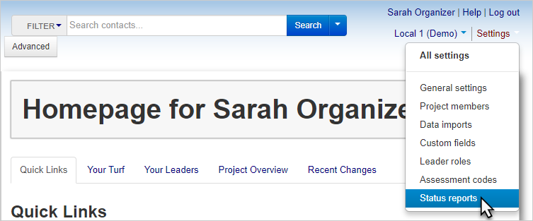

\[et\_pb\_section fb\_built="1" admin\_label="section" \_builder\_version="4.16" global\_colors\_info="{}"\]\[et\_pb\_row admin\_label="row" \_builder\_version="4.16" background\_size="initial" background\_position="top\_left" background\_repeat="repeat" global\_colors\_info="{}"\]\[et\_pb\_column type="4\_4" \_builder\_version="4.16" custom\_padding="|||" global\_colors\_info="{}" custom\_padding\_\_hover="|||"\]\[et\_pb\_text \_builder\_version="4.22.2" background\_size="initial" background\_position="top\_left" background\_repeat="repeat" hover\_enabled="0" global\_colors\_info="{}" sticky\_enabled="0"\]

**Status reports** allow you to create snapshots of your campaign progress for others to review.

With status reports, you can select what information to display and quantify, what shops to include in your report, and customize the layout of your report. Once you have created a status report, you can save it, edit it, and re-run it in the future to reflect your continued progress.

Status reports are a big topic; visit the [Status Reports section](../../../using-broadstripes/lists-and-reports/status-reports-overview/) to learn more about how to create, edit, and work effectively with status reports.

Status reports can be found under the Settings tab in any Broadstripes project admin account.

\[/et\_pb\_text\]\[/et\_pb\_column\]\[/et\_pb\_row\]\[/et\_pb\_section\]
