\[et\_pb\_section fb\_built="1" admin\_label="section" \_builder\_version="3.22"\]\[et\_pb\_row admin\_label="row" \_builder\_version="3.25" background\_size="initial" background\_position="top\_left" background\_repeat="repeat"\]\[et\_pb\_column type="4\_4" \_builder\_version="3.25" custom\_padding="|||" custom\_padding\_\_hover="|||"\]\[et\_pb\_text \_builder\_version="4.2.2" background\_size="initial" background\_position="top\_left" background\_repeat="repeat" hover\_enabled="0" inline\_fonts="Abril Fatface"\]

## Intro

Now that you've got your project running, the lead organizers on your campaign may start to request summary reports to see the progress that's being made. These reports – which Broadstripes calls "**status reports**" – give a comprehensive, high-level snapshot of where your organizing efforts stand.

**Status reports** commonly roll up data from across your campaign to include all the shops and departments you organize, displaying information like the total number of workers you are organizing, and a summary view of all current assessments by total count or percentage.

Those are just a few examples of what a report might show. Since Broadstripes' **status report** feature is highly customizable, you can quickly create your own reports to capture whatever data that's key to your campaign.

## How to get started

You can create a custom status report by following these steps:

- [Create the report](#create_status_report): Get started by creating your new report, naming it, and filling in some very basic information.
- [Choose columns](#choose_columns): Choose what information the report should display and what shops or departments to include in the data you capture.
- [Change styling](#styling) (optional): If you want to change the fonts or overall look of the report, Broadstripes allows you to do that with CSS. This won't change the content of the report, so you can skip this step if you are satisfied with the style provided.
- [Use your report](#working_with_status_reports): When you're done, you'll have a fully-customized report that you can print, download as a pdf, and save in Broadstripes for others to run at any time.

## Create a status report

Here's how to set up a basic status report:

1. Click **Settings** > **Status reports** in the upper right corner of any page to get started. 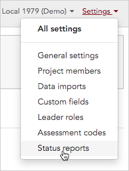

1. This opens a page called **Status report definitions**. To generate a new status report, click **\+ Define new report**.

[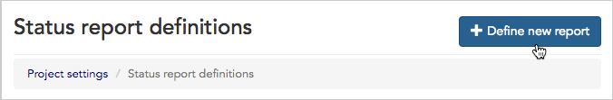](../../../../wp-content/uploads/2018/03/67dead8-statusdefinenew.png)

1. A form will open where you can choose basic options for your report. You'll need to fill out this section before you can continue on to more advanced modifications.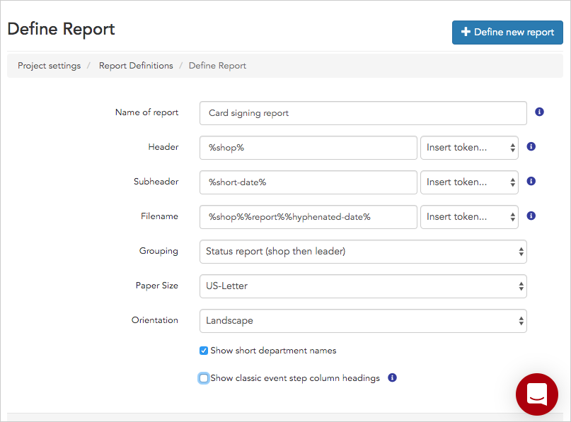

1. Give your report a **Name** that will make sense to you and your team. You will be able to choose the filename of the printed report separately.
2. Next, give your report a **Header** and **Subheader**. You can either manually type fixed names (which will stay the same no matter the content of the report), or use the provided options for **tokens**.

#### What are "tokens?"

**Tokens** are placeholders that will be replaced with the relevant information at the time that the report is run. For instance, if your report is for a single shop called Grand Hotel and you select the **Shop name** (or **%shop%**) token as your subheader, at run time, the **Shop name** token will be replaced with "Grand Hotel."

1. **Filename** is the name the report is given when the file is downloaded for printing (for instance "**Grand\_Hotel\_Status\_Report\_2018-12-20.pdf**"). To get a file name like this, you can combine multiple tokens by selecting one token then another from the drop-down list (for instance, choose **%shop**, then **%report**, then **%hyphenated-date**).
2. **Grouping** determines the categories your report will display and the order in which they will be displayed. You can choose from **shop then leader**, **leader then shop**, **shop only**, or **Classification report.**

#### Classification reports

A **Classification report** will display departments (Housekeeping, Special Events, etc.) in each shop or workplace in addition to shops and leaders. Classification reports are for large shops, where departments may be the more relevant subdivision for your organizing: for example, a large hotel where the Housekeeping department essentially functions as its own shop.

1. **Paper Size** and **Orientation** give you control over the printing output of your report.
2. Check **show short department names** to show shortened versions of department names on your report. When this box is unchecked, every department name will be prefaced by the shop name, e.g. a header called "Grand Hotel Housekeeping." When it is checked, that header would simply read "Housekeeping."
3. The checkbox called **Show classic event step column headings** gives you a choice between two different column heading formats: "Classic" and "New."
    - **Classic** includes a header with an event name above the columns for different event steps.
    - **New** displays event steps with no name above them.

\[caption id="attachment\_4354" align="alignnone" width="516"\] “**Classic**” heading format vs. “**New**” heading format.\[/caption\]

No matter which format you use, you can customize the contents and orientation of every column. If you use the "New" format, you may want to change the name of the event step columns for additional clarity.

1. Click **Save** to create your report and access the next set of report options (choosing columns and organizations).
2. After you save, you will be taken to the **column editor tab**. However, at this point, you can access your report from the **Status report definitions** page at any time. If you want to edit the columns, add organizations, and adjust the formatting later, all you have to do is click **edit** from the **Status report definitions page**.

## Choose columns for a status report

After you fill in the basic options for your status report, as discussed above, you will be directed to a page with several tabs where you can customize the information your report will display.

The first customization tab is called **Columns** and, as the name suggests, it allows you to customize which columns of data your report displays.

### Add a column

To add a column to your status report, single-click on the column name under **Available Columns**. Columns that you select will show up under the **Selected Columns** heading.

[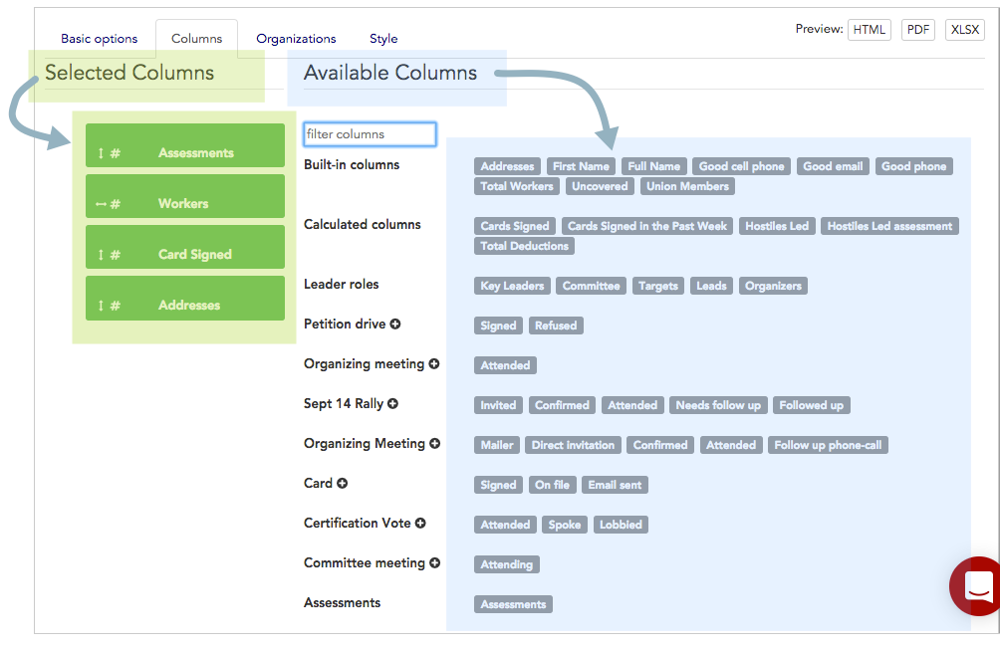](../../../../wp-content/uploads/2018/03/1cc13f6-statuscolumns.png)

### Available columns

The "Available Columns" choices are organized by category:

- **Built-in columns** reference [built-in information fields](../../../admin-tools/data-tools-admin/built-in-data/) like name, and contact info.
- **Calculated columns** are not required, and may not have been set up for your project. You can read more about them in the [Calculated columns](../../../admin-tools/project-settings/calculated-columns-settings/) article.
- **Leader roles** include the leaders within the bargaining unit or worker group, which are explained in the [Leader roles](../../../admin-tools/data-tools-admin/leadership-roles/) article.
- **Events** for your project are listed individually along with their steps. You can choose to display as many events and event steps as you need in your report. Learn more about how events work in the [Events](https://help.broadstripes.com/help-articles/admin-tools/data-tools-admin/creating-an-event/) article.
- The last available column is **Assessments,** (this is sometimes called **Codes**, depending on your project's general settings) which will display any assessment code data collected for people in your project, as discussed in the [Assessments](https://help.broadstripes.com/help-articles/admin-tools/project-settings/assessment-settings/) article. 

#### Assessments will affect your filters

If you choose to display the **Assessments** column (sometimes called "**Codes**") in your status report, you _cannot filter your report by assessment code_. That means that 1s, 2s, 3s, 4s, and 5s will show up on every report. If assessment codes are _not_ displayed, you _will_ be able to filter what's included in the report by assessments – for example, to display just 1s and 2s in a report.

Also, note that a "**Not set**" column will be added to your Assessments code column automatically. "**Not set**" tracks the number of workers who have not been assessed.

### Find columns faster

The **Available Columns** list can get pretty long and overwhelming, so Broadstripes gives you the option to filter columns by keyword using the **filter columns box** at the top of the **Available Columns** list. This helps you find what you're looking for quickly in projects that have a lot of custom fields, calculated columns, and event data logged in Broadstripes.

[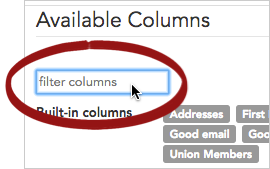](../../../../wp-content/uploads/2018/03/37821ad-StatusFilter.png)

For instance, if you want to find the "**Addresses**" column, you can type the first few letters – "**Add**" – in the filter box. Broadstripes will filter the results, and the "**Addresses**" column will appear below.

[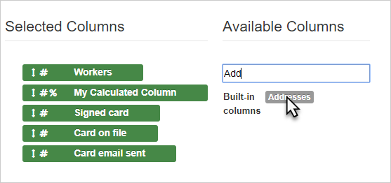](../../../../wp-content/uploads/2018/03/e59cad1-status_report_columns_2.png)

### Rename a column

You can use the **Name** text box to rename any column to display on your report with a different header.

For instance, you could select the "**Cards Signed**" column, and then change the name to display "**Cards Signed as of 7/13**". This can be useful when you want to convey your information more legibly, or emphasize the timeline of your progress.

[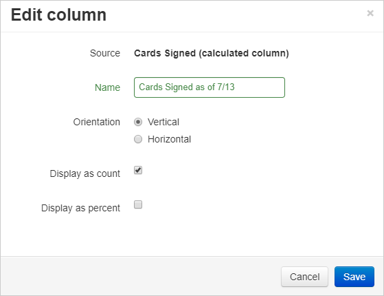](../../../../wp-content/uploads/2018/03/2908cf6-columns_4.png)

 

#### Classic vs. New column headings

When you defined your status report initially, you'll remember that the checkbox called **Show classic event step column headings** gave you a choice between two different column heading formats: "Classic" and "New."

- **Classic** includes a header with an event name above the columns for different event steps.
- **New** displays event steps with no event name above them.

If you chose the "New Style" of report, you may want to rename your event step columns to include the event name, for instance, to change "**Signed**" to "**Card signed**," or "**File**" to "**Card on file**."

### Choose header label orientation

Next, you can also choose whether you want the header label to be oriented as **Vertical** or **Horizontal** text on your report (this will not affect the data on the report, just the header text).

**Vertical** orientation looks like this:

[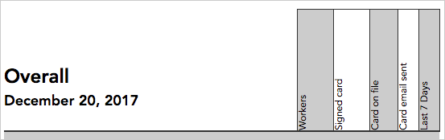](../../../../wp-content/uploads/2018/03/d3901d9-statusvertical.png)

**Horizontal** looks like this:

[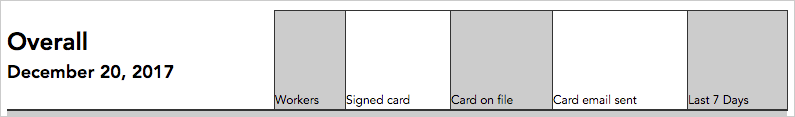](../../../../wp-content/uploads/2018/03/c6e54b2-statushorizontal.png)

As you can see, horizontal takes up a lot more space, but makes it much easier to read long headers.

### Display as count or percentage

Last, you can choose to display your column as a **count**, a **percent**, or both. You **must** check at least one of **Display as count** and **Display as percent** to have any of your column data show up in your final report.

Once you are satisfied with your formatting choices, click **Save,** and the column will be added to **Selected Columns** list.

### Reorder your report columns

The **Selected Columns** list is ordered to show you the way in which your columns will appear on the final report (the first column in the list will be laid out the furthest to the left in the report, and the last column in the list will be furthest to the right).

You can **change how columns are ordered** by clicking on the green box of the column you want to move, then dragging and dropping it to a new spot, like so:

[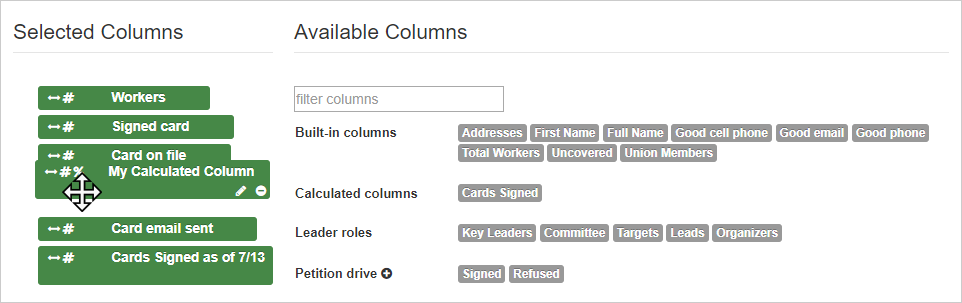](../../../../wp-content/uploads/2018/03/06b94d1-columns_11.png)

To make sure your columns are correctly arranged and oriented, first **click the save button,** then you can use the **Preview buttons** at the top of the page to see how your report will look once printed.

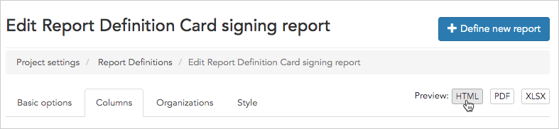

### Save your work

Before you leave the **Columns page**, be sure to save your changes by clicking **Save**. Don't worry – if you forget and try to leave without saving, a popup will remind you to stay and save your work! 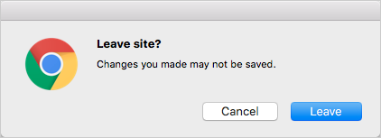

## Choose organizations for a status report

Your status report will only include data for the organizations you choose to display. If you don't choose any organizations, none will be displayed, so this is a key step.

To get started, click on to the **Organizations** tab to start choosing which shops and departments to include in your report. 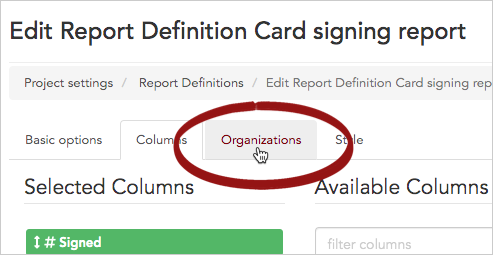

### Navigating Organizations

By default, when you open the organizations tab, you'll see all the organizations in your project in the work area.

However, you can use the **toolbar** at the top of the shop list to make it easier to navigate and select the specific shops and departments you want to include in your report.

Here's a look at what actions are triggered by each button on the toolbar: 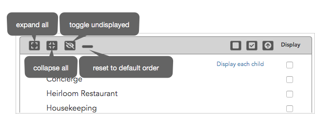

> **expand all** lets you see every possible shop and department
> 
> **collapse all** allows you to view only the top level shops and departments
> 
> **hide/show undisplayed** toggles between showing you all shops or just the shops and departments that will appear in your report (that is, those with the **display checkbox** checked)
> 
> **reset to default order** returns the order of the list to its original state (if you have [dragged and dropped](#drag_and_drop) the list to reorder it)

### Choosing organizations

First, it's important to know that organizations will always be displayed hierarchically in the work area. Even if you [drag and drop](#drag_and_drop) a shop or department to re-order it, it will move in a way that keeps the hierarchy intact.

Here's how the hierarchy view works: In the example below, the shops named **Basic Hotel,** **Grand Hotel,** and **Luxury Hotel** are at the top level of the hierarchy, with departments nested below them. Departments, such as **Concierge, Heirloom Restaurant,** or **Housekeeping**, can also have sub-departments nested below them, for instance the **2nd Floor** and **3rd Floor** sub-departments under Housekeeping.

**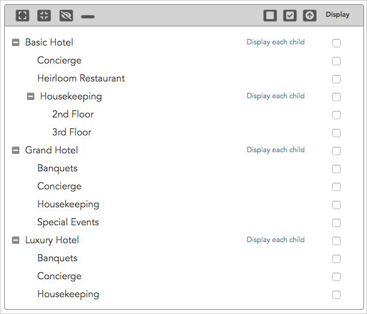**

Now that you understand the way shops, departments, and sub-departments are shown in the work area, here's how to select them to be included in your report:

1. To include a location (i.e. a shop, department, or sub-department) in your report, simply check the organization's corresponding **Display** box on the right side of the page.
2. For **Classification Reports** only, you'll have the option to check the **Breakout Classifications** box. This will display information about job classifications for the corresponding location.

### Which levels to display?

If you're having a hard time choosing which levels of shop structure to display, just remember that **you will often _not_ need to display the top level** of your shop structure hierarchy. This is because all workers should be classified not only within a shop, but also within a department, so displaying departments rather than shops will give you a more precise picture of where your workers are.

To simplify the task of **selecting all departments under a shop** to be included in your report, you can click the **"display each child"** link next to a shop name as shown below. This will not include the shop itself, however; you'll need to check it additionally to include it in the report.

**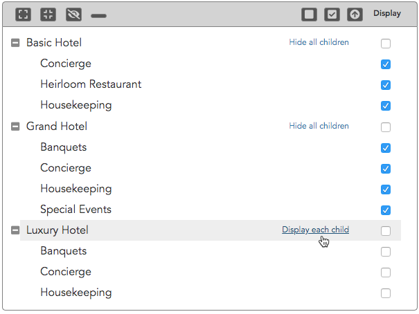**

### See if employees work at a location before displaying it in a report

To make sure you understand where your workers are positioned in the shop structure (for instance, at the **shop**, **department** or **sub-department** level), you **can hover your mouse** over any department or shop and see how many **direct** and **indirect** employees that shop or department contains. This can help you decide what levels of a shop hierarchy in your report.

#### Direct and indirect employees

When a level of your structure has a **direct employee**, that means that the level is the smallest/most specific level of the shop structure under which that employee works.

When a level of your structure has **indirect employees,** it means those employees work at a level somewhere below the selected level of the shop structure. For instance, an employee working on the 2nd Floor of Housekeeping at Grand Hotel would be an indirect employee of both Housekeeping and Grand Hotel.

In the two examples below, the **Grand Hotel** has 0 direct employees, so it's probably not worth displaying. **Housekeeping**, on the other hand, has 118 direct employees, so displaying it in your report is a good idea if you want to capture a complete picture that includes all workers.

[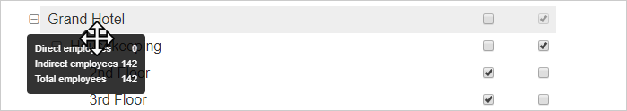](../../../../wp-content/uploads/2018/03/7d3e4fe-organizations_3.png)

[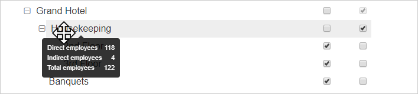](../../../../wp-content/uploads/2018/03/817cc90-organizations_4.png) 

### Change your report's sort order

By default, the shops and departments in your report will be displayed alphabetically. Below each department, its sub-departments are also displayed alphabetically. If you'd like to change the order that these appear on your report, just **click and hold on the name** of any department or sub-department, then **drag and drop** it to the desired location.

When you're satisfied with your work, click **Save**.

### Preview your report

Once you've selected and saved the organizations (shops, departments and sub-departments) you want to include in your report, you can **preview the report** to make sure it looks the way you want it to.

1. After saving, **click** **HTML** for an on-screen preview, **PDF** for a preview in PDF, and **XLSX** for a preview in Excel spreadsheet format.
    
    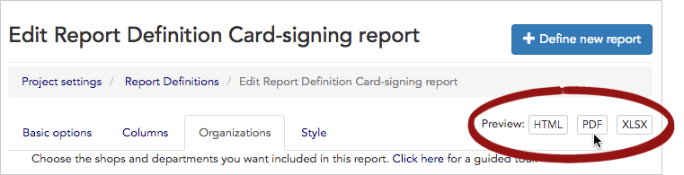
    
2. Your preview will open in a new tab. 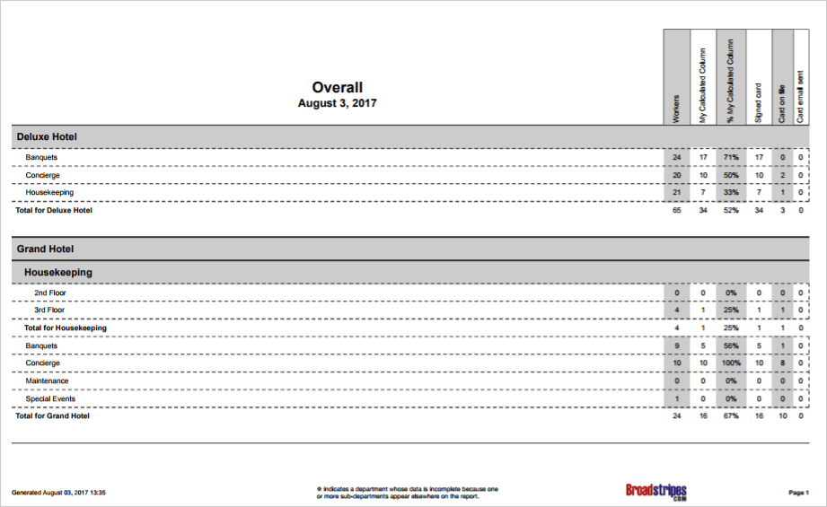
3. If you want to make any changes, just return to the **Organizations tab.**
4. If you are happy with the preview, your status report is complete!
5. To run the report, click the **Report Definitions link** to go back to the main **Report Definitions** page. 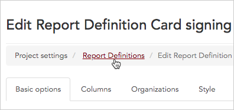
6. Then find your report, and click **Run**.
7. If you want to change the look of the report (including custom fonts or colors), you can continue to the optional next step of adding custom styles.

## Add custom styles to change the look of a report

If you want to make any custom style changes, you can get started by clicking the last tab, labeled **Style**.

To change the look of the report, Broadstripes allows you to apply custom CSS code by adding it to the code area on this page as shown below.

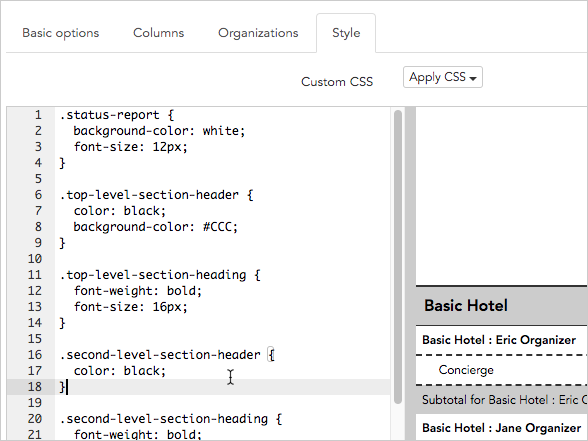

After adding your custom CSS code, click **Save** and you will see a preview of your report.

If you are not familiar with CSS, it is a widely-used language that allows you to specify a document's style–including layout choices, colors, and fonts. You can learn more about using CSS at [https://www.w3schools.com/css/](https://www.w3schools.com/css/).

## Working with status reports

1. To view status reports, you need to start on the **Status report definitions page**. If you are not already there, click **Settings** > **Status reports** in the upper right corner of any page to open it. 
2. The **Status report definitions** page provides a list of all your existing saved status reports. It shows you basic information about the reports, and provides links to actions you can take, like **running, editing,** or **deleting** a report.

[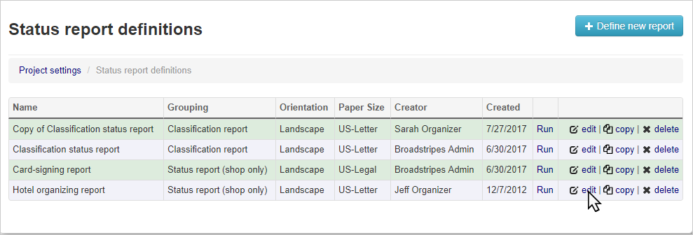](../../../../wp-content/uploads/2018/03/fc91213-what_to_do_with_your_report-1.png)

## Status report actions

Once you have status reports set up, here are some options for working with them.

> **Run** – This will re-run any status report with new, updated information. This means you can use the same parameters as the original report with updated progress, instead of going through the entire process of creating a new report.
> 
> **edit** – This will bring you back to the **Create a status report** page and allow you to change the report options. Move through each of the setup tabs as needed (Columns, Organizations, Style) and save as you go. You can then run the report again to see updated numbers.
> 
> **copy** – This will leave the selected report intact, and create a new copy. A pop-up will display telling you to enter a name for your new report. The default will be "**Copy of \[report name\]**," but you can change it to anything other than the name of the original report. Click **OK** when you're satisfied with your new report name and the copy will appear in the **Status report definitions** list. To make changes to your copied report, click **edit**.
> 
> **x delete** – You can **delete** a report by using the **delete** button all the way to the right. Don't worry, you'll be asked to confirm your request before Broadstripes deletes your hard work!

Once you've run a report, you can download it as a PDF by clicking the **View as PDF** button at the top of the report.

[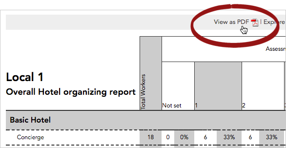](../../../../wp-content/uploads/2018/03/1791d55-statusorgviewasPDF.png)

\[/et\_pb\_text\]\[/et\_pb\_column\]\[/et\_pb\_row\]\[/et\_pb\_section\]
