\[et\_pb\_section fb\_built="1" admin\_label="section" \_builder\_version="4.16" global\_colors\_info="{}"\]\[et\_pb\_row admin\_label="row" \_builder\_version="4.16" background\_size="initial" background\_position="top\_left" background\_repeat="repeat" global\_colors\_info="{}"\]\[et\_pb\_column type="4\_4" \_builder\_version="4.16" custom\_padding="|||" global\_colors\_info="{}" custom\_padding\_\_hover="|||"\]\[et\_pb\_text \_builder\_version="4.16" background\_size="initial" background\_position="top\_left" background\_repeat="repeat" hover\_enabled="0" global\_colors\_info="{}" sticky\_enabled="0"\]

## Tag people to create manual lists

**Lists** give you an easy way to manually tag individuals whom you want to track as a group for any reason. For instance:

- people who go on break or hang out together
- people that are your first-choice key targets
- people who helped hand out flyers last week

With lists, you simply create the list, tag the individuals, and that's it. Once the list is made, you can open it at any time, and easily add or remove members as needed. You can even share a saved list with other Broadstripes users, or make it inactive once you've stopped using it regularly.

Learn more about how to tag your people with lists:

## Working with tag lists

**Lists** give you an easy way to manually tag individuals who you want to track as a group for any reason. Once the tag list is created, you can open it and view the members. Here's how:

### View your tag lists and their members

1. Start by clicking the **Lists** link on the navigation panel.

1. You'll see your project's list index page, which lists the active tag lists in the project (both shared and personal). Inactive tag lists are available on the other tab.

[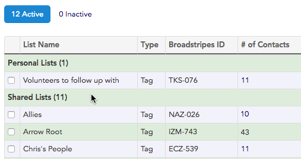](https://help.broadstripes.com/wp-content/uploads/2018/03/e24a13d-ListLists2.png)

1. Clicking on the number in the **\# of Contacts** column will open a page showing all the members of that list.

[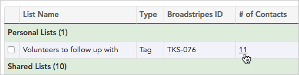](https://help.broadstripes.com/wp-content/uploads/2018/03/55f4e4c-ListsContacts.png)

1. With that page open, you can also easily **apply a layout** to the list. Just like with other search results, applying a layout lets you see the columns of information that are most useful to your work. (Learn more about this in the [Create and save a layout](https://help.broadstripes.com/help-articles/using-broadstripes/customize/save-a-layout/) article.)

[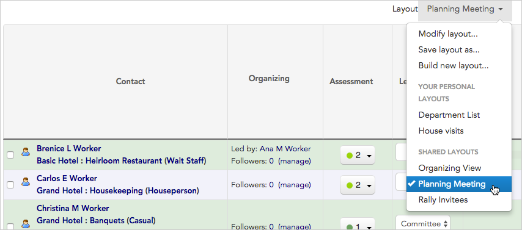](https://help.broadstripes.com/wp-content/uploads/2018/03/9a2bcf6-ListsContactLayout.png)

### Search for a list

You can also search for a list if you know its name or ID. To search, type "**list =** " and the list name or ID into the search bar.

[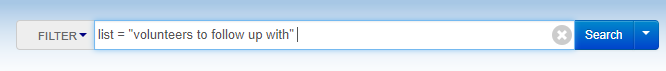](https://help.broadstripes.com/wp-content/uploads/2018/03/46290b3-tag_list_redo_1.png)

[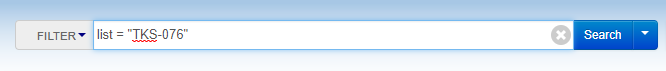](https://help.broadstripes.com/wp-content/uploads/2018/03/86517af-tag_list_redo_2.png)

### Transfer a list

You can also create a list and transfer it (and its members) to another Broadstripes user. This is different than creating a shared list, because the list will disappear from your view and become a personal list for only the user to whom you assign it.

1. Start by **checking the list** you want to transfer.

[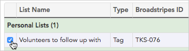](https://help.broadstripes.com/wp-content/uploads/2018/03/9e572c3-ListsAssign.png)

1. From the **Actions** drop-down menu, choose **Transfer to another user**.

[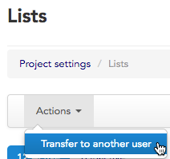](https://help.broadstripes.com/wp-content/uploads/2018/03/90f758e-ListsTrans.png)

1. Type the name of the user and click **Transfer list**.

[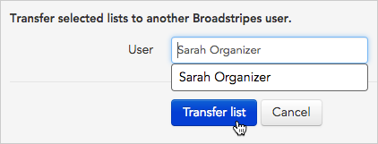](https://help.broadstripes.com/wp-content/uploads/2018/03/29d3325-ListsTransUser.png)

1. The list will now appear in Sarah's personal tag lists.

## Create a new tag list

1. Starting on the **Lists page**, click **\+ New List**.

[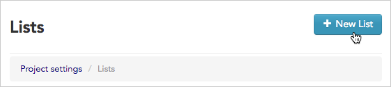](https://help.broadstripes.com/wp-content/uploads/2018/03/9d679a0-ListsNew.png)

1. Give the list a **Name** and **Description** (optional), and choose if you want the tab list to be just visible to you (**Personal**), or visible to all other users (**Shared**). Click **Save** to create the new tab list.

[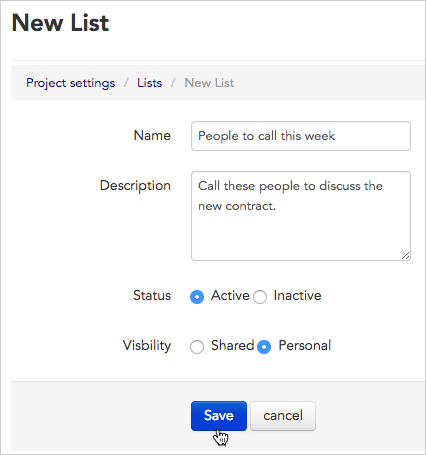](https://help.broadstripes.com/wp-content/uploads/2018/03/62f7557-ListsNewSave.png)

## Add people to a tag list

Tag lists allow you to add any individuals to a single list simply by tagging them. There are multiple ways to add people to a tag list, but the most common is by selecting people from search results and applying a bulk action. Get step-by-step instructions in the [Actions - Add to/Remove from List article](https://help.broadstripes.com/help-articles/using-broadstripes/working-with-search-results/bulk-actions-list/).

## Remove people from a tag list

Like adding people to a tag list, removing people starts by selecting them from search results and applying a bulk editing action. Get step-by-step instructions in the [Actions - Add to/Remove from List article](https://help.broadstripes.com/help-articles/using-broadstripes/working-with-search-results/bulk-actions-list/).

## Edit, deactivate, or delete a tag list (or its members)

There are a few reasons that you may want to edit a tag list that you've created:

- [Add](#ftoc-heading-7) or [remove](#ftoc-heading-8) members
- Change the list's [name or description](#ftoc-heading-11)
- [Make a personal list a shared list](#ftoc-heading-11), or vice versa
- [Make an active list inactive](#ftoc-heading-12), or vice-versa
- [Permanently delete](#ftoc-heading-14) a list from Broadstripes

### Add or remove members from a tag list

The easiest way to add members to a tag list is from the search results page. You can add all the contacts in the search results at once, or select just a few people. Check out the "[Add people to a tag list](#ftoc-heading-7)" section of this article to learn more.

Removing members can be done from the lists page or any search results page. Learn how in the "[Remove people from a tag list](#ftoc-heading-8)" section of this article.

### Change a tag list's name, description, or visibility (shared or personal)

1. Start by clicking the **Lists** link on the navigation panel.

1. Broadstripes will open the **Lists** page where you'll see all of your active lists (both shared and personal).
2. Click **edit** next to the name of the list you want to change.

[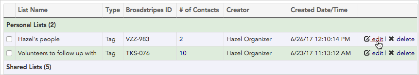](https://help.broadstripes.com/wp-content/uploads/2018/03/eeedf41-ListsEditList.png)

1. Make changes to your tag list's name or description, or change its visibility (from shared to personal or vice versa) and click **Save**.

[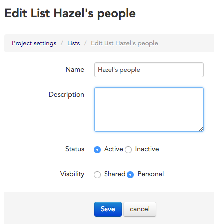](https://help.broadstripes.com/wp-content/uploads/2018/03/7aa5bd4-ListsEditListDetail.png)

### Make a tag list inactive

It's simple to make tag lists inactive if they are no longer useful to your daily work. Making a list inactive will remove it from drop-down menus and from the navigation toolbar, but the contents of the tag list will not be lost. If you ever need to see the members of an inactive list again, simply re-activate it. Here's how:

1. To make an active tag list inactive, start at the **Lists** page and click **edit** next to the list you want to change.

1. Under **Status**, select **Inactive** and then click the **Save** button.

[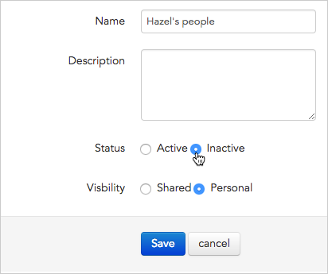](https://help.broadstripes.com/wp-content/uploads/2018/03/af0643e-ListsEditListInactive.png)

### Re-activate an inactive list

1. Start at the **Lists** page and click the **Inactive** tab.

[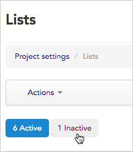](https://help.broadstripes.com/wp-content/uploads/2018/03/e4ccf7a-ListsEditInactiveTab.png)

1. You'll see all the inactive lists in your project. Click **edit** next to the list you want to re-activate.

[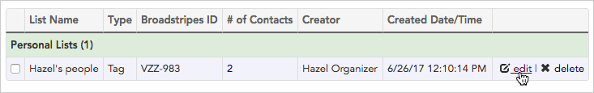](https://help.broadstripes.com/wp-content/uploads/2018/03/f112142-ListsEditInactiveTabEdit.png)

1. Next to **Status**, select **Active**. Click the **Save** button.

[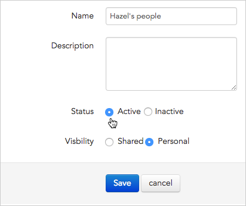](https://help.broadstripes.com/wp-content/uploads/2018/03/72a73dc-ListsEditListReactivate.png)

1. Your tag list is now active again. You can view its members by clicking on the number in the **\# of Contacts** column.

[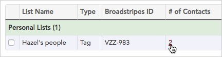](https://help.broadstripes.com/wp-content/uploads/2018/03/65a3754-ListsEditListReactivateView.png)

## Permanently delete a tag list

You can delete a list if you want to erase it permanently from the system. The contacts themselves will not be deleted, but the list will be removed from your project and can't be retrieved later.

1. Start at the **Lists** page and click **delete** next to the list you want to remove.

[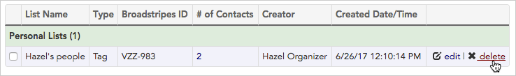](https://help.broadstripes.com/wp-content/uploads/2018/03/aa26408-ListsDeleteList.png)

1. A pop-up box will open asking you to confirm the deletion. Click **OK** to delete the tag list permanently.

\[/et\_pb\_text\]\[/et\_pb\_column\]\[/et\_pb\_row\]\[/et\_pb\_section\]
