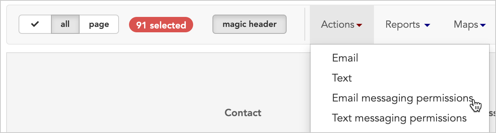

\[et\_pb\_section fb\_built="1" \_builder\_version="3.22"\]\[et\_pb\_row \_builder\_version="3.25" background\_size="initial" background\_position="top\_left" background\_repeat="repeat"\]\[et\_pb\_column type="4\_4" \_builder\_version="3.25" custom\_padding="|||" custom\_padding\_\_hover="|||"\]\[et\_pb\_text \_builder\_version="4.4.8"\]

# Email messaging permissions

* * *

## Opt in multiple workers at once to receive Broadstripes emails

This article only covers one step in the process of sending email messages with Broadstripes – how to mark workers' email addresses as **"Opted in."** Check out the [Email messaging article](https://help.broadstripes.com/help-articles/using-broadstripes/working-with-search-results/bulk-actions-send-email/) if you'd like to learn more about how to send bulk email messages using Broadstripes.

Before you can send Broadstripes emails to workers, they need to consent, or "opt in," to receive your email messages. This bulk action allows you to update multiple workers' permission settings at once, whether it is to mark them "Opted in" or "Opted out" or even "Unspecified" or "Unreachable."

In this example, we’ll show how to opt-in emails for a group of workers. Here’s how:

1. First, we’ll run a search for people whose email addresses we want to opt in. (If you need help running a search, check out the [Create and save a search](https://help.broadstripes.com/help-articles/using-broadstripes/customize/create-and-save-a-search/) article.)
2. From the **Search Results** page, we’ll [select all the workers](https://help.broadstripes.com/help-articles/using-broadstripes/working-with-search-results/selecting-deselecting-contacts/#ftoc-heading-2). 
3. With the contacts selected, we'll go to the **Actions** drop-down menu and choose Email messaging permissions.

\[/et\_pb\_text\]\[/et\_pb\_column\]\[/et\_pb\_row\]\[/et\_pb\_section\]
