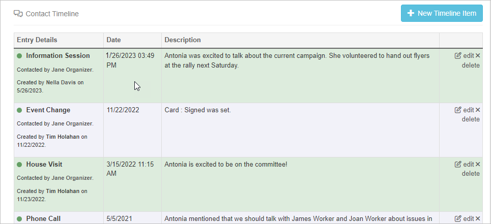
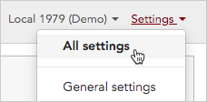
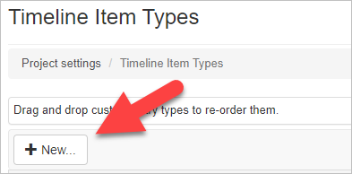
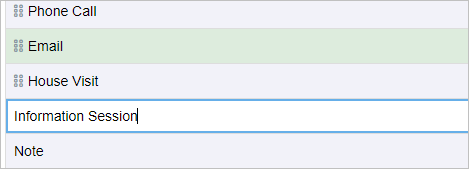
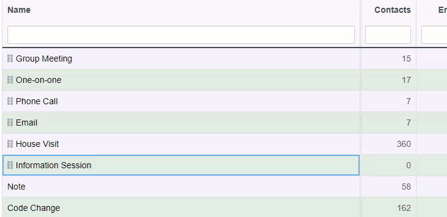
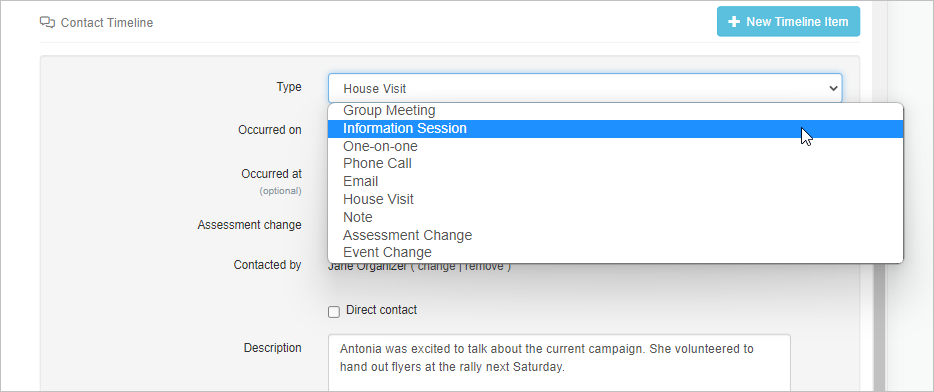
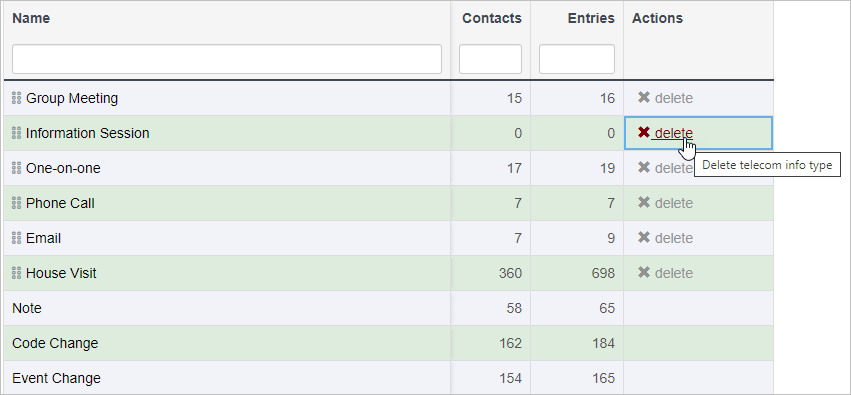
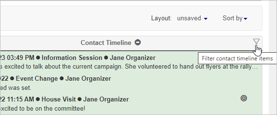
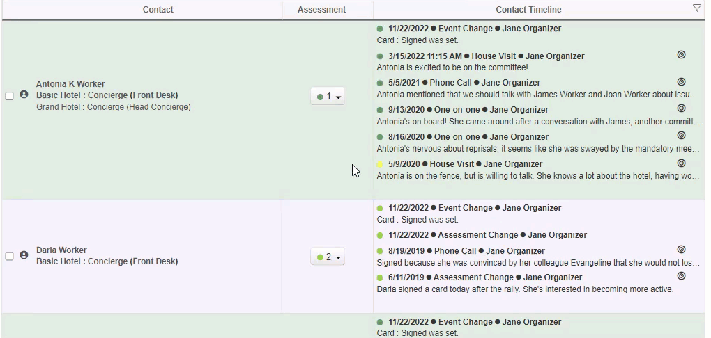

## Overview

A contact timeline is a perpetual history of notes, events, conversations, and interactions with a contact. The timeline will record and display emails, text messages, changes in assessments, and other important subjects. A timeline item provides details on the occurrence, including when the event occurred, who created the item, who contacted the person, and a description.

Over time, a contact timeline may become lengthy with information and events that have transpired. Timeline types allow you to organize your data on your contact timeline. This will also allow you to filter timeline types on your search results page for easier data location. 

You may create additional timeline types beyond the default types provided by Broadstripes to record interactions and events that are important to your project.

By default, the following timeline types are already defined and enabled for you:

- **Note**
- **Code Change (Assessment Change)**
- **Event Change**
- Email
- Group Meeting
- House Visit
- One-on-one
- Phone Call
- SMS Message

There will be times when you want to record an interaction or create a note that doesn’t fit within those predefined categories, like a special meeting or a blitz event. For those instances, you can create a new timeline item type that better categorizes the interaction. Here’s how:

### Creating a timeline type

1. Select the **Settings** menu in the top right corner of the app and click **All settings. ** 
2. Under the Basic section of Project settings, select **Timeline item types**.
3. Select the “**\+ New”** button” and a new timeline item type will appear. 
4. Name your new timeline item type. For this example, we will create an “Information Session” timeline item type. 
5. You can drag and drop to reorder the position of the item in your project’s timeline type dropdown menu. (It’s helpful to place frequently used timeline types toward the top of the menu.) 

Now that you have a new timeline type created, you may go ahead and use it for any of your entries on your contact timeline.

* * *

### Deleting a timeline type

If you or your project members do not use a particular timeline type, you may delete that one. This will keep your timeline types menu concise and consistent.

1. Go to your Settings menu in the top right corner of the app and select **All Settings. ** 
2. Under the Basic section of Project settings, select **Timeline item types.**
3. Click “**x delete**” in the corresponding row of the timeline type that you want to remove from the project. You will be prompted to confirm your choice to delete via popup. Click ****OK. **** 

**Note:** There are a few instances in which you cannot delete a timeline type. If a timeline type has a timeline item associated with a contact, the timeline type cannot be removed. In addition, **Note, Code Change,** and **Event Change** are system defaults and may not be removed.

### Filtering Timeline types in Search results

The contact timeline column in your search results may be filtered to display specific timeline types.

To filter, select the funnel in the top right corner of the contact timeline column. 

A popup menu will appear with checkboxes for all the different timeline types. Check the timeline types that you want to view and click **Apply**. 

Your search results will now only display the timeline types that were selected.
