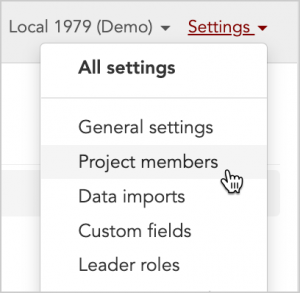
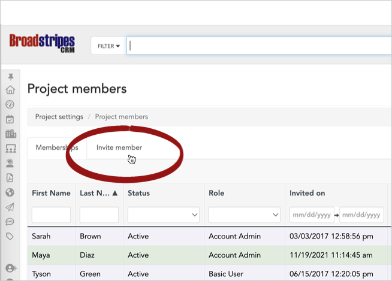
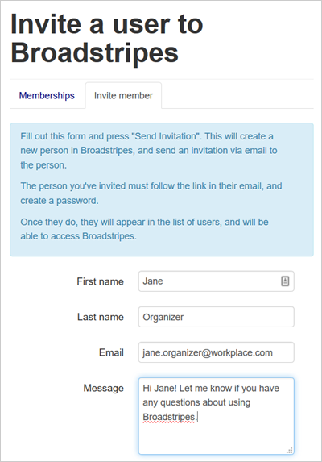
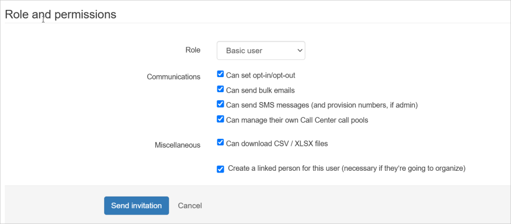
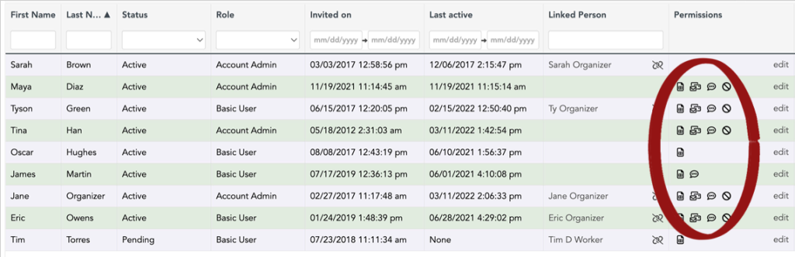
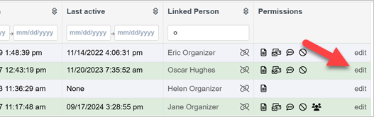
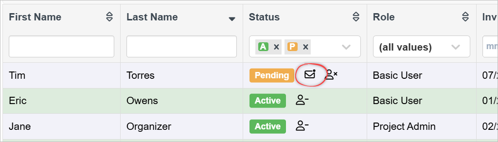
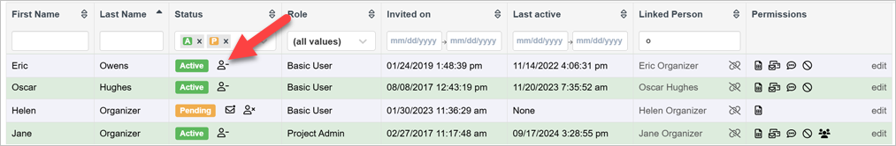
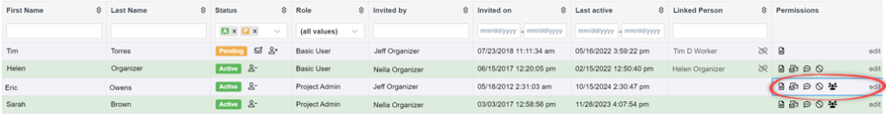
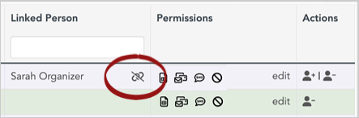

\[et\_pb\_section fb\_built="1" admin\_label="section" \_builder\_version="4.16" global\_colors\_info="{}"\]\[et\_pb\_row admin\_label="row" \_builder\_version="4.16" background\_size="initial" background\_position="top\_left" background\_repeat="repeat" global\_colors\_info="{}"\]\[et\_pb\_column type="4\_4" \_builder\_version="4.16" custom\_padding="|||" global\_colors\_info="{}" custom\_padding\_\_hover="|||"\]\[et\_pb\_text admin\_label="Text" \_builder\_version="4.16" global\_colors\_info="{}"\]

## Intro

After setting up your project and importing your data, you're ready to bring users on board.

The topics in this section will help guide you through what to consider when adding users to your project and provide simple step-by-step instructions on how to invite and manage them.

As a project admin, you have the ability to invite new users to your Broadstripes project.

It's important, obviously, that these be people you trust with access to the information in the project.

Before you invite a new organizer, take a moment to think about whether you want them to have the same privileges that you do, and how they'll be interacting with the project: will they be organizing in the field, or based in the campaign office supporting other organizers?

## Video: Invite a new user

Once you've given roles and permissions some thought, here's a video that walks you through the steps for adding a user to your project (or you can read about how to invite users step-by-step in the article below):

\[/et\_pb\_text\]\[et\_pb\_text admin\_label="Admin video invite a user" \_builder\_version="4.9.4" custom\_margin="20px||20px||false|false" global\_module="22582" saved\_tabs="all" global\_colors\_info="{}"\]

\[video\_lightbox\_youtube video\_id="ofRENvKE08Y&rel=0" width="640" height="520" auto\_thumb="1"\]

### Add and invite a new user

\[/et\_pb\_text\]\[et\_pb\_text admin\_label="Text" \_builder\_version="4.27.0" background\_size="initial" background\_position="top\_left" background\_repeat="repeat" hover\_enabled="0" global\_colors\_info="{}" sticky\_enabled="0"\]

## Step-by-step: Invite a user

1. Start by going to **Settings > Project members** in the upper right-hand corner of the page. On the **Project members** page, you will see a list of all the people who have been invited to your project.

#### Note

Before you invite a new person, check whether they have already been invited by looking for their name in the list on the **Memberships tab**. If they missed the invitation or it went to their spam folder, you can click the **resend invitation** link. (Note that the presence of a resend link doesn't mean that the user hasn't activated their membership.)

1. If the person hasn't been invited, click the **Invite member** tab (next to **Memberships**) to access the new member form.  
      
    
    
    

1. Fill out the first section of the new member form. The **Message** text box is optional and may be left blank. Either way, the invitation will contain a "You've been invited to... " introductory line with a link directing the user to activate their account.

1. Choose the user's role and permissions from the drop-down menu at the bottom of the page. If you need an explanation of the different roles and permissions Broadstripes offers to users, or if you have questions about whether to check the "**Create a linked person**" checkbox, take a look at the "**[Edit user permissions](#ftoc-heading-7)**" section below.

1. Click the **Send invitation** button, and the person you are inviting will receive an email from Broadstripes with a link to set a password.
2. Once they have a password, they will appear in the list of project users under the **Memberships** tab on the **Project members** page.
3. On this page, their permissions and roles are also visible and you can hover over any icon to see a more detailed description of permissions granted.

1. Permissions and roles can be edited by clicking the "**edit**" link. Learn more about editing a user's permissions or role in the "Edit user permissions" section below.

If you have sent a invite to a user who has deleted or can't find the invite email, you can re-send an invitation email. In the Status column of the person's row, click the envelope icon to resend the invitation email.

## Support your users

Once a user is invited to join your project, they'll need to set up their password by registering their account. Once their password is set, they'll use it to log in. Occasionally, you may be asked to help retrieve or reset a password. Since admins don't have access to password information, that's something users will need to do on their own. However, you can support your users by helping to walk them through the process.

These articles provide everything a user needs to know to register their account, create their password, log in, and reset their password:

- [Register your account (and create your password)](https://help.broadstripes.com/help-articles/using-broadstripes/get-started/register-your-account/)
- [Log in (and reset a password)](https://help.broadstripes.com/help-articles/using-broadstripes/get-started/log-in-and-reset-a-password/)

## Deactivate a user

A crucial responsibility of the project admin is deactivating organizers who leave the campaign.

When an organizers leaves a campaign, it may be important to remove their access to the information contained in the Broadstripes project.

#### Important

If the user has left your organization, you may need to remove them from more than one project. In that case, you will need to repeat this process for each project of which they are a member.

1. Start by going to **Settings > Project members** in the upper right-hand corner of the page.

1. On the **Project members** page, you will see a list of all the people who have been invited to your project. Locate the person you want to remove on this list. (If you can't find them, that means they no longer have access to the project, and may already have been removed.)

1. In the Status column, click the **deactivate** icon in the person's row.
2. A notification will appear in the top right of the app, confirming the deactivation.

## Video: Remove a user or edit a user's role or permissions

Admins can edit a user's role or permissions at any time, or remove them from a project altogether. Here's a video that walks you through the steps (or you can read about how to make these edits in the article below):

\[/et\_pb\_text\]\[et\_pb\_text admin\_label="Admin video change a user's role or permissions" \_builder\_version="4.9.4" custom\_margin="20px||20px||false|false" global\_module="22583" saved\_tabs="all" global\_colors\_info="{}"\]

\[video\_lightbox\_youtube video\_id="If4DGBYhyoE&rel=0" width="640" height="520" auto\_thumb="1"\]

### Change a user's role or permissions

\[/et\_pb\_text\]\[et\_pb\_text \_builder\_version="4.27.0" global\_colors\_info="{}"\]

Step-by-step: Edit a user's role or permissions

You can decide what kind of role a user will play when you initially invite them to join your project. After a user is set up, you can edit their user role at any time. Here's how:

1. Go to **Settings > Project members** and click the "**edit**" link next to the user's name.

### User roles

Choose the correct user role. There are two types of users: **Basic users** and **Project admins**.

- A **Basic user** account will fulfill the needs of most of your organizers.
- **Project admins** have additional permissions that you may not want all users on your project to have: for example, the ability to add new users.
- You can learn more details about user roles and associated permissions on the [user roles page](https://help.broadstripes.com/help-articles/admin-tools/running-a-project-admin/user-types-and-permissions/).

### User permissions

When you initially asked a user to join your project, you had a chance to set some specific permissions. After a user joins the project, you can grant or revoke these permissions at any time by clicking the **"edit"** link on the **Settings > Project members** page as shown above. Keep in mind that if a user is given the admin role, they will have the authority to grant or restore permissions to themselves. Here are the specific permissions you can grant:

- **Can set opt-in/opt-out** Check this box to enable the user to control contacts' opt-in and opt-out settings for Broadstripes SMS and email messaging
- **Can send bulk emails** Check this box to allow the user to send emails to group of Broadstripes contacts
- **Can send SMS messages (and provision numbers, if admin)** Check this box to allow the user to send group texts to Broadstripes contacts and receive replies on their own phones using a provisioned number that masks their actual phone number. If the user has admin permissions, checking this box will also allow them to provision new phone numbers for other users for masking purposes.
- **Can manage their own Call Center call pools** Check this box if you use Broadstripes' Call Center and want allow the user permission to create and modify call pools.
- **Download CSV / Excel files** Check this box to allow a user to export spreadsheet lists from Broadstripes' search results to their local machine.
- **Can manage project members** Check this box to allow a project admin to edit user permissions and invite new users.
- **Create a linked person for this user (necessary if they’re going to organize)** **Note:** The option to **Create a linked person** is only available when the user is first invited to your project. Check this box if the user you’re inviting will be organizing workers directly. To have leadership relationships within a Broadstripes project, a user account must be linked to a person in the project. If the person you’re inviting is a lead who will be looking at the data and running reports but not organizing, or someone who will only be doing data entry, they don’t need a linked person, and this box can remain unchecked. You can always unlink a person by clicking the unlink icon.

\[/et\_pb\_text\]\[/et\_pb\_column\]\[/et\_pb\_row\]\[/et\_pb\_section\]
