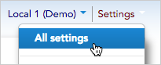
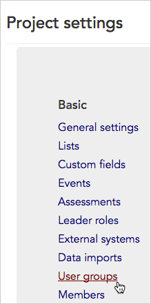
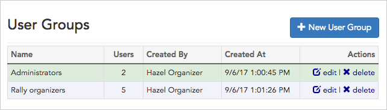

\[et\_pb\_section bb\_built="1" admin\_label="section"\]\[et\_pb\_row admin\_label="row" background\_position="top\_left" background\_repeat="repeat" background\_size="initial" \_builder\_version="3.0.105"\]\[et\_pb\_column type="4\_4"\]\[et\_pb\_text background\_position="top\_left" background\_repeat="repeat" background\_size="initial" \_builder\_version="3.0.105" background\_layout="light"\]

User groups allow you to pull users together into small groups to simplify sharing and communication tasks.

1. To get started, access **User Groups** by clicking **Settings** > **All settings** in the upper right corner of any page.

1. From the **Project settings page**, click the **Basic > User groups** link.

1. The **User groups index page** will open listing all of the existing user groups in your project.

1. From this page, you can:
    - See basic information about existing user groups like how many users they contain, who created them, and when.
    - Click the links to  **edit** or  **delete** your existing user groups.
    - Create a new group by clicking the **\+ New User Group** button in the upper-right corner of the page.

\[/et\_pb\_text\]\[/et\_pb\_column\]\[/et\_pb\_row\]\[/et\_pb\_section\]
