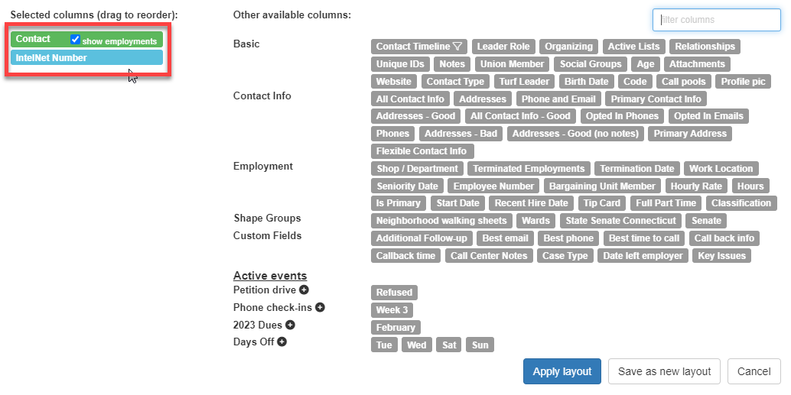
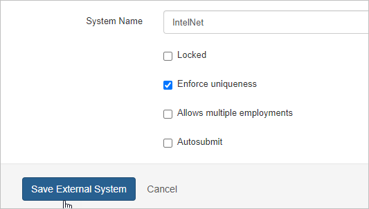
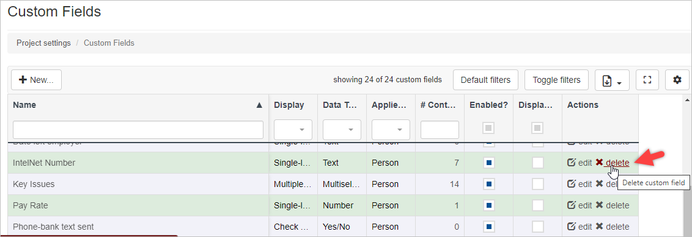
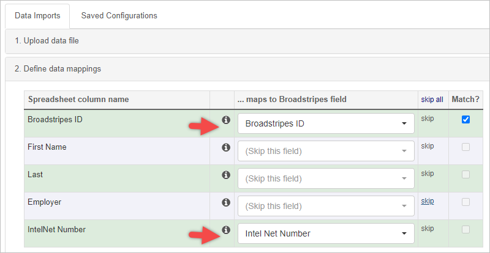

External Systems data consist of unique IDs that originate from sources outside the application, such as another database. These unique values are specific to individuals or organizations and can be used for matching when importing data into Broadstripes. Leveraging these unique values as an external system is a more efficient approach than assigning them as custom field values.

**NOTE:** It is not currently possible to match on a custom field, though we hope to add that feature in the near future.

This article focuses on extracting values in a Broadstripes custom field and converting them to a new external system ID. Using an example where we have a custom field named "IntelNet Number," we will export the current values into a spreadsheet and then import them into an external system field as follows:

1. 1. Search for all records in your project with a value in the custom field, i.e. IntelNetNumber = any.
    2. Create a simple layout with "IntelNet Number" as the only column alongside the "Contact" name field. 
    3. With the new layout, select all contacts who have an IntelNet Number. Using the Reports dropdown menu, select Spreadsheet (XLSX) or Spreadsheet (CSV).
    4. Create an [external system](https://help.broadstripes.com/help-articles/admin-tools/data-tools-admin/external-systems/) named "IntelNet Number." Make sure to select "Enforce uniqueness" and leave the other checkboxes unchecked. 
    5. Delete the "IntelNet Number" custom field. 
    6. In the downloaded spreadsheet from step 3, change the column header (i.e., the first row) for "IntelNet Number" to "IntelNet Number ID" (as Broadstripes auto-maps external system values on import).
    7. Save the spreadsheet with the changes.
    8. Create a [new data import](https://help.broadstripes.com/help-articles/admin-tools/project-settings/data-imports-settings/#ftoc-heading-4) and use the spreadsheet that was just saved.
    9. Ensure that the "Broadstripes ID" column (You will match on this.) and the "IntelNet ID" column are "mapped," while all other columns are "skipped." 
    10. **Submit** the Import.

After completing the import process, you can utilize the "IntelNet" external system ID for matching purposes in future imports, enhancing data management and accuracy in Broadstripes.
