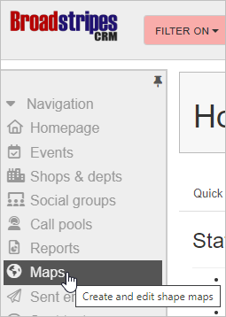
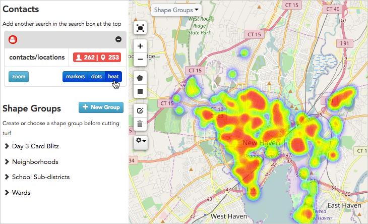
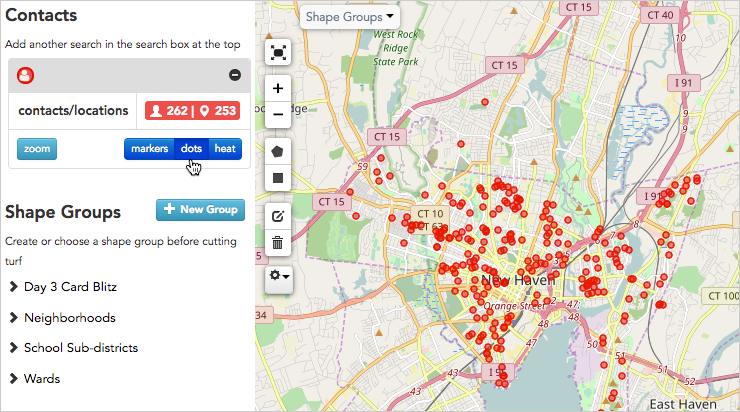
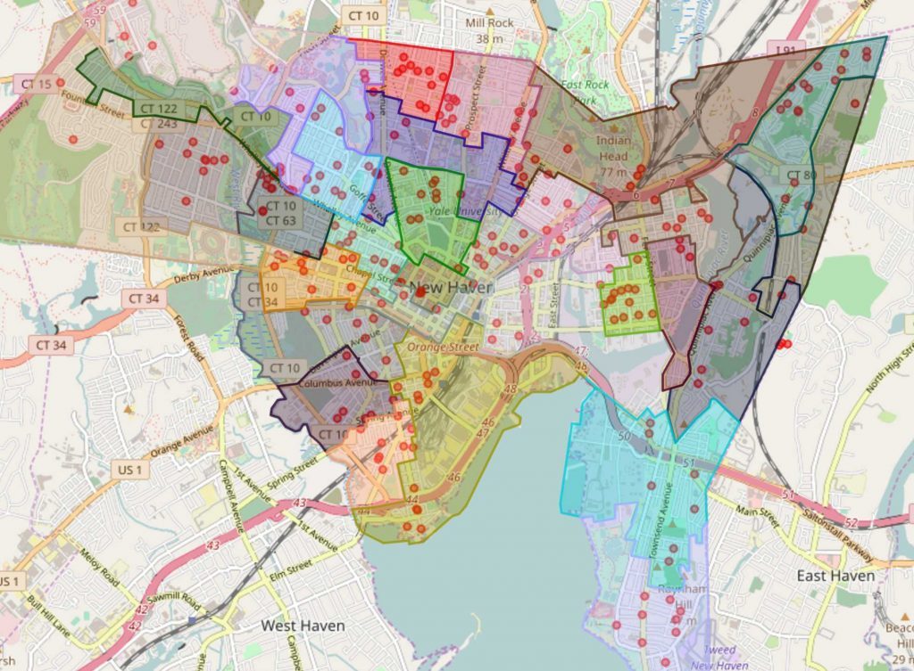

\[et\_pb\_section fb\_built="1" admin\_label="section" \_builder\_version="4.16" global\_colors\_info="{}"\]\[et\_pb\_row admin\_label="row" \_builder\_version="4.16" background\_size="initial" background\_position="top\_left" background\_repeat="repeat" global\_colors\_info="{}"\]\[et\_pb\_column type="4\_4" \_builder\_version="4.16" custom\_padding="|||" global\_colors\_info="{}" custom\_padding\_\_hover="|||"\]\[et\_pb\_text \_builder\_version="4.19.4" background\_size="initial" background\_position="top\_left" background\_repeat="repeat" hover\_enabled="0" global\_colors\_info="{}" sticky\_enabled="0"\]

## Get started

With Broadstripes' **Maps** feature, you can easily view any list of people on an interactive map.

1. Start by clicking the **Maps** link on the navigation panel.  
    
    
2. Clicking this link takes you to Broadstripes' **Maps** page. You'll see the location of every person in your project (who has a good address) pinpointed on the map that appears.
3. You can change the way contacts are marked by clicking the blue buttons in the left-hand panel: **markers, dots** or **heat**.\[caption id="attachment\_2259" align="aligncenter" width="730"\] Here are the same contacts shown as a heat map.\[/caption\]\[caption id="attachment\_2258" align="aligncenter" width="740"\] Here, all contacts are shown with dots.\[/caption\]
4. For a better look, you can zoom in or out using the **zoom controls** on the left-hand side of the map, or with the **plus** and **minus keys** on your keyboard.
5. The **Maps** page also allows you to work with geographic shapes, whether pre-loaded political districts or hand-cut turf. These shapes can be used for political outreach, planning house visits, and other geographically informed analysis of your people.

## Learn more

You can learn more about maps in the [Maps overview](https://help.broadstripes.com/help-articles/using-broadstripes/maps/maps-overview/) and [How maps work](https://help.broadstripes.com/help-articles/using-broadstripes/maps/how-maps-work/) articles.

\[/et\_pb\_text\]\[/et\_pb\_column\]\[/et\_pb\_row\]\[/et\_pb\_section\]
