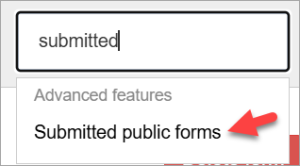
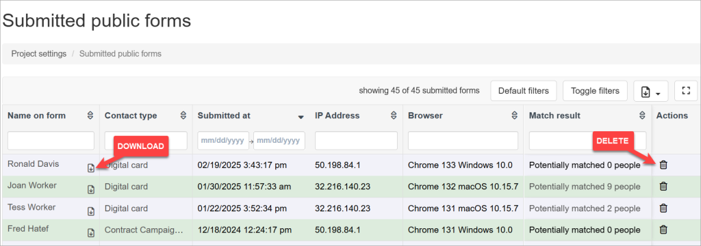
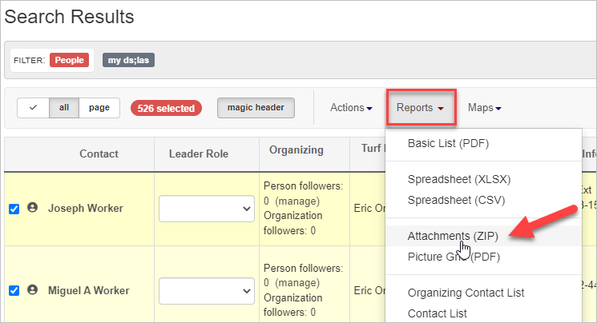
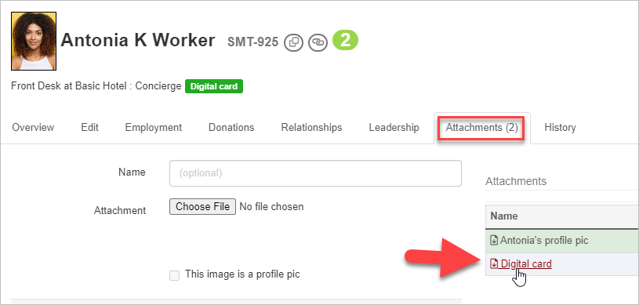

## Overview

Once public forms have been submitted, you may view or download them for printing or other purposes. Here is how:

## Viewing Public forms

1. In the upper right corner of any page, click **Settings** and type "Submitted" in the filter input box. 
2. Click the **Submitted public forms** option in the menu.
3. This will take you to a list of all the contacts that were matched or created by a submitted form in your project.
4. Next to each contact, you'll see an icon you can click to download a copy of that contact’s form.
5. The **Forms submitted** page provides key information about each submission, including:
    
    - Submission contact type (Name of the public form)
    - Date and time of submission
    - IP address of the submitter
    - Web browser used
    - Matching results for existing records
    
    At the end of each contact row, you'll find the option to **Delete** the form submission.
    
    > **Important**: Deleting a form submission will permanently remove both the form and the associated contact record from your Broadstripes project. This action cannot be undone, and the record cannot be retrieved after deletion.
    

## Searching for public Forms

If you are looking for a specific public form, you can **search for attachments** with that form's name. The search will return all records that have a downloadable attachment with that name.  

## Downloading Public Forms

You may **download** the PDF(s) created by a public form submission one at a time or in bulk. Here's how:

1. From the **search results** page, select one or more contacts with attached forms. If you are new to working with search results, this [Selecting (and deselecting) contacts](https://help.broadstripes.com/help-articles/using-broadstripes/working-with-search-results/selecting-deselecting-contacts/) article can show you how.
2. Next, go the **Reports** dropdown menu and select **Attachments**.
3. Broadstripes will generate a **zip file** containing the requested forms.  

_\*Note: This report will download all the attachments for each contact._

 

To view a single form, you may simply go to the person's record and download it from the **Attachments** tab. Click on the file with the name of the public form to download. 

By following these steps, you can efficiently manage, view, and download your submitted public forms.

- [Create a new contact type](https://help.broadstripes.com/help-articles/admin-tools/public-forms/first-step/) 
- [The "Standard fields" tab](https://help.broadstripes.com/help-articles/admin-tools/public-forms/standard-fields-tab-in-public-form/)
- [The "Timeline" tab](https://help.broadstripes.com/help-articles/admin-tools/public-forms/timeline-tab/)
- [The "Employment" tab](https://help.broadstripes.com/help-articles/admin-tools/public-forms/employment-tab/)
- [The "Form content" tab](https://help.broadstripes.com/help-articles/admin-tools/public-forms/form-content-tab/)
- [The "Email" tab](https://help.broadstripes.com/help-articles/admin-tools/public-forms/email-tab/)
- [The "Other options" tab](https://help.broadstripes.com/help-articles/admin-tools/public-forms/other-options-tab/)
- [Viewing and Downloading public forms](https://help.broadstripes.com/help-articles/admin-tools/public-forms/viewing-and-downloading-public-forms/)
