What are calculated columns?

Calculated columns allow administrators to create their own custom metrics.

Most fields in Broadstripes hold a single piece of information (for instance a person's first name or whether or not they've signed a card). With calculated columns, you can combine or manipulate information from multiple Broadstripes fields and display that _calculated_ data in a special custom field called a "**calculated column**."

Broadstripes' calculated columns fields are also dynamic – they update automatically to reflect any changes to the data they are calculating.

Calculated columns might sound complicated, but Broadstripes handles all the calculations and updates behind the scenes. Once they're created, calculated columns don't require any special handling by your users – they can usually be treated just like any other Broadstripes field.

# How to use calculated columns

Just like with custom fields, there's no limit to the number of calculated columns you can create, and you can include them easily in your project's status reports, custom layouts, or any user's turf panel.

## Examples of calculated columns

Here are a few of the many ways you can put calculated columns to work in your project.

* * *

### Show a progress bar on your turf panel

Calculated columns can show a progress indicator on your turf panel–for instance, how many cards have been signed at a certain location.

This user's **turf panel** includes a calculated column with a **progress bar** for signed cards at the Basic Hotel. It also shows that of 86 workers, a total of **65** cards (or **75%**) have been signed.

* * *

### Calculate totals for your reports

Calculated columns can also be used in reports. This **status report** uses a calculated column to show how many **cards were signed in the last week**. The report will update automatically each time it is run, so it will always calculate just the cards signed in the last seven days.

* * *

### List multiple workers in a single field

Calculted columns can be used to list multiple workers in a single column in your search results, for instance, to list each leader's hostile workers (in a single field). This **saved layout** includes a calculated column showing a list of each leader's **hostile followers**.

[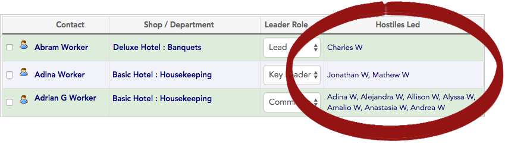](https://help.broadstripes.com/wp-content/uploads/2018/03/62a84d3-CalcColLayouts.png)

* * *

# Creating calculated columns

Now that you've learned what calculated columns are and what they can do, you're ready to learn how to use them to customize your project.

Learn how to create different types of calculated columns step-by-step in the sections below.

Use a calculated column:

## On the turf panel

In this section, we'll look at how to add a progress bar to a user's turf panel to show the status of a card-signing goal using a calculated column.

First, we'll **create the calculated column**, specifying the data we want calculated. For this example, we want to see the **number of cards signed by location**.

Once we create the calculated column, we'll **choose to have it show on the turf panel**. It will automatically appear in a progress bar format, showing total cards signed as both a number and percentage.

When we're finished, the result will look like this:

[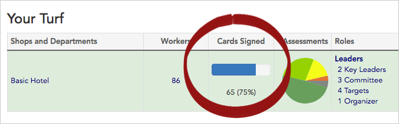](https://help.broadstripes.com/wp-content/uploads/2018/03/f8ff200-CalcColTurf.png)

### Create the calculated column

1. To get started, access **Calculated columns** by clicking **Settings** > **All settings** in the upper right corner of any page.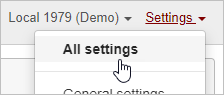

1. From the **Project settings page**, click the **Special features > Calculated columns** link.

[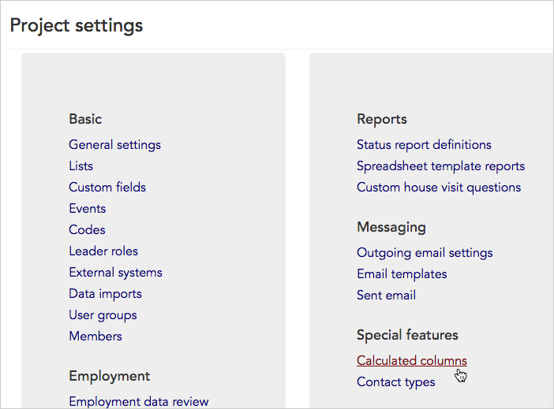](https://help.broadstripes.com/wp-content/uploads/2018/03/b7e7ae7-CalcColLink.png)

1. The **Calculated columns settings index page** will open, listing any calculated columns that have already been created for your project.
2. Since we want to create a new column, we'll click the **\+ New Calculated Column** button.

[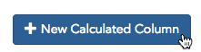](https://help.broadstripes.com/wp-content/uploads/2018/03/6198f0f-CalcColButton.png)

1. A **New Calculated Column form** will open.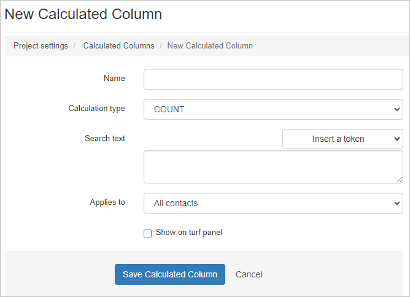

1. Start by giving the calculated column a **Name**. We'll use the name "**Cards Signed**," since it is short but descriptive enough that it will be understood by our users.
2. Next, choose the **Calculation type**. You may choose from several calculation types:\[table id=calccolumns /\] Since we want the total number of cards signed, we'll choose "**COUNT**."

 

1. We'll use the **Search text** field to specify the data we want Broadstripes to calculate.

Our complete **Search text** will look like this:

#### A note on search syntax and tokens

When creating search text for calculated columns, anything inside {curly brackets} is called a "**token**."

In the search text "_employer = {contact-broadstripes-id}_" above, the token is used to tell Broadstripes to **group and calculate the results by employer.** It also specifies that the results should be reported separately for each employer **according to the employer's unique contact-broadstripes-id**.

More common tokens you might use is: **_leader = {contact-broadstripes-id}_** (this reports results separately for each leader) or **_id = **{c**ontact-broadstripes-id}_** (when calculating data about an individual contact, e.g., amount of event steps checked for a worker)

1. For **Applies to**, we'll specify "**Organization**" rather than a person or all contacts. This helps Broadstripes understand that the calculated column should display data only when it is showing information about an organization; for other types of contacts the column will be left blank.
2. Finally, we'll **check** the **Show on the turf panel checkbox** so our calculated column will automatically appear on all users' turf panels.
3. Click to **Save Calculated Column**. Our completed form will look like this: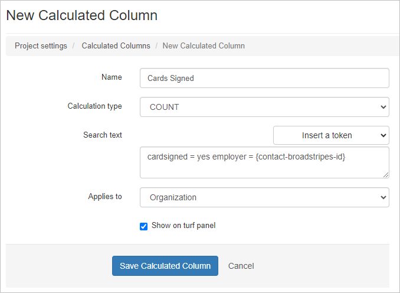

### View the calculated column on the turf panel

Now that we've created our new calculated column, we'll view it on the turf panel.

1. We'll open our turf panel by either clicking the **Broadstripes** logo at the top left corner of any page, or the **Homepage** link in the left-hand navigational toolbar.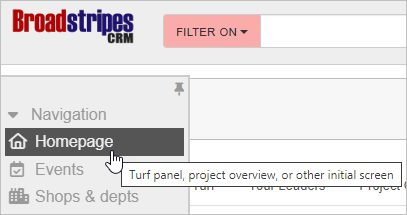

1. **Your Turf panel** will open automatically (if it doesn't, just click the **Your Turf** tab). You can see the new calculated column which displays signed cards by location as a **progress bar**. It also shows that of the 86 workers at the Basic Hotel, a total of **65** cards (or **75%**) have been signed.

## On a status report

In this section, we'll look at how to show data from a specific period of time on a status report using a calculated column.

First, we'll **create the calculated column**, specifying the data we want calculated. For this example, we want to see how many cards were signed by location in just the last seven days.

Once we create the calculated column, we'll **add it to our status report**. Once it's added to the report, the calculated column will recalculate the total each time the report is run, so we'll always see how many cards were signed in the last week.

When we're finished, the result will look like this:

### Create the calculated column

1. To get started, access **Calculated columns** by clicking **Settings** > **All settings** in the upper right corner of any page. 

1. From the **Project settings page**, click the **Special features > Calculated columns** link.

1. The **Calculated columns settings index page** will open, listing any calculated columns that have already been created for your project.
2. Since we want to create a new column, we'll click the **\+ New Calculated Column** button.

1. A **New Calculated Column form** will open.

1. Start by giving the calculated column a **Name**. We'll use the name "**Cards Signed in the Past Week**," since it is short but descriptive enough that it will be understood by our users.
2. Next, choose the **Calculation type**. Since we want the total number of cards signed, we'll choose "**COUNT**."
3. We'll use the **Search text** field to specify the data we want Broadstripes to calculate.

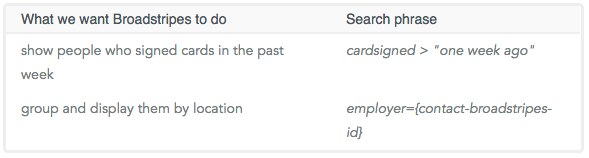 Our complete **Search text** will look like this:

#### A note on search syntax and tokens

**Natural language**: Broadstripes' search tools understand natural language search phrases like "one week ago" or "two months ago."

**Tokens:** When creating search text for calculated columns, anything inside {curly brackets} is called a "**token**." In the search text "_employer = {contact-broadstripes-id}_" above, the token is used to tell Broadstripes to **group and calculate the results by employer.** It also specifies that the results should be reported separately for each employer **according to the employer's unique contact-broadstripes-id**.

Another common token you might use is: **_leader = {contact-broadstripes-id}_** (this reports results separately for each leader)

1. For **Applies to**, we'll specify "**Organization**" rather than person or all contacts. This helps Broadstripes understand that the calculated column should display data only when it is showing information about an organization; for other types of contacts the column will be left blank.
2. We'll leave the **Show on the turf panel** checkbox **unchecked** since we only plan to use this on status reports.
3. Finally, we'll click **Save Calculated Column**. Our completed form will look like this:

[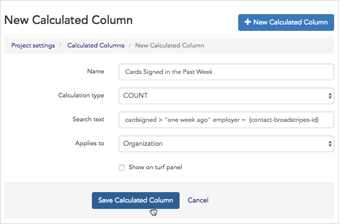](https://help.broadstripes.com/wp-content/uploads/2018/03/b8787df-CalcColStatusFormComplete.png)

### Add the calculated column to a status report

Now that we've created our new calculated column, we'll add it to our status report.

1. We'll open **Status report definitions" by clicking** Settings **>** Status reports\*\* in the upper right corner of any page.

[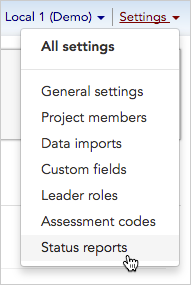](https://help.broadstripes.com/wp-content/uploads/2018/03/5d13173-CalcColStatusMenu.png)

1. The **Status report definitions index page** will open, listing any status reports for the project.
2. We want to add our new calculated column to our existing "**Card-signing report**," so we'll click the  **edit** link.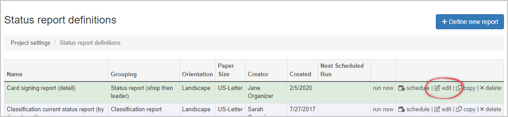

1. Once the editing window opens, click the **Columns** tab.

[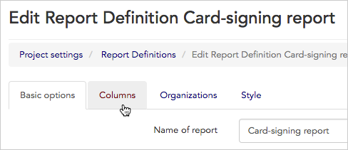](https://help.broadstripes.com/wp-content/uploads/2018/03/4f4eaf4-CalcColStatusReportColumnTab.png)

1. You'll see "**Selected Columns**" on the left and "**Available Columns**" on the right. Click "**Cards Signed in the Past Week**" from the **Calculated columns** section to add it to the report.

[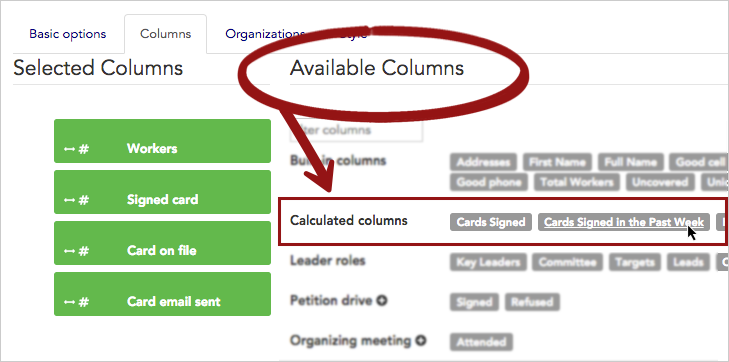](https://help.broadstripes.com/wp-content/uploads/2018/03/3f191be-CalcColStatusReportColumnSelect.png)

1. In the pop-up box that opens, we'll give the column the shortened label name "**Last 7 days**" to take up less room on the report layout.
2. We'll choose a **Vertical** label orientation and choose to "**Display as count**" so we'll see the total number of cards signed (rather than a percentage).
3. Click **Save** and you'll be returned to the **Columns tab**.

[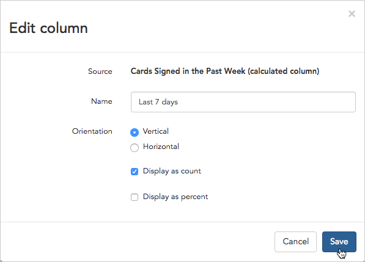](https://help.broadstripes.com/wp-content/uploads/2018/03/bcfc487-CalcColStatusReportColumnEdit.png)

1. On the **Columns tab** click **Save** again to keep the changes you made to your report. (On this page, you can also **drag and drop** the green **Selected Columns** to change the order they appear on the report).

[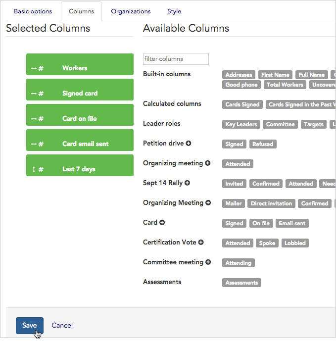](https://help.broadstripes.com/wp-content/uploads/2018/03/6ec4e9f-CalcColStatusReportColumnSave.png)

1. Once you've saved your changes, you can preview the updated report and see your new calculated column.
2. Click a **Preview button** to see the new report in whatever format you prefer. We'll choose HTML to view it on-screen immediately.

[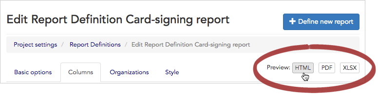](https://help.broadstripes.com/wp-content/uploads/2018/03/083287b-CalcColStatusReportColumnPreview.png)

1. Your status report will open, and you can see the new calculated column displaying cards signed by location in the last seven days.

[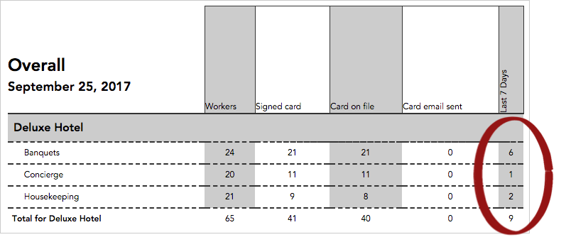](https://help.broadstripes.com/wp-content/uploads/2018/03/eaeea89-CalcColStatusRpts.png)

## On the search results

In this section, we'll look at how to list each leader's hostile workers (in a single field) in the search results layout using a calculated column.

First, we'll **create the calculated column**, specifying the data we want calculated. For this example, we want to see the names of hostile workers under each leader.

Once we create the calculated column, we'll **add it to a saved search results layout**. Once it's added to the layout, the calculated column will display the list of hostiles each time we view our search results.

When we're finished, our search results layout will look like this:

[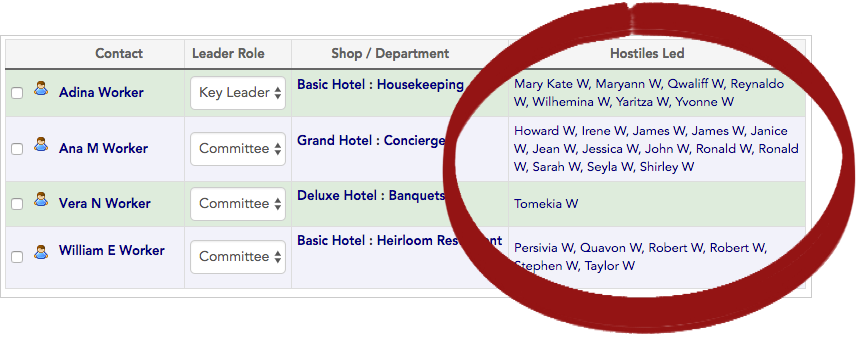](https://help.broadstripes.com/wp-content/uploads/2018/03/35c90ad-CalcColLayoutLayoutComplete2.png)

### Create the calculated column

1. To get started, access **Calculated columns** by clicking **Settings** > **All settings** in the upper right corner of any page.

1. From the **Project settings page**, click the **Special features > Calculated columns** link.

1. The **Calculated columns settings index page** will open, listing any calculated columns that have already been created for your project.
2. Since we want to create a new column, we'll click the **\+ New Calculated Column** button.

1. A **New Calculated Column form** will open.

1. Start by giving the calculated column a **Name**. We'll use the name "**Hostiles Led**," since it is short but descriptive enough that it will be understood by our users.
2. Next, choose the **Calculation type**. Since we want a list of all the hostile workers' names, we'll choose "**FIRSTNAMELASTINITIAL**."
3. We'll use the **Search text** field to specify the data we want Broadstripes to calculate.

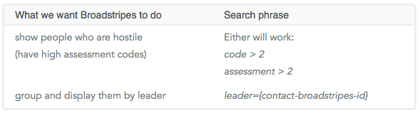

Our complete **Search text** will look like this:

[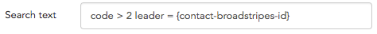](https://help.broadstripes.com/wp-content/uploads/2018/03/8174833-CalcColLayoutCodeComplete.png)

#### A note on search syntax and tokens

**Tokens:** When creating search text for calculated columns, anything inside {curly brackets} is called a "**token**." In the search text "_leader = {contact-broadstripes-id}_" above, the token is used to tell Broadstripes to **group and calculate the results by leader.** It also specifies that the results should be reported separately for each leader **according to the leader's unique contact-broadstripes-id**.

Another common token you might use is: **_employer = {contact-broadstripes-id}_** (this reports results separately for each location/employer)

1. For **Applies to**, we'll specify "**Person**" rather than organization or all contacts. This helps Broadstripes understand that the calculated column should display data only when it is showing information about a person; for other contact types, the column will be left blank.
2. We'll leave the **Show on the turf panel** checkbox **unchecked** since we only plan to use this on a search layout.
3. Finally, we'll click **Save Calculated Column**. Our completed form will look like this: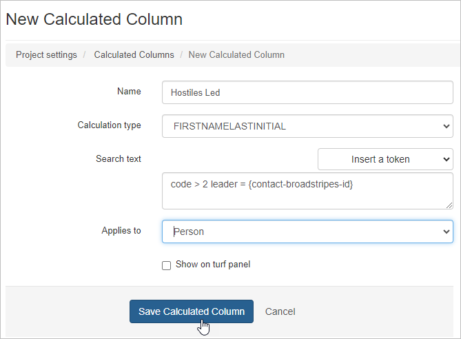

### Add the calculated column to a search results layout

Now that we've created our new calculated column, we'll add it to a search layout.

1. First, we'll **run a search** to show all of our leaders.

1. The search results will appear in the lower part of the window.

[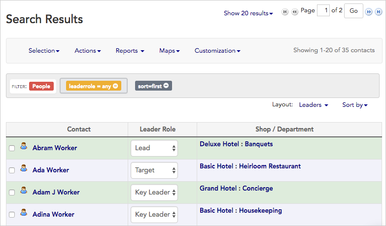](https://help.broadstripes.com/wp-content/uploads/2018/03/1ca624f-SearchresultsBefore.png)

1. Next, we'll **modify the layout** to include our new calculated column. Our default layout is a saved layout called "**Leaders**." Your layout will probably be named something different, but you can still follow the same steps. Choose "**Modify layout**" from the **Layout drop-down menu.**

[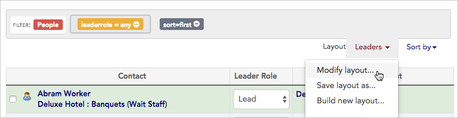](https://help.broadstripes.com/wp-content/uploads/2018/03/790d28f-CalcColLayoutModLayout.png)

1. Using the layout-building tool that opens, we'll **click once** on the new calculated column "**Hostiles Led**" listed under **Other available columns** to include it in the layout.

[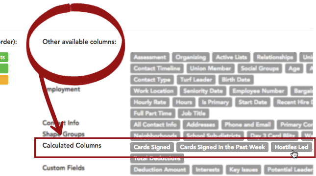](https://help.broadstripes.com/wp-content/uploads/2018/03/edfd7d3-CalcColLayoutLayoutAddZoom.png)

1. Next, we'll click the **Save changes** button at the bottom of the layout builder to permanently add it to our saved layout.

[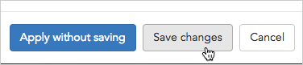](https://help.broadstripes.com/wp-content/uploads/2018/03/0197178-CalcColLayoutLayoutAddSave.png)

1. Our search results window will open again, and we can now see the names of all hostile workers listed by their leaders.

