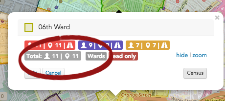

\[et\_pb\_section fb\_built="1" admin\_label="section" \_builder\_version="4.16" global\_colors\_info="{}"\]\[et\_pb\_row admin\_label="row" \_builder\_version="4.16" background\_size="initial" background\_position="top\_left" background\_repeat="repeat" global\_colors\_info="{}"\]\[et\_pb\_column type="4\_4" \_builder\_version="4.16" custom\_padding="|||" global\_colors\_info="{}" custom\_padding\_\_hover="|||"\]\[et\_pb\_text \_builder\_version="4.24.2" background\_size="initial" background\_position="top\_left" background\_repeat="repeat" global\_colors\_info="{}"\]

## Understanding map shapes and shape groups

### Shapes

A **shape** is a user-defined area of the Broadstripes map (for instance a voting ward, neighborhood, or school district). Any people in your project who are located within a shape you've drawn are considered a part of that shape.

Broadstripes allows you to create your own shapes – for instance, to define house-visit assignments or manage other neighborhood-based organizing. This is sometimes called cutting turf. Broadstripes can also provide complicated [pre-made shapes](https://help.broadstripes.com/help-articles/using-broadstripes/maps/uploading-shape-files/), like state legislative districts, whose borders are defined by law, and may change over time.

### Shape groups

A **shape group** is a collection of shapes. Like shapes, shape groups are totally customizable. You can create a shape group, name it, and decide exactly which shapes you want to include in the group. If you change your mind, you can easily add or remove shapes from the group.

\[caption id="" align="aligncenter" width="1363"\] **Shape groups** can be simple (left) or more complex (center). Individual **shapes** (right) are assembled to make shape groups.\[/caption\]

## Viewing people on a map using shapes and shape groups

Once they are set up, shapes provide a simple way to navigate and assess your contacts by their location.

1. To see groups of people using the shapes feature, start by clicking the **Shape Groups** drop-down menu in the upper left-hand corner of the map. (For help getting to the map page, see the [Maps overview](https://help.broadstripes.com/help-articles/using-broadstripes/maps/maps-overview/) article.)

1. Choose the shape group you want displayed on the map by clicking the **checkbox** next to its name. For this example, I'm interested in comparing the number of voters in each of the city's wards, so I'll check **Wards**.
2. The map will instantly **display all the shapes** in the selected shape group. You can see below that the **Wards** shape group is made of 30 individual shapes.

1. Each shape is defined by an outline and a unique color. To get detailed information about the people located inside a certain shape, just mouse-over the map and **click anywhere on that shape**.

1. A pop-up box will open, displaying a **head count** for the people located in that shape.

For instance, in our example below, out of the total number of people in the "Wards" shape group, you can see that the **"06th Ward" shape** contains a total of 11 people (and 11 locations).

1. As shown below, you can also see summaries that correspond with the three current **searches** that have been applied to the map.
    
    Search summaries give tallies for just the contacts _within_ the selected shape:
    

- **Red** shows _everyone in our project_. (There are 11 people in the **6th Ward shape**.)
- **Purple** shows the results of a search for people who have _assessments <= 3_. (9 people)
- **Yellow** shows the results of a search for people who have _assessments <= 2_. (7 people)

1. From this same pop-up box, you can also launch some other helpful tasks:

- You can click **edit** to rename the shape or change its shape group.

- You can make the shape **read-only** and prevent other users from altering your shape.

- You can also launch the **driving directions** generator. Click the **road icon** to have Broadstripes create turn-by-turn directions to the houses encompassed in the search. **Note:** driving directions are offered only for shapes that contain 24 people or fewer.

1. 1. If you'd like to make new shapes and shape groups or edit the shapes you have, you can learn about that next in the "Make a shape" and "Edit a shape" sections below.

# Make a shape

While the Broadstripes **Maps** feature has the power to show you all of your people across the entire region covered by your Broadstripes project, the **Shapes** feature gives you the ability to cut that turf into as many smaller, user-defined regions as you need.

These shapes can be used for political outreach, planning house visits, and any other task or analysis that's contingent on the geographic location of your people.

## Draw a polygon shape

Define a section of the map using a free-form multi-sided shape.

1. Start by clicking the **polygon icon** on the map toolbar.

1. Next, **click on the map** where you want your shape to start. **Continue to click** around the edges of the region you want to outline — each click will create an anchor point along the shape's perimeter. Your shape doesn't have to be perfect – Broadstripes can help you fit it to the streets on the map more closely in a later step. You can also go back later and manually adjust it.

1. When you're happy with the outline of your shape, **click on the first point** you drew to close and complete the shape.

1. 1. Your new shape will automatically be **named** and **assigned a color.**
    2. Each shape you create will also automatically be saved as part of a **shape group**. By default, new shapes will be saved under the first shape group listed in the left-hand panel (or under a shape group labeled "Ungrouped" if you don't have any shape groups in your project yet).

1. To see all the shapes in a shape group, click the  **arrow or caret icon** next to the group's name as shown below. This will expand the shape group and show you each individual shape that's part of the group.

\[caption id="attachment\_2869" align="aligncenter" width="497"\] **Expand** a shape group by clicking the **caret** icon (left image). The individual shapes in the group are all displayed below the shape group (right image).\[/caption\]

1. If you need to make changes to your shape – rename it, change the group it's in, or modify the boundaries – those are covered in the "Edit a shape" section below.

## Draw a rectangle shape

Rectangles allow you to divide areas into shapes quickly, but with somewhat less precision than the polygon tool.

1. On the map, start at one corner of the rectangle you want to create. **Click and hold down**the mouse, then **drag across the map** until you've created the size rectangle you need to cover your entire shape area.
2. **Release** your mouse, and your new rectangle shape will be created.

1. You can **edit** the shape name or shape group that it's part of just as you would with a polygon shape (read more in the "Edit a shape" section below).
2. You might find that rectangles don't match up well with the orientation of the streets of your city. Although you can't rotate a rectangle, you can alter the rectangle's borders by manually moving points of the outline, as explained below.

# Edit a shape

### Make changes to any shape on your map.

After you've created shapes on your Broadstripes map, it's simple to make changes. You can rename a shape or even make it part of another shape group. You can also make it read-only, or modify its boundaries.

Here's how:

## Edit a shape's name or shape group (or make it read-only)

1. On the map, **click anywhere inside the shape** you want to change to select it, then click the **Edit** button.

1. A dialog box will open.
    - You can type a new **Shape name** to rename it.
    - You can reassign the shape to another shape group using the **Shape group drop-down list**.
    - Click **Read Only** if you don't want other users to make changes to your shape.
2. As shown in the image below, for this example, we've changed the name of our shape from "**Shape012**" to "**Jill's House visits**" and chosen to include the shape in the "**Day 3 Card Blitz**" shape group.

1. Click **Save**.

## Fine-tune the border of a shape

You can always adjust the outline of a shape by moving the points along the shape's border to redefine its outline. Here's how to make manual adjustments to the border of a polygon shape you've drawn:

### Adjust a shape's border

1. Start by clicking the **edit layers icon** to adjust a shape's borders.

1. This will display the square white **anchor points** that define the border of your shape.
    - **Click and drag** any anchor point to **reposition** it and change the outline of your shape.
    - **Double-click** an anchor point to **delete** it from the shape's outline.

1. When you're done making adjustments to the shape's outline, click **Save** in the map toolbar (or click **Cancel** to undo). Once you've clicked "Save", the changes can't be undone.

\[/et\_pb\_text\]\[/et\_pb\_column\]\[/et\_pb\_row\]\[/et\_pb\_section\]
