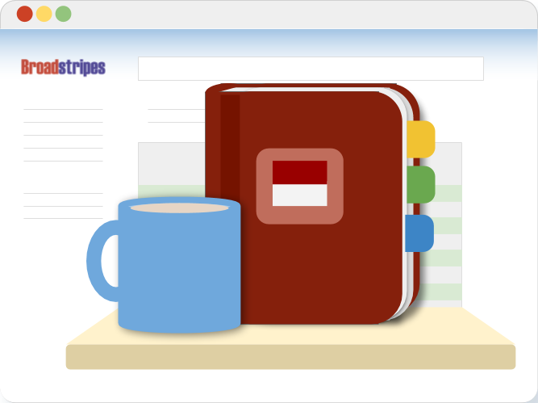
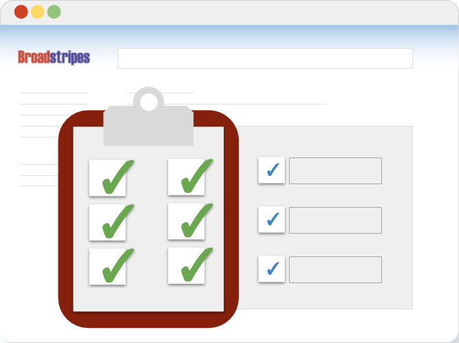
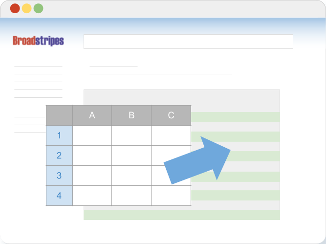
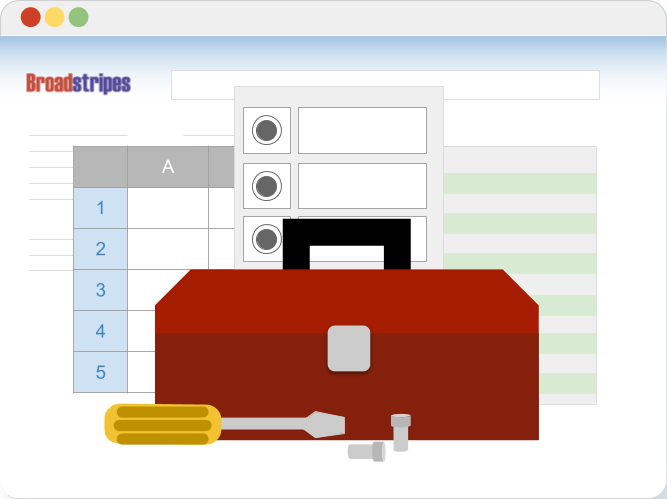
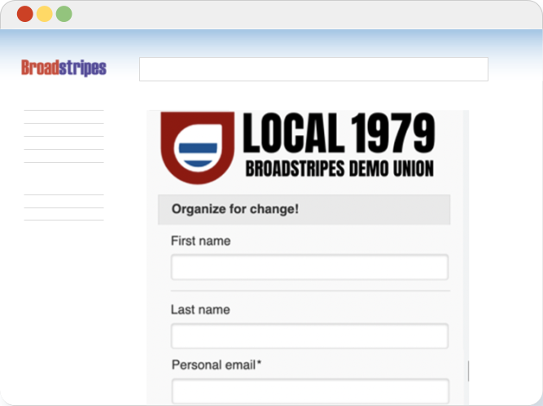

\[et\_pb\_section fb\_built="1" fullwidth="on" \_builder\_version="4.16" background\_image="https://help.broadstripes.com/wp-content/uploads/2018/02/isometropolis.jpg" background\_size="initial" background\_position="bottom\_right" background\_repeat="repeat" custom\_padding="0px|0px|0px|0px" hover\_enabled="0" global\_colors\_info="{}" sticky\_enabled="0"\]\[et\_pb\_fullwidth\_header title="Admin Guides" button\_one\_url="https://help.broadstripes.com/help-guides/" background\_overlay\_color="rgba(122,17,13,0)" \_builder\_version="4.16" title\_font="Lato|900|||||||" title\_font\_size="60px" content\_font="Nunito Sans|300|||||||" content\_font\_size="24px" background\_color="rgba(255, 255, 255, 0)" use\_background\_color\_gradient="on" background\_color\_gradient\_direction="50deg" background\_color\_gradient\_stops="#610505 52%|rgba(94,0,0,0.49) 100%" background\_color\_gradient\_overlays\_image="on" background\_color\_gradient\_start="#610505" background\_color\_gradient\_start\_position="52%" background\_color\_gradient\_end="rgba(94,0,0,0.49)" button\_one\_icon="=||divi||400" custom\_padding="|||80px" custom\_padding\_tablet="" custom\_padding\_phone="|0px||0px|false|false" custom\_padding\_last\_edited="on|desktop" module\_alignment\_tablet="" module\_alignment\_phone="center" module\_alignment\_last\_edited="on|phone" global\_colors\_info="{}" button\_one\_text\_size\_\_hover\_enabled="off" button\_two\_text\_size\_\_hover\_enabled="off" button\_one\_text\_color\_\_hover\_enabled="off" button\_two\_text\_color\_\_hover\_enabled="off" button\_one\_border\_width\_\_hover\_enabled="off" button\_two\_border\_width\_\_hover\_enabled="off" button\_one\_border\_color\_\_hover\_enabled="off" button\_two\_border\_color\_\_hover\_enabled="off" button\_one\_border\_radius\_\_hover\_enabled="off" button\_two\_border\_radius\_\_hover\_enabled="off" button\_one\_letter\_spacing\_\_hover\_enabled="off" button\_two\_letter\_spacing\_\_hover\_enabled="off" button\_one\_bg\_color\_\_hover\_enabled="off" button\_two\_bg\_color\_\_hover\_enabled="off"\]

Your admin-only guide to setting up a project, running data imports, and managing users

\[/et\_pb\_fullwidth\_header\]\[/et\_pb\_section\]\[et\_pb\_section fb\_built="1" \_builder\_version="4.16" custom\_padding="0px|0px|49.3125px|0px" hover\_enabled="0" global\_colors\_info="{}" sticky\_enabled="0"\]\[et\_pb\_row \_builder\_version="4.16" width="70%" width\_tablet="" width\_phone="75%" width\_last\_edited="on|phone" module\_alignment="center" custom\_margin="51px|auto||auto||" custom\_padding="21px|17px|25px|33px|false|false" border\_radii="on|8px|8px|8px|8px" border\_width\_all="1px" border\_color\_all="rgba(160,160,160,0.5)" box\_shadow\_style="preset3" box\_shadow\_color="rgba(0,0,0,0.22)" global\_colors\_info="{}"\]\[et\_pb\_column type="4\_4" \_builder\_version="4.16" custom\_padding="|||" global\_colors\_info="{}" custom\_padding\_\_hover="|||"\]\[et\_pb\_text admin\_label="Getting started with a new project" \_builder\_version="4.16" text\_line\_height="1.4em" header\_2\_text\_color="#e09900" header\_2\_font\_size="30px" custom\_margin="||0px|" custom\_padding="|27px|0px|||" global\_colors\_info="{}"\]

## **​Getting started with a new project**

\[/et\_pb\_text\]\[et\_pb\_text admin\_label="Getting started with a new project" \_builder\_version="4.16" text\_line\_height="1.4em" header\_text\_color="#037a09" header\_font\_size="40px" header\_2\_font="|800|||||||" header\_2\_text\_color="#8c0900" header\_2\_font\_size="30px" header\_4\_text\_color="#707070" header\_6\_text\_color="#6b6b6b" custom\_margin="||0px|" custom\_margin\_tablet="" custom\_margin\_phone="" custom\_margin\_last\_edited="on|desktop" custom\_padding="|25px|0px|65px|false|false" custom\_padding\_tablet="" custom\_padding\_phone="|10px||10px|false|false" custom\_padding\_last\_edited="on|desktop" global\_colors\_info="{}"\]

#### All you need to know to get started – including customizing a project, preparing and importing spreadsheet data, and inviting users.

\[/et\_pb\_text\]\[et\_pb\_text admin\_label="Dynamic list of articles" \_builder\_version="4.27.0" custom\_padding="|||10%|false|false" global\_colors\_info="{}"\]

#### \[catlist id=34 numberposts=4 orderby="menu\_order"\]

\[/et\_pb\_text\]\[/et\_pb\_column\]\[/et\_pb\_row\]\[et\_pb\_row \_builder\_version="4.16" width="70%" width\_tablet="" width\_phone="75%" width\_last\_edited="on|phone" module\_alignment="center" custom\_margin="51px|auto||auto||" custom\_padding="21px|17px|25px|33px|false|false" border\_radii="on|8px|8px|8px|8px" border\_width\_all="1px" border\_color\_all="rgba(160,160,160,0.5)" box\_shadow\_style="preset3" box\_shadow\_color="rgba(0,0,0,0.22)" global\_colors\_info="{}"\]\[et\_pb\_column type="4\_4" \_builder\_version="4.16" custom\_padding="|||" global\_colors\_info="{}" custom\_padding\_\_hover="|||"\]\[et\_pb\_text admin\_label="Text-Project settings" \_builder\_version="4.16" text\_line\_height="1.4em" header\_text\_color="#037a09" header\_font\_size="40px" header\_2\_font="|800|||||||" header\_2\_text\_color="#8c0900" header\_2\_font\_size="30px" header\_4\_text\_color="#707070" header\_6\_text\_color="#6b6b6b" custom\_margin="||0px|" custom\_padding="|22px|0px|||" global\_colors\_info="{}"\]

## **​Project settings**

\[/et\_pb\_text\]\[et\_pb\_text admin\_label="Text-Project settings" \_builder\_version="4.16" text\_line\_height="1.4em" header\_text\_color="#037a09" header\_font\_size="40px" header\_2\_font="|800|||||||" header\_2\_text\_color="#8c0900" header\_2\_font\_size="30px" header\_4\_text\_color="#707070" header\_6\_text\_color="#6b6b6b" custom\_margin="||0px|" custom\_margin\_tablet="" custom\_margin\_phone="" custom\_margin\_last\_edited="on|desktop" custom\_padding="|25px|0px|65px|false|false" custom\_padding\_tablet="" custom\_padding\_phone="|10px||10px|false|false" custom\_padding\_last\_edited="on|desktop" global\_colors\_info="{}"\]

#### As the admin of your Broadstripes project, you have a lot to keep track of. The Project settings page gives you a single access point for all your admin tools, making your job a little simpler.

\[/et\_pb\_text\]\[et\_pb\_text admin\_label="Dynamic list of articles" \_builder\_version="4.16" custom\_padding="|||10%|false|false" global\_colors\_info="{}"\]

#### \[catlist name="project-settings" numberposts=100 orderby="menu\_order" order=asc\]

\[/et\_pb\_text\]\[/et\_pb\_column\]\[/et\_pb\_row\]\[et\_pb\_row \_builder\_version="4.16" width="70%" width\_tablet="" width\_phone="75%" width\_last\_edited="on|phone" module\_alignment="center" custom\_margin="51px|auto||auto||" custom\_padding="21px|17px|25px|33px|false|false" border\_radii="on|8px|8px|8px|8px" border\_width\_all="1px" border\_color\_all="rgba(160,160,160,0.5)" box\_shadow\_style="preset3" box\_shadow\_color="rgba(0,0,0,0.22)" global\_colors\_info="{}"\]\[et\_pb\_column type="4\_4" \_builder\_version="4.16" custom\_padding="|||" global\_colors\_info="{}" custom\_padding\_\_hover="|||"\]\[et\_pb\_text admin\_label="Text-Import" \_builder\_version="4.16" text\_line\_height="1.4em" header\_font="||||||||" header\_2\_font="|800|||||||" header\_2\_text\_color="#e09900" header\_2\_font\_size="30px" custom\_margin="||0px|" custom\_padding="|22px|0px|||" header\_2\_font\_size\_last\_edited="off|" global\_colors\_info="{}"\]

## **Data Import**

\[/et\_pb\_text\]\[et\_pb\_text admin\_label="Text-Import" \_builder\_version="4.16" text\_line\_height="1.4em" header\_text\_color="#037a09" header\_font\_size="40px" header\_2\_font="|800|||||||" header\_2\_text\_color="#8c0900" header\_2\_font\_size="30px" header\_4\_text\_color="#707070" header\_6\_text\_color="#6b6b6b" custom\_margin="||0px|" custom\_margin\_tablet="" custom\_margin\_phone="" custom\_margin\_last\_edited="on|desktop" custom\_padding="|25px|0px|65px|false|false" custom\_padding\_tablet="" custom\_padding\_phone="|10px||10px|false|false" custom\_padding\_last\_edited="on|desktop" global\_colors\_info="{}"\]

#### Learn about bringing spreadsheet data into Broadstripes.

\[/et\_pb\_text\]\[et\_pb\_text admin\_label="Dynamic list of articles" \_builder\_version="4.16" custom\_padding="|||10%|false|false" global\_colors\_info="{}"\]

#### \[catlist name="data-import-admin" numberposts=100 orderby=menu\_order order=asc\]

\[/et\_pb\_text\]\[/et\_pb\_column\]\[/et\_pb\_row\]\[et\_pb\_row \_builder\_version="4.16" width="70%" width\_tablet="" width\_phone="75%" width\_last\_edited="on|phone" module\_alignment="center" custom\_margin="51px|auto||auto||" custom\_padding="21px|17px|25px|33px|false|false" border\_radii="on|8px|8px|8px|8px" border\_width\_all="1px" border\_color\_all="rgba(160,160,160,0.5)" box\_shadow\_style="preset3" box\_shadow\_color="rgba(0,0,0,0.22)" global\_colors\_info="{}"\]\[et\_pb\_column type="4\_4" \_builder\_version="4.16" custom\_padding="|||" global\_colors\_info="{}" custom\_padding\_\_hover="|||"\]\[et\_pb\_text admin\_label="Text-Data Tools" \_builder\_version="4.16" text\_line\_height="1.4em" header\_font="||||||||" header\_text\_color="#037a09" header\_font\_size="40px" header\_2\_font="|800|||||||" header\_2\_text\_color="#4b8416" header\_2\_font\_size="30px" header\_4\_text\_color="#707070" header\_6\_text\_color="#6b6b6b" custom\_margin="||0px|" custom\_padding="|22px|0px|||" global\_colors\_info="{}"\]

## ​Data Tools

\[/et\_pb\_text\]\[et\_pb\_text admin\_label="Text-Data Tools" \_builder\_version="4.16" text\_line\_height="1.4em" header\_text\_color="#037a09" header\_font\_size="40px" header\_2\_font="|800|||||||" header\_2\_text\_color="#8c0900" header\_2\_font\_size="30px" header\_4\_text\_color="#707070" header\_6\_text\_color="#6b6b6b" custom\_margin="||0px|" custom\_margin\_tablet="" custom\_margin\_phone="" custom\_margin\_last\_edited="on|desktop" custom\_padding="|25px|0px|65px|false|false" custom\_padding\_tablet="" custom\_padding\_phone="|10px||10px|false|false" custom\_padding\_last\_edited="on|desktop" global\_colors\_info="{}"\]

#### Where does my data belong? Take a deep dive into Broadstripes' different custom data tools and their intended uses.

\[/et\_pb\_text\]\[et\_pb\_text admin\_label="Dynamic list of articles" \_builder\_version="4.16" custom\_padding="|||10%|false|false" global\_colors\_info="{}"\]

#### \[catlist name="data-tools-admin" numberposts=100 orderby="menu\_order" order=asc\]

\[/et\_pb\_text\]\[/et\_pb\_column\]\[/et\_pb\_row\]\[et\_pb\_row \_builder\_version="4.16" width="70%" width\_tablet="" width\_phone="75%" width\_last\_edited="on|phone" module\_alignment="center" custom\_margin="51px|auto||auto||" custom\_padding="21px|17px|25px|33px|false|false" border\_radii="on|8px|8px|8px|8px" border\_width\_all="1px" border\_color\_all="rgba(160,160,160,0.5)" box\_shadow\_style="preset3" box\_shadow\_color="rgba(0,0,0,0.22)" global\_colors\_info="{}"\]\[et\_pb\_column type="4\_4" \_builder\_version="4.16" custom\_padding="|||" global\_colors\_info="{}" custom\_padding\_\_hover="|||"\]\[et\_pb\_text admin\_label="Text-Project settings" \_builder\_version="4.27.0" text\_line\_height="1.4em" header\_text\_color="#037a09" header\_font\_size="40px" header\_2\_font="|800|||||||" header\_2\_text\_color="#8c0900" header\_2\_font\_size="30px" header\_4\_text\_color="#707070" header\_6\_text\_color="#6b6b6b" custom\_margin="||0px|" custom\_padding="|22px|0px|||" global\_colors\_info="{}"\]

## **​Public Forms**

\[/et\_pb\_text\]\[et\_pb\_text admin\_label="Text-Project settings" \_builder\_version="4.27.0" text\_line\_height="1.4em" header\_text\_color="#037a09" header\_font\_size="40px" header\_2\_font="|800|||||||" header\_2\_text\_color="#8c0900" header\_2\_font\_size="30px" header\_4\_text\_color="#707070" header\_6\_text\_color="#6b6b6b" custom\_margin="||0px|" custom\_margin\_tablet="" custom\_margin\_phone="" custom\_margin\_last\_edited="on|desktop" custom\_padding="|25px|0px|65px|false|false" custom\_padding\_tablet="" custom\_padding\_phone="|10px||10px|false|false" custom\_padding\_last\_edited="on|desktop" global\_colors\_info="{}"\]

#### Collect important data like survey responses, contact info or card signatures from anyone with access to the Web. Public forms are fully customizable and can be shared with others by simply sending out a Web link, and all responses are stored in Broadstripes.

\[/et\_pb\_text\]\[et\_pb\_text admin\_label="Dynamic list of articles" \_builder\_version="4.27.0" custom\_padding="|||10%|false|false" global\_colors\_info="{}"\]

#### \[catlist name="public-forms" numberposts=100 orderby="menu\_order" order=asc\]

\[/et\_pb\_text\]\[/et\_pb\_column\]\[/et\_pb\_row\]\[et\_pb\_row \_builder\_version="4.16" background\_size="initial" background\_position="top\_left" background\_repeat="repeat" global\_colors\_info="{}"\]\[et\_pb\_column type="4\_4" \_builder\_version="4.16" custom\_padding="|||" global\_colors\_info="{}" custom\_padding\_\_hover="|||"\]\[et\_pb\_divider show\_divider="off" \_builder\_version="4.16" max\_width="84%" module\_alignment="center" height="0px" global\_colors\_info="{}"\]

\[/et\_pb\_divider\]\[/et\_pb\_column\]\[/et\_pb\_row\]\[et\_pb\_row column\_structure="1\_4,1\_2,1\_4" make\_equal="on" \_builder\_version="4.16" background\_size="initial" background\_position="top\_left" background\_repeat="repeat" global\_colors\_info="{}"\]\[et\_pb\_column type="1\_4" \_builder\_version="4.16" custom\_padding="|||" global\_colors\_info="{}" custom\_padding\_\_hover="|||"\]\[/et\_pb\_column\]\[et\_pb\_column type="1\_2" \_builder\_version="4.16" custom\_padding="|||" global\_colors\_info="{}" custom\_padding\_\_hover="|||"\]\[et\_pb\_search exclude\_pages="off" placeholder="Search the knowledge base" \_builder\_version="4.16" global\_colors\_info="{}" button\_text\_size\_\_hover\_enabled="off" button\_one\_text\_size\_\_hover\_enabled="off" button\_two\_text\_size\_\_hover\_enabled="off" button\_text\_color\_\_hover\_enabled="off" button\_one\_text\_color\_\_hover\_enabled="off" button\_two\_text\_color\_\_hover\_enabled="off" button\_border\_width\_\_hover\_enabled="off" button\_one\_border\_width\_\_hover\_enabled="off" button\_two\_border\_width\_\_hover\_enabled="off" button\_border\_color\_\_hover\_enabled="off" button\_one\_border\_color\_\_hover\_enabled="off" button\_two\_border\_color\_\_hover\_enabled="off" button\_border\_radius\_\_hover\_enabled="off" button\_one\_border\_radius\_\_hover\_enabled="off" button\_two\_border\_radius\_\_hover\_enabled="off" button\_letter\_spacing\_\_hover\_enabled="off" button\_one\_letter\_spacing\_\_hover\_enabled="off" button\_two\_letter\_spacing\_\_hover\_enabled="off" button\_bg\_color\_\_hover\_enabled="off" button\_one\_bg\_color\_\_hover\_enabled="off" button\_two\_bg\_color\_\_hover\_enabled="off"\]

\[/et\_pb\_search\]\[/et\_pb\_column\]\[et\_pb\_column type="1\_4" \_builder\_version="4.16" custom\_padding="|||" global\_colors\_info="{}" custom\_padding\_\_hover="|||"\]\[et\_pb\_button button\_url="https://help.broadstripes.com/using-broadstripes/" button\_text="Go to User Help Guides" button\_alignment="right" admin\_label="Using Broadstripes Button" \_builder\_version="4.16" custom\_button="on" button\_text\_size="13px" button\_text\_color="rgba(6,102,165,0.84)" button\_border\_color="rgba(6,102,165,0.84)" button\_icon="E||divi||400" button\_icon\_color="rgba(6,102,165,0.84)" button\_on\_hover="off" button\_text\_color\_hover="rgba(6,102,165,0.97)" saved\_tabs="all" global\_colors\_info="{}" button\_text\_size\_\_hover\_enabled="off" button\_one\_text\_size\_\_hover\_enabled="off" button\_two\_text\_size\_\_hover\_enabled="off" button\_text\_color\_\_hover\_enabled="on" button\_text\_color\_\_hover="rgba(6,102,165,0.97)" button\_one\_text\_color\_\_hover\_enabled="off" button\_two\_text\_color\_\_hover\_enabled="off" button\_border\_width\_\_hover\_enabled="off" button\_one\_border\_width\_\_hover\_enabled="off" button\_two\_border\_width\_\_hover\_enabled="off" button\_border\_color\_\_hover\_enabled="off" button\_one\_border\_color\_\_hover\_enabled="off" button\_two\_border\_color\_\_hover\_enabled="off" button\_border\_radius\_\_hover\_enabled="off" button\_one\_border\_radius\_\_hover\_enabled="off" button\_two\_border\_radius\_\_hover\_enabled="off" button\_letter\_spacing\_\_hover\_enabled="off" button\_one\_letter\_spacing\_\_hover\_enabled="off" button\_two\_letter\_spacing\_\_hover\_enabled="off" button\_bg\_color\_\_hover\_enabled="off" button\_one\_bg\_color\_\_hover\_enabled="off" button\_two\_bg\_color\_\_hover\_enabled="off"\]\[/et\_pb\_button\]\[/et\_pb\_column\]\[/et\_pb\_row\]\[/et\_pb\_section\]
