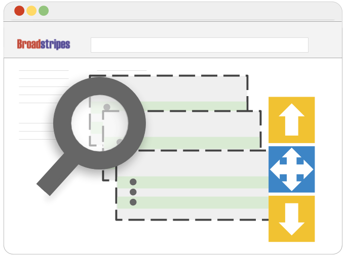
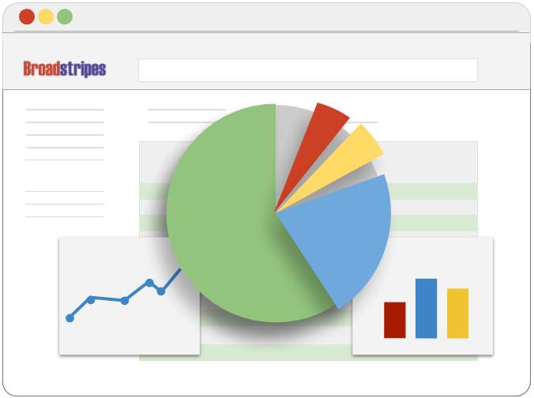
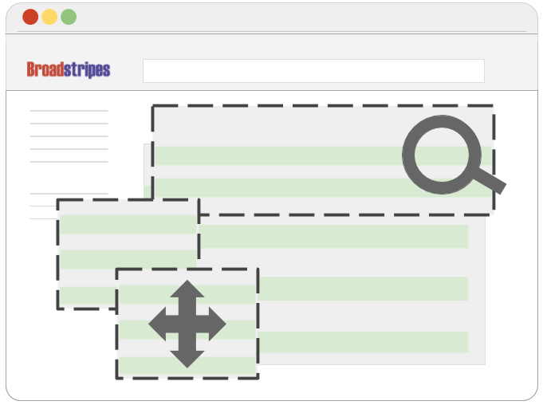
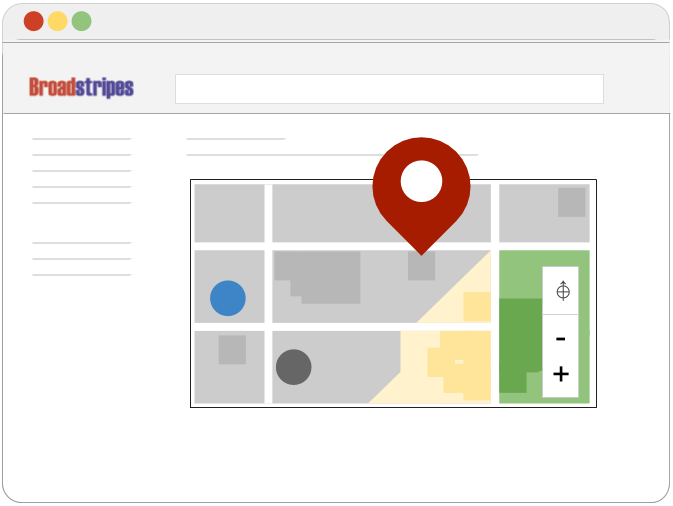
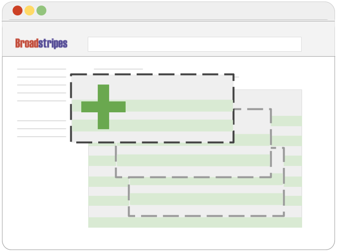

\[et\_pb\_section fb\_built="1" fullwidth="on" \_builder\_version="4.16" background\_color="rgba(255,255,255,0)" background\_image="https://help.broadstripes.com/wp-content/uploads/2018/02/isometropolis.jpg" background\_size="initial" background\_position="bottom\_right" background\_repeat="repeat" custom\_padding="0px|0px|0px|0px" global\_colors\_info="{}"\]\[et\_pb\_fullwidth\_header title="Organizer Guides " button\_one\_url="https://help.broadstripes.com/admin-tools/" background\_overlay\_color="rgba(22,92,173,0)" \_builder\_version="4.19.4" title\_font="Lato|900|||||||" title\_font\_size="60px" content\_font="Nunito Sans|300|||||||" content\_font\_size="24px" background\_color="rgba(255, 255, 255, 0)" use\_background\_color\_gradient="on" background\_color\_gradient\_direction="50deg" background\_color\_gradient\_stops="#165cad 52%|rgba(22,92,173,0.55) 100%" background\_color\_gradient\_start="#165cad" background\_color\_gradient\_start\_position="52%" background\_color\_gradient\_end="rgba(22,92,173,0.55)" background\_size="initial" background\_position="bottom\_right" background\_repeat="repeat" background\_blend="screen" custom\_button\_one="on" button\_one\_text\_size="12px" button\_one\_text\_color="#00386d" button\_one\_icon="=||divi||400" custom\_padding="|||80px" custom\_padding\_tablet="" custom\_padding\_phone="|||10px" custom\_padding\_last\_edited="on|phone" hover\_enabled="0" global\_colors\_info="{}" button\_one\_text\_size\_\_hover\_enabled="off" button\_two\_text\_size\_\_hover\_enabled="off" button\_one\_text\_color\_\_hover\_enabled="off" button\_two\_text\_color\_\_hover\_enabled="off" button\_one\_border\_width\_\_hover\_enabled="off" button\_two\_border\_width\_\_hover\_enabled="off" button\_one\_border\_color\_\_hover\_enabled="off" button\_two\_border\_color\_\_hover\_enabled="off" button\_one\_border\_radius\_\_hover\_enabled="off" button\_two\_border\_radius\_\_hover\_enabled="off" button\_one\_letter\_spacing\_\_hover\_enabled="off" button\_two\_letter\_spacing\_\_hover\_enabled="off" button\_one\_bg\_color\_\_hover\_enabled="off" button\_two\_bg\_color\_\_hover\_enabled="off" sticky\_enabled="0"\]

Start learning the basics, and maybe pick up a few advanced moves.

\[/et\_pb\_fullwidth\_header\]\[/et\_pb\_section\]\[et\_pb\_section fb\_built="1" \_builder\_version="4.16" custom\_padding="|0px|49.3125px|0px" global\_colors\_info="{}"\]\[et\_pb\_row column\_structure="1\_4,3\_4" \_builder\_version="4.16" custom\_padding="|17px|38px|33px||" border\_radii="on|8px|8px|8px|8px" border\_width\_all="1px" border\_color\_all="#6bba18" box\_shadow\_style="preset3" box\_shadow\_color="rgba(0,0,0,0.22)" global\_colors\_info="{}"\]\[et\_pb\_column type="1\_4" \_builder\_version="4.16" background\_enable\_color="off" custom\_padding="|||" global\_colors\_info="{}" custom\_padding\_\_hover="|||"\]\[et\_pb\_text \_builder\_version="4.16" header\_3\_font="|300||on|||||" header\_3\_letter\_spacing="5px" custom\_margin="||5px|||" custom\_padding="30px||0px||false|false" custom\_padding\_tablet="" custom\_padding\_phone="" custom\_padding\_last\_edited="on|phone" global\_colors\_info="{}"\]

## Featured Video

\[/et\_pb\_text\]\[et\_pb\_text admin\_label="Get Started video" module\_class="wplightbox" \_builder\_version="4.9.4" background\_enable\_color="off" text\_orientation="center" width="284" max\_width="90%" module\_alignment="center" height="178" custom\_padding\_tablet="" custom\_padding\_phone="|5px||5px|false|false" custom\_padding\_last\_edited="on|phone" global\_module="22584" saved\_tabs="all" template\_type="module" global\_colors\_info="{}"\]

\[video\_lightbox\_youtube video\_id="-u4Sb32eFoQ&rel=0" width="640" height="520" auto\_thumb="1"\]

### Getting started – Product tour

\[/et\_pb\_text\]\[/et\_pb\_column\]\[et\_pb\_column type="3\_4" \_builder\_version="4.16" custom\_padding="|||" global\_colors\_info="{}" custom\_padding\_\_hover="|||"\]\[et\_pb\_text admin\_label="Text-Getting Started" \_builder\_version="4.16" text\_line\_height="1.4em" header\_text\_color="#037a09" header\_font\_size="40px" header\_2\_font="||||||||" header\_2\_text\_color="#4b8416" header\_2\_font\_size="30px" header\_4\_text\_color="#707070" header\_6\_text\_color="#6b6b6b" custom\_margin="||0px|" custom\_padding="||0px|" global\_colors\_info="{}"\]

## **Getting Started**

\[/et\_pb\_text\]\[et\_pb\_text \_builder\_version="4.16" custom\_margin="||||false|false" custom\_padding="||||false|false" global\_colors\_info="{}"\]

#### \[catlist name="Get Started" numberposts=100 orderby="menu\_order"\]

\[/et\_pb\_text\]\[/et\_pb\_column\]\[/et\_pb\_row\]\[et\_pb\_row \_builder\_version="4.16" width="70%" width\_tablet="" width\_phone="75%" width\_last\_edited="on|phone" module\_alignment="center" custom\_margin="51px|auto||auto||" custom\_padding="21px||5px||false|false" border\_radii="on|8px|8px|8px|8px" border\_color\_all="rgba(51,51,51,0.5)" global\_colors\_info="{}"\]\[et\_pb\_column type="4\_4" \_builder\_version="4.16" custom\_padding="|||" global\_colors\_info="{}" custom\_padding\_\_hover="|||"\]\[et\_pb\_text admin\_label="Search" \_builder\_version="4.16" text\_line\_height="1.4em" header\_2\_text\_color="#e09900" header\_2\_font\_size="30px" custom\_margin="||0px|" custom\_padding="||0px|" header\_2\_font\_size\_last\_edited="off|" global\_colors\_info="{}"\]

## **​Search**

\[/et\_pb\_text\]\[et\_pb\_text \_builder\_version="4.16" custom\_padding="|||10%|false|false" global\_colors\_info="{}"\]

#### \[catlist name="Search" numberposts=100 orderby="menu\_order"\]

\[/et\_pb\_text\]\[/et\_pb\_column\]\[/et\_pb\_row\]\[et\_pb\_row \_builder\_version="4.16" width="70%" module\_alignment="center" custom\_padding="||5px||false|false" border\_radii="on|8px|8px|8px|8px" border\_color\_all="rgba(51,51,51,0.5)" global\_colors\_info="{}"\]\[et\_pb\_column type="4\_4" \_builder\_version="4.16" custom\_padding="|||" global\_colors\_info="{}" custom\_padding\_\_hover="|||"\]\[et\_pb\_text admin\_label="Work with search results" \_builder\_version="4.16" text\_line\_height="1.4em" header\_2\_text\_color="#e09900" header\_2\_font\_size="30px" custom\_margin="||0px|" custom\_padding="||0px|" header\_2\_font\_size\_last\_edited="off|" global\_colors\_info="{}"\]

## **Working with Search Results and Performing Bulk Updates**

\[/et\_pb\_text\]\[et\_pb\_text \_builder\_version="4.16" custom\_padding="|||10%|false|false" global\_colors\_info="{}"\]

#### \[catlist name="working-with-search-results" numberposts=100 orderby="menu\_order"\]

\[/et\_pb\_text\]\[/et\_pb\_column\]\[/et\_pb\_row\]\[et\_pb\_row \_builder\_version="4.16" width="70%" module\_alignment="center" custom\_padding="||5px||false|false" border\_radii="on|8px|8px|8px|8px" border\_color\_all="rgba(51,51,51,0.5)" global\_colors\_info="{}"\]\[et\_pb\_column type="4\_4" \_builder\_version="4.16" custom\_padding="|||" global\_colors\_info="{}" custom\_padding\_\_hover="|||"\]\[et\_pb\_text admin\_label="Text-Lists and reports" \_builder\_version="4.16" text\_line\_height="1.4em" header\_2\_text\_color="#0c71c3" header\_2\_font\_size="30px" custom\_margin="||0px|" custom\_padding="||0px|" global\_colors\_info="{}"\]

## **Lists and Reports**

\[/et\_pb\_text\]\[et\_pb\_text \_builder\_version="4.16" custom\_padding="|||10%|false|false" global\_colors\_info="{}"\]

#### \[catlist name="lists-and-reports" numberposts=100 orderby="menu\_order"\]

\[/et\_pb\_text\]\[/et\_pb\_column\]\[/et\_pb\_row\]\[et\_pb\_row \_builder\_version="4.16" width="70%" module\_alignment="center" custom\_padding="||5px||false|false" border\_radii="on|8px|8px|8px|8px" border\_color\_all="rgba(51,51,51,0.5)" global\_colors\_info="{}"\]\[et\_pb\_column type="4\_4" \_builder\_version="4.16" custom\_padding="|||" global\_colors\_info="{}" custom\_padding\_\_hover="|||"\]\[et\_pb\_text admin\_label="Customize-Text" \_builder\_version="4.16" text\_line\_height="1.4em" header\_2\_text\_color="#8c0900" header\_2\_font\_size="30px" custom\_margin="||0px|" custom\_padding="||0px|" global\_colors\_info="{}"\]

## **Customize**

\[/et\_pb\_text\]\[et\_pb\_text \_builder\_version="4.16" custom\_padding="|||10%|false|false" global\_colors\_info="{}"\]

#### \[catlist name="Customize" numberposts=100 orderby="menu\_order"\]

\[/et\_pb\_text\]\[/et\_pb\_column\]\[/et\_pb\_row\]\[et\_pb\_row \_builder\_version="4.16" width="70%" module\_alignment="center" custom\_padding="||5px||false|false" border\_radii="on|8px|8px|8px|8px" border\_color\_all="rgba(51,51,51,0.5)" global\_colors\_info="{}"\]\[et\_pb\_column type="4\_4" \_builder\_version="4.16" custom\_padding="|||" global\_colors\_info="{}" custom\_padding\_\_hover="|||"\]\[et\_pb\_text admin\_label="Text-Maps" \_builder\_version="4.16" text\_line\_height="1.4em" header\_2\_text\_color="#729b00" header\_2\_font\_size="30px" custom\_margin="||0px|" custom\_padding="||0px|" global\_colors\_info="{}"\]

## **Maps**

\[/et\_pb\_text\]\[et\_pb\_text \_builder\_version="4.16" custom\_padding="|||10%|false|false" global\_colors\_info="{}"\]

#### \[catlist name="maps" numberposts=100 orderby="menu\_order"\]

\[/et\_pb\_text\]\[/et\_pb\_column\]\[/et\_pb\_row\]\[et\_pb\_row \_builder\_version="4.16" width="70%" module\_alignment="center" custom\_padding="||5px||false|false" border\_radii="on|8px|8px|8px|8px" border\_color\_all="rgba(51,51,51,0.5)" global\_colors\_info="{}"\]\[et\_pb\_column type="4\_4" \_builder\_version="4.16" custom\_padding="|||" global\_colors\_info="{}" custom\_padding\_\_hover="|||"\]\[et\_pb\_text admin\_label="Adding Records" \_builder\_version="4.16" text\_line\_height="1.4em" header\_2\_text\_color="#8c0900" header\_2\_font\_size="30px" custom\_margin="||0px|" custom\_padding="||0px|" global\_colors\_info="{}"\]

## **Working with Contact Records**

\[/et\_pb\_text\]\[et\_pb\_text \_builder\_version="4.16" custom\_padding="|||10%|false|false" global\_colors\_info="{}"\]

#### \[catlist name="working-with-contact-records" numberposts=100 orderby="menu\_order"\]

\[/et\_pb\_text\]\[/et\_pb\_column\]\[/et\_pb\_row\]\[et\_pb\_row column\_structure="1\_4,1\_2,1\_4" \_builder\_version="4.16" background\_size="initial" background\_position="top\_left" background\_repeat="repeat" global\_colors\_info="{}"\]\[et\_pb\_column type="1\_4" \_builder\_version="4.16" custom\_padding="|||" global\_colors\_info="{}" custom\_padding\_\_hover="|||"\]\[/et\_pb\_column\]\[et\_pb\_column type="1\_2" \_builder\_version="4.16" custom\_padding="|||" global\_colors\_info="{}" custom\_padding\_\_hover="|||"\]\[et\_pb\_search exclude\_pages="off" placeholder="Search the knowledge base" \_builder\_version="4.16" global\_colors\_info="{}" button\_text\_size\_\_hover\_enabled="off" button\_one\_text\_size\_\_hover\_enabled="off" button\_two\_text\_size\_\_hover\_enabled="off" button\_text\_color\_\_hover\_enabled="off" button\_one\_text\_color\_\_hover\_enabled="off" button\_two\_text\_color\_\_hover\_enabled="off" button\_border\_width\_\_hover\_enabled="off" button\_one\_border\_width\_\_hover\_enabled="off" button\_two\_border\_width\_\_hover\_enabled="off" button\_border\_color\_\_hover\_enabled="off" button\_one\_border\_color\_\_hover\_enabled="off" button\_two\_border\_color\_\_hover\_enabled="off" button\_border\_radius\_\_hover\_enabled="off" button\_one\_border\_radius\_\_hover\_enabled="off" button\_two\_border\_radius\_\_hover\_enabled="off" button\_letter\_spacing\_\_hover\_enabled="off" button\_one\_letter\_spacing\_\_hover\_enabled="off" button\_two\_letter\_spacing\_\_hover\_enabled="off" button\_bg\_color\_\_hover\_enabled="off" button\_one\_bg\_color\_\_hover\_enabled="off" button\_two\_bg\_color\_\_hover\_enabled="off"\]  \[/et\_pb\_search\]\[/et\_pb\_column\]\[et\_pb\_column type="1\_4" \_builder\_version="4.16" custom\_padding="|||" global\_colors\_info="{}" custom\_padding\_\_hover="|||"\]\[/et\_pb\_column\]\[/et\_pb\_row\]\[/et\_pb\_section\]
