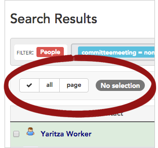
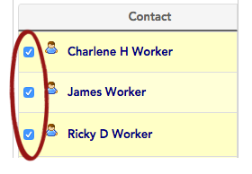
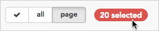
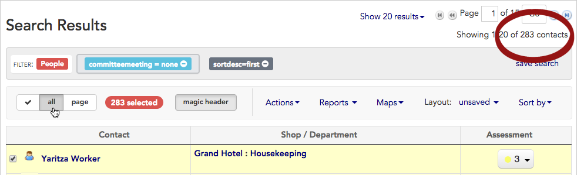
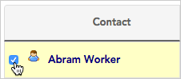

\[et\_pb\_section bb\_built="1" admin\_label="section"\]\[et\_pb\_row admin\_label="row" background\_position="top\_left" background\_repeat="repeat" background\_size="initial" \_builder\_version="3.0.105"\]\[et\_pb\_column type="4\_4"\]\[et\_pb\_text background\_position="top\_left" background\_repeat="repeat" background\_size="initial" \_builder\_version="3.0.105" background\_layout="light"\]

When working with the contacts in your search results, you may decide that you want your actions to apply to every contact record returned in the search results, or you may want to include just certain records (and exclude others).

This article will show you how to **select (and deselect) contact records** before applying an action to them.

1. 1. To select contacts, start by **running a search** to filter for just the contacts you want to work with. (Learn more about creating custom searches in the \[Create and save a search\] article.)
    2. When the search results appear, you'll see the **selection tools** in the toolbar above the search results.

1. 1. The **selection tools** offer three choices (these selection options are explained in [more detail](https://help.broadstripes.com/v2017/docs/selecting-and-deselecting-contacts#section-select-the-current-page) below):
        
        - click **all** to select all of the records in the search results
        - click **page** to select only the records shown on the current page of the search results
        - click again on either "all" or "page" to **deselect** those records.
        
        You can also [select contacts manually.](https://help.broadstripes.com/v2017/docs/selecting-and-deselecting-contacts#section-select-or-deselect-contacts-manually)
        
    2. Once you've selected the contact records that you want, Broadstripes\_\_ places a check\_\_ next to their name on the search results panel, indicating that they're selected.

1. A **badge** will also appear on the menu bar showing the number of records included in your selection.

\[caption id="attachment\_1682" align="aligncenter" width="270"\] This **badge** shows that from all the search results, 20 contact records have been selected.\[/caption\]

## Selection options

### Select the current page

Clicking **page** from the **selection tools** will select just the results that appear on the page you are currently viewing.

For instance, in the figure below, you are looking at page **1 of 15**, which contains contacts **1-20 (of 283)**. Choosing **page** will select only these 20 visible contacts to be included in your bulk action.

\[box type="download"\]**Paging down to include more records**

As you may have noticed when using the search results page, Broadstripes dynamically loads additional records as you page down through your search results.

_**Example:**_ Page 1 might have included 20 records when it was first loaded, but as you scrolled down the page, it grew to include 35 records.

This is important to note since choosing **page** will select every record _currently_ included on the visible search results page. This means that for the example above, 35 (not 20) records will be selected for a bulk action.\[/box\]

### Select all results

Choose **all** to select every record returned in the search results.

For example, in the figure below, choosing **all** will select all 283 contacts to be included in your bulk action.

\[caption id="attachment\_1681" align="alignnone" width="994"\] Click **all** to include all 283 contacts in your bulk action.\[/caption\]

### Deselect records

To **clear/deselect selected records**, just click again on whichever button you've selected ("**all**" or "**page**").

When you initially chose "**all**" or "**page**," Broadstripes added a checkbox next to each of the selected records in the search results list below; clicking again on the selected button ("**all**" or "**page**") clears those checkboxes so that no records are selected.

This feature is important when you need to change your selection (for instance to change from selecting all results to manually choosing just a few).

\[caption id="attachment\_1683" align="aligncenter" width="278"\] Click again on the box to clear your selection (deselect the records).\[/caption\]

### Select (or deselect) contacts manually

The last method for choosing contact records for a bulk action is to **manually check (or uncheck)** the checkbox next to the contact's name. While this can be time-consuming for selecting a large number of records at once, it is a simple way to choose just a few records.

\[caption id="attachment\_1687" align="aligncenter" width="226"\] Select a contact manually by checking the checkbox next to their name. Click again to deselect\[/caption\]

\[/et\_pb\_text\]\[/et\_pb\_column\]\[/et\_pb\_row\]\[/et\_pb\_section\]
