\[et\_pb\_section bb\_built="1" \_builder\_version="3.0.47"\]\[et\_pb\_row \_builder\_version="3.0.47" background\_size="initial" background\_position="top\_left" background\_repeat="repeat"\]\[et\_pb\_column type="4\_4"\]\[et\_pb\_text \_builder\_version="3.0.102" background\_layout="light"\]

As you probably know, the search results page lets you see the records that match your search criteria and to view details about those contacts (learn more about creating custom searches in the [creating a search](https://help.broadstripes.com/docs/save-a-search) article).

What you might _not_ know is that the search results page contains another powerful feature – the ability to apply a **bulk action** to the contacts in those search results.

\[caption id="attachment\_1818" align="aligncenter" width="598"\] Broadstripes allows you to make a change to multiple records at once using Actions.\[/caption\]

## How you can use these actions:

\[/et\_pb\_text\]\[et\_pb\_toggle admin\_label="Toggle Add to tag list" title="Add contacts to a tag list (or remove them)" open\_toggle\_text\_color="#0c71c3" closed\_toggle\_text\_color="#0c71c3" icon\_color="#0c71c3" \_builder\_version="3.0.102" title\_level="h3" open="off"\]

One of the most common bulk actions applied to search results is adding contacts to a tag list. **Tag lists** give you an easy way to manually tag individuals whom you want to track as a group for any reason (for instance your key volunteers, or the people you need to follow up with this month). You can learn more about setting up and using this feature in the [Tag Lists](https://help.broadstripes.com/docs/tag-lists) overview article.

## Add contacts to a tag list

Once you have a tag list set up and know which contacts you want to add to it, you're ready. Read the complete step-by-step instructions in the [Add people to a tag list](https://help.broadstripes.com/docs/add-people-to-a-tag-list) article.

## Remove contacts

If you need to make changes to your tag lists, removing contacts can be done as a bulk action, too. For step-by-step instructions, check out the [Remove people from a tag list](https://help.broadstripes.com/docs/remove-people-from-a-tag-list) article.

\[/et\_pb\_toggle\]\[et\_pb\_toggle admin\_label="Toggle Set (and unset) event steps" title="Set (and unset) event steps" open\_toggle\_text\_color="#0c71c3" closed\_toggle\_text\_color="#0c71c3" icon\_color="#0c71c3" \_builder\_version="3.0.102" title\_level="h3" open="off"\]

When you are checking off an event or an event step for multiple contacts at once, using an action can be a great time-saver. (If you are new to events, check out the [Events](https://help.broadstripes.com/docs/creating-an-event) overview article for more information.)

## Set event steps

For this example, we'll show how to check off signed cards for a group of contacts we visited last week.

1. First, we'll run a search for people on our house visit list. Then, from the **Search Results**page, we'll [select the contacts](https://help.broadstripes.com/docs/selecting-and-deselecting-contacts) who have just signed their cards. (If you need help running a search, check out the [Create and save a search](https://help.broadstripes.com/docs/save-a-search) article.)
2. With the contacts selected, we'll go to the **Actions** drop-down menu and choose **Assign Event Steps**.
3. When prompted to select an event step, we'll choose the **Card > Signed** step and click **Add**.  
     
4. Broadstripes will automatically update all of the contact records that we selected to show that their cards are signed. A **pop-up box** will appear to confirm our update.

## Unset (uncheck) an event step

If you want to uncheck (rather than check) an event step for a group of contacts all at once, you can do that from the actions drop-down menu, too. In this example, we have a list of people who were accidentally marked as having signed cards. We need to correct their records to show that they haven't yet signed a card.

1. Again, we'll start by running a search. From the **Search Results** page, we'll [select the contacts](https://help.broadstripes.com/docs/selecting-and-deselecting-contacts) we need to correct. (If you need help running a search, check out the [Create and save a search](https://help.broadstripes.com/docs/save-a-search) article.)
2. With the contacts selected, we'll go to the **Actions** drop-down menu and choose **Assign Event Steps**.

1. When prompted to select an event step, we'll choose the **Card > Signed** step. 

1. Finally, we'll click **Remove** to unset (uncheck) the Card > Signed event step.
2. Broadstripes will automatically update all of the contact records that we selected to show that their cards are no longer signed. A **pop-up box** will appear to confirm our update.

\[/et\_pb\_toggle\]\[et\_pb\_toggle admin\_label="Toggle Set (and clear) custom fields" title="Set (and clear) custom fields" open\_toggle\_text\_color="#0c71c3" closed\_toggle\_text\_color="#0c71c3" icon\_color="#0c71c3" \_builder\_version="3.0.102" title\_level="h3" open="off"\]

If you are like other Broadstripes users, it's likely that you use at least one custom field to track information that's important to your campaign. If you want to set or update the value of a custom field for multiple users at once, you can use a bulk action to simplify that task. (If you are new to custom fields, you can read more about them in the [Data tools overview](https://help.broadstripes.com/v2017/docs/data-tools-overview#section-what-are-custom-fields-and-why-do-i-need-them-).)

\[box type="bio"\]**Text input exception**

Before you get started, note that not _all_ types of custom fields can be updated in bulk. For instance, custom fields that allow you to write free-form text (like **single-line** and**multiple-line text input boxes**) cannot be updated in bulk. **Check boxes**, **radio buttons**, and **drop-down** or **multiple-selection choosers** , however, can all be updated using this time-saving method.  
\[/box\]

## Update a custom field for multiple contacts

For this example, we'll update a group of contacts to show that they are all interested in benefits, something we track in our project using a custom field called "**Interests**."

1. 1. First, we'll run a search that includes the people whose records we want to update. From the **Search Results** page, we'll [select the contacts](https://help.broadstripes.com/docs/selecting-and-deselecting-contacts) who are interested in benefits. (If you need help running a search, check out the [Create and save a search](https://help.broadstripes.com/docs/save-a-search) article.)
    2. With the contacts selected, we'll go to the **Actions** drop-down menu and choose **Set custom field**.

\[box type="download"\] **Custom fields are unique to your project**  
In this example, we're using a custom field named "Interests" to track a worker's possible area of engagement. If you don't see this option in your list of choices, don't worry. Since custom fields are set up by organizations like yours to meet your specific needs, your project will likely contain custom fields with totally different names, values, and purposes.\[/box\]

1. When prompted to select the custom field, we'll choose **Interests**.
2. From the drop-down list of values that appears, we'll choose **Benefits** and click **Update**.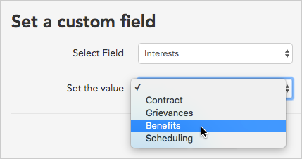
3. When you click **Update**, a pop-up box will appear showing that Broadstripes has queued the contacts for the update. No further action is needed – Broadstripes will automatically update all of the contact records that we selected, setting the custom field called "**Interests**" to show the value "**Benefits**".

## Clear the value of a custom field with bulk actions

In certain cases, you can also use a bulk action to clear out the value of a custom field.

### Drop-down choosers

If your custom field is a drop-down chooser, simply select the **blank value** at the top of the drop-down list.

\[caption id="attachment\_1946" align="aligncenter" width="428"\] Selecting the blank value will clear any previous value for the selected contacts.\[/caption\]

### Checkboxes

If your custom field is a **single checkbox** and you'd like to clear the value, simply leave the checkbox unchecked and then click **Update**. This will leave the box unchecked for all selected contacts.

\[caption id="attachment\_1947" align="aligncenter" width="432"\] Leave the checkbox **unchecked** and click **Update** to make the custom field unchecked for all selected contacts.\[/caption\]

If your custom field contains **multiple checkboxes**, first check the value(s) you want to clear and then click **Remove selected options**.  
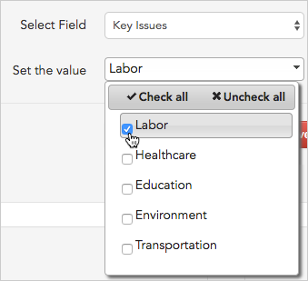

\[caption id="attachment\_1949" align="aligncenter" width="462"\]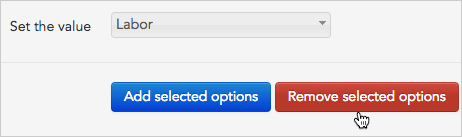 Checking the value **"Labor"** and then clicking **Remove selected** will clear "Labor" from all selected contact records but leave all other checked boxes untouched.\[/caption\]

\[/et\_pb\_toggle\]\[et\_pb\_toggle admin\_label="Toggle Assign (and remove) leadership" title="Assign (and remove) leadership" open\_toggle\_text\_color="#0c71c3" closed\_toggle\_text\_color="#0c71c3" icon\_color="#0c71c3" \_builder\_version="3.0.102" title\_level="h3" open="off"\]

Broadstripes' bulk actions make it simple to assign a leader to multiple contacts at once. If you need to remove a leader, you can do that with a bulk action, too.

## Assign a leader

1. First, run a search for the people you want to assign to a leader. Then, from the **Search Results** page, [select those contacts](https://help.broadstripes.com/docs/selecting-and-deselecting-contacts). (If you need help running a search, check out the [Create and save a search](https://help.broadstripes.com/docs/save-a-search) article.)
2. With the contacts selected, go to the **Actions** drop-down menu and choose **Assign to leader**.
3. When prompted for the leader, **begin typing their name** in the text box. Broadstripes will suggest names that match. **Select the correct name** from the list and click **Add leader**.

If any of the selected workers were previously assigned to a leader, Broadstripes will ask you to **Assign** (confirm) or **Cancel** the new leadership assignment.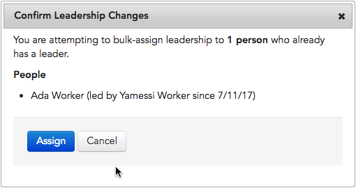

1. Broadstripes will automatically update all of the contact records that you selected with their new leader. A **pop-up box** will appear to confirm the update.

## Remove leadership information

If you want to remove leadership information from a group of contacts, you can do that from the actions drop-down menu, too. In the previous example, we assigned 20 contacts to Mary Worker. In this example, we'll remove Mary Worker as the leader of those workers. When we're done, their records will show that they have no leader.

1. We'll start by running a search for people Mary leads. From the **Search Results** page, we'll [select the contacts](https://help.broadstripes.com/docs/selecting-and-deselecting-contacts) we assigned to Mary in the previous example. (If you need help running a search, check out the [Create and save a search](https://help.broadstripes.com/docs/save-a-search) article.)
2. With those contacts selected, we'll go to the **Actions** drop-down menu and choose **Remove leader**.

1. Next, we'll be given a choice to **End Relationship** or **Delete**.
    - Choose **End Relationship** if you want to keep an historical record of the fact that Mary was once the worker's leader (an entry showing the start and end date of the relationship will be written on the **Leadership tab** of the worker's record).
    - Choose **Delete** if you want to completely erase the leadership relationship and any history of it (for instance, if Mary was assigned in error).

1. Click the **End Leader Relationships** button.
2. Broadstripes will automatically update all of the selected contact records to show that they are not lead by anyone. A **pop-up box** will appear to confirm our update.

\[/et\_pb\_toggle\]\[et\_pb\_toggle admin\_label="Toggle Update employment information" title="Update employment information" open\_toggle\_text\_color="#0c71c3" closed\_toggle\_text\_color="#0c71c3" icon\_color="#0c71c3" \_builder\_version="3.0.102" title\_level="h3" open="off"\]

Use a bulk action to update workers' department or job title or to create, terminate, or delete entire employment records for a group of workers.

Working from your search results, you can easily update employment information for a group of workers from the **Actions drop-down menu**.

You can add new employments, show that a worker has been terminated from an employment, or even completely delete all history of an employment. You can also easily use a bulk action to change specific employment information for a group of workers. This includes the department they work in or their job title (sometimes labeled "classification").

Here's how:

## Create employments

For this example, we'll show how to assign a group of workers a **new employment** as Houseperson in Housekeeping on the second floor of the Grand Hotel.

If any of our workers already have an employment, this new employment will be added as an _additional_ employment – existing employments will not be affected (to _replace_ a worker's employment, first terminate any current employments).

1. To create an employment for our group of workers, we'll start by running a search. From the **Search Results** page, we'll [select the workers](https://help.broadstripes.com/docs/selecting-and-deselecting-contacts) whose employment we are adding. (If you need help running a search, check out the [Create and save a search](https://help.broadstripes.com/docs/save-a-search) article.)
2. With the contacts selected, we'll go to the **Actions** drop-down menu and choose **Create employment**.
3. When prompted for the department, **begin typing the department name** in the text box. Broadstripes will suggest names that match. **Select the department** from the list and move to the **Job title** field.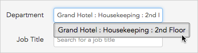
4. If you use job titles (sometimes labeled "**Classifications**"), **begin typing the job title name** in the text box and choose a job title from the list that appears.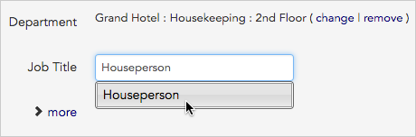
5. Broadstripes is able to record a number of additional employment details including employees' hourly rate, start date, and whether or not they are part of the bargaining unit. Click the link labeled **more** to view or update this optional information.

Adding additional employment data is optional.

1. When you've finished adding the workers' employment information, click the **Create employments** button.
2. Broadstripes will automatically update all of the contact records that we selected with their new employment. A **pop-up box** will appear to confirm our update.

## Terminate employments

If you want to **terminate an employment** for a group of contacts at one time, you can do that from the actions drop-down menu, too. A record of any terminated employment will be visible on the **Employment tab** of each worker's profile page.

In this example, we will terminate an employment for three workers who are no longer working in Housekeeping on the second floor of the Grand Hotel.

1. Again, we'll start by running a search. From the **Search Results** page, we'll [select the workers](https://help.broadstripes.com/docs/selecting-and-deselecting-contacts) whose employments we need to terminate. (If you need help running a search, check out the [Create and save a search](https://help.broadstripes.com/docs/save-a-search) article.)
2. With the contacts selected, we'll go to the **Actions** drop-down menu and choose **Terminate employment**.
3. We'll be prompted to choose between **terminating all employments** and **terminating a particular employment**.  
    We'll choose a specific employment (Grand Hotel : Housekeeping : 2nd Floor), enter the termination date, and give a brief explanation of why the employment ended. If this employment had child records, we could choose to terminate those as well by checking the **Include children** checkbox.
4. Finally, we'll click the **Terminate employments** button to complete our bulk action.
5. Broadstripes will automatically update all of the contact records that we selected to show that their 2nd floor Housekeeping employment is terminated. A **pop-up box** will appear to confirm the changes. A record of this terminated employment will be visible on the **Employment tab** of each worker's profile page.

## Delete employments

Sometimes you may want to completely **delete an employment record**. Unlike termination, the deletion of an employment will not leave any historical record of the employment on a worker's profile.

In this example, we will delete an employment for four workers who were entered incorrectly as 3rd floor Housekeeping employees at the Grand Hotel.

1. Again, we'll start by running a search. From the **Search Results** page, we'll [select the workers](https://help.broadstripes.com/docs/selecting-and-deselecting-contacts) whose employments we need to delete. (If you need help running a search, check out the [Create and save a search](https://help.broadstripes.com/docs/save-a-search) article.)
2. With the contacts selected, we'll go to the **Actions** drop-down menu and choose **Delete employment**.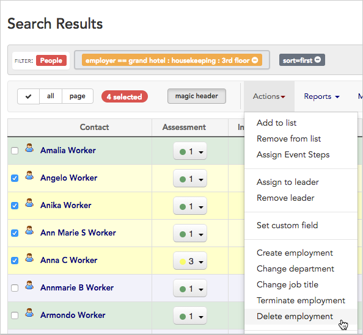
3. We'll be prompted to choose what to delete:
    - **all of their employments** permanently removes all employment records
    - **only their employments with a particular employer** permanently removes only the employment you specify in the next step
    - **only their employments with no employer** permanently removes an employment that may have been created without a specified employer

We'll choose a specific employment (Grand Hotel : Housekeeping : 3rd Floor) and check the **Include children** checkbox so no child employment records remain.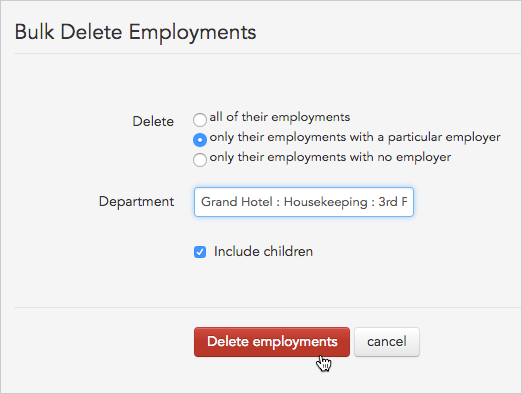

1. We'll click the **Delete employments** button to complete our bulk action.
2. Broadstripes will automatically delete the 3rd Floor Housekeeping employment record for all of the contact records that we selected. This deletion will be permanent, and there will be no history showing that the employment ever existed. A **pop-up box** will appear to confirm the changes.

## Change departments

For this example, we'll **change the department** for a group of workers who were previously in Housekeeping, but are now working in Concierge services at the Deluxe Hotel.

1. To make this change for our group of workers, we'll start by running a search. From the **Search Results** page, we'll [select the workers](https://help.broadstripes.com/docs/selecting-and-deselecting-contacts) whose department we are changing. (If you need help running a search, check out the [Create and save a search](https://help.broadstripes.com/docs/save-a-search) article.)
2. With the contacts selected, we'll go to the **Actions** drop-down menu and choose **Change department**.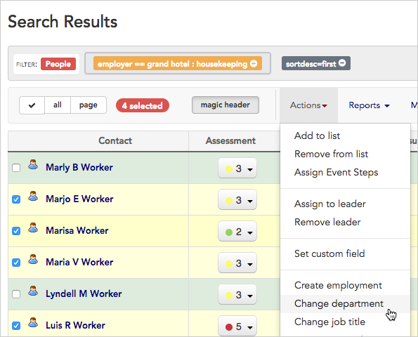
3. Click the **change** link to change the department.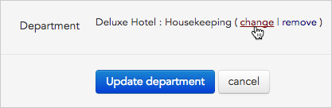
4. When prompted for the department, **begin typing the department name** in the text box. Broadstripes will suggest names that match. **Select the department** from the list and click **Update department**.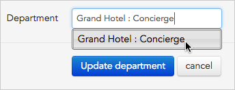
5. Broadstripes will automatically update all of the contact records that we selected with their new department. A **pop-up box** will appear to confirm our update.

## Change job titles (classifications)

Depending on the project settings set up by your administrator, you may see either the label "classification" or "job title" in your Broadstripes project – both refer to the same field, only the label is different.

In this example, we'll **change the job title (classification)** for the four workers whose departments we updated in the previous step. We'll change their job titles from "Houseperson" to "Front Desk", their new role.

1. Again, we'll start by running a search. From the **Search Results** page, we'll [select the workers](https://help.broadstripes.com/docs/selecting-and-deselecting-contacts) whose job titles we need to change. (If you need help running a search, check out the [Create and save a search](https://help.broadstripes.com/docs/save-a-search) article.)
2. With the contacts selected, we'll go to the **Actions** drop-down menu and choose **Change job title**.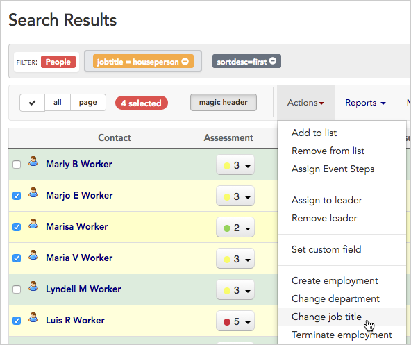
3. When prompted for the new job title, **begin typing the job title** in the text box. Broadstripes will suggest names that match. **Select the job title** from the list and click **Update job title**.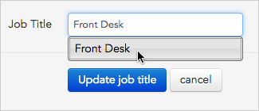
4. Broadstripes will automatically update all of the contact records that we selected to show their new Front desk role. A **pop-up box** will appear to confirm the changes.

\[/et\_pb\_toggle\]\[et\_pb\_toggle admin\_label="Toggle Delete contacts permanently" title="Delete contacts permanently" open\_toggle\_text\_color="#0c71c3" closed\_toggle\_text\_color="#0c71c3" icon\_color="#0c71c3" \_builder\_version="3.0.102" title\_level="h3" open="off"\]

You can use bulk actions to **permanently delete a contact or group of contacts** from your Broadstripes project. Unlike with other organizing databases you may have used, when you delete a contact in Broadstripes, the record is _completely removed_ from your Broadstripes project along with all associated data and history. After a record has been deleted, it cannot be retrieved by any user for any reason. Deleting contact records cannot be undone.

\[box type="bio"\] **Cases where contacts can't be deleted**  
There are a few cases where contacts cannot be deleted using a bulk action. Contacts that are linked to Broadstripes users can't be deleted. You will also not be able to delete contacts that are linked to a locked external system.\[/box\]

If you are sure that you want to permanently delete contacts with a bulk action, here are the steps to follow:

## Delete contacts

For this example, we'll show how to permanently delete a group of workers that we no longer want in our Broadstripes project.

1. We'll start by running a search. From the **Search Results** page, we'll [select the workers](https://help.broadstripes.com/docs/selecting-and-deselecting-contacts)whose records we are deleting. (If you need help running a search, check out the [Create and save a search](https://help.broadstripes.com/docs/save-a-search) article.)
2. With the contacts selected, we'll go to the **Actions** drop-down menu and choose **Delete**.

\[box type="warning"\] **Deletion is permanent**  
Deleting a contact will _permanently remove_ that person's record and all their associated details from the entire Broadstripes project. The record cannot be retrieved after it is deleted. You cannot undo a deletion.\[/box\]

1. If you're sure you want to delete the contacts, click **OK** to confirm the deletion.

When deleting more than five contacts at once, you'll be asked to confirm your deletion by typing **DELETE** before clicking **OK**.

1. Broadstripes will automatically queue the process of deleting the selected records and their associated data. A **pop-up box** will appear to confirm the deletion is queued. No further action is needed.

\[box type="bio"\]**Deleting large numbers of contacts**

If you are removing a large volume of contacts at one time, it may take up to a few minutes for Broadstripes to complete the process.

This means that immediately after queuing the records for deletion, you may still see those records in search results or reports. You won't be notified that the deletion is complete, but Broadstripes will queue the process as soon as you confirm the deletion and finish when all selected contacts are deleted.  
\[/box\]

\[/et\_pb\_toggle\]\[/et\_pb\_column\]\[/et\_pb\_row\]\[/et\_pb\_section\]
