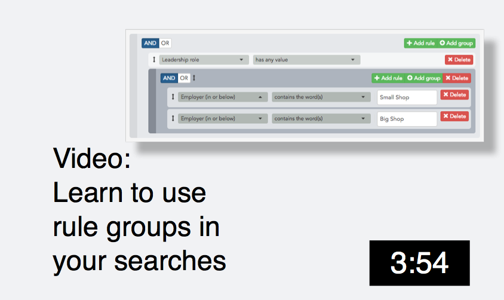
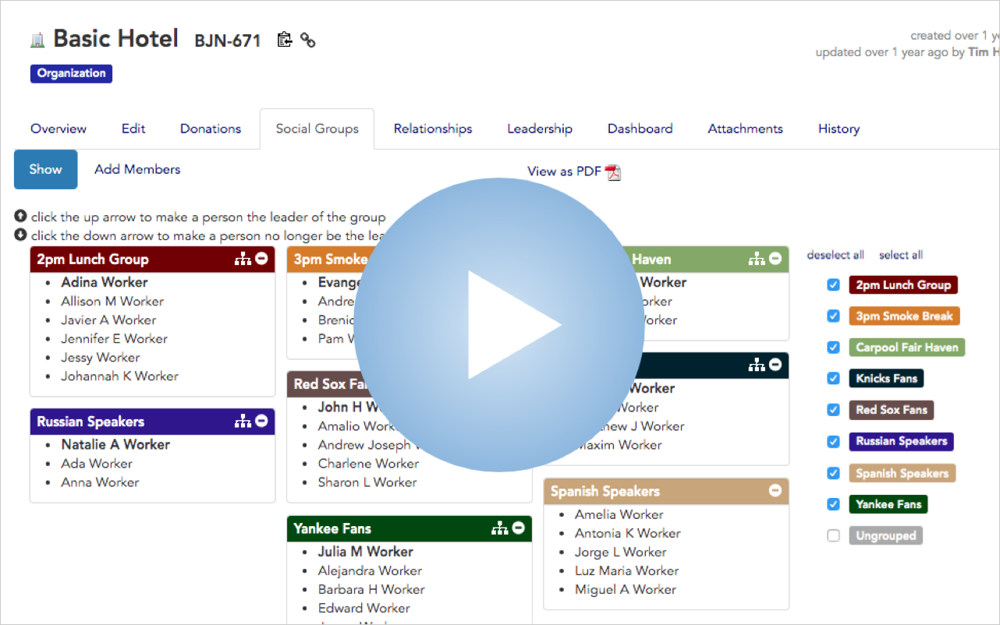
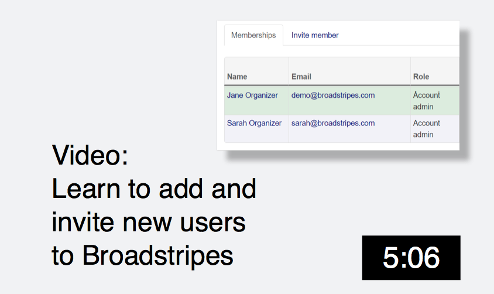
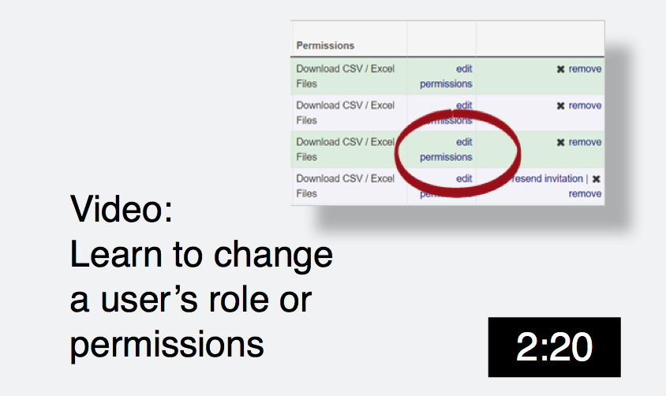

\[et\_pb\_section fb\_built="1" fullwidth="on" \_builder\_version="3.22" background\_image="https://help.broadstripes.com/wp-content/uploads/2018/02/isometropolis.jpg" background\_size="initial" background\_position="bottom\_right" background\_repeat="repeat" custom\_padding="0px|0px|0px|0px" fb\_built="1" \_i="0" \_address="0"\]\[et\_pb\_fullwidth\_header title="Videos and Tutorials" button\_one\_url="https://help.broadstripes.com/admin-tools/" background\_overlay\_color="rgba(22,92,173,0)" admin\_label="Videos and tutorials header" \_builder\_version="3.27.4" title\_font="Lato|900|||||||" title\_font\_size="60px" content\_font="Nunito Sans|300|||||||" content\_font\_size="24px" background\_color="rgba(255, 255, 255, 0)" use\_background\_color\_gradient="on" background\_color\_gradient\_start="#e0ac00" background\_color\_gradient\_end="rgba(224,172,0,0.57)" background\_color\_gradient\_direction="52deg" background\_color\_gradient\_start\_position="52%" custom\_button\_one="on" button\_one\_text\_size="12px" button\_one\_text\_color="#00386d" button\_one\_icon="%%28%%" custom\_padding="|||80px" custom\_padding\_phone="|||10px" custom\_padding\_last\_edited="on|phone" saved\_tabs="all" button\_one\_text\_size\_\_hover\_enabled="off" button\_one\_text\_size\_\_hover="null" button\_two\_text\_size\_\_hover\_enabled="off" button\_two\_text\_size\_\_hover="null" button\_one\_text\_color\_\_hover\_enabled="off" button\_one\_text\_color\_\_hover="null" button\_two\_text\_color\_\_hover\_enabled="off" button\_two\_text\_color\_\_hover="null" button\_one\_border\_width\_\_hover\_enabled="off" button\_one\_border\_width\_\_hover="null" button\_two\_border\_width\_\_hover\_enabled="off" button\_two\_border\_width\_\_hover="null" button\_one\_border\_color\_\_hover\_enabled="off" button\_one\_border\_color\_\_hover="null" button\_two\_border\_color\_\_hover\_enabled="off" button\_two\_border\_color\_\_hover="null" button\_one\_border\_radius\_\_hover\_enabled="off" button\_one\_border\_radius\_\_hover="null" button\_two\_border\_radius\_\_hover\_enabled="off" button\_two\_border\_radius\_\_hover="null" button\_one\_letter\_spacing\_\_hover\_enabled="off" button\_one\_letter\_spacing\_\_hover="null" button\_two\_letter\_spacing\_\_hover\_enabled="off" button\_two\_letter\_spacing\_\_hover="null" button\_one\_bg\_color\_\_hover\_enabled="off" button\_one\_bg\_color\_\_hover="null" button\_two\_bg\_color\_\_hover\_enabled="off" button\_two\_bg\_color\_\_hover="null" \_i="0" \_address="0.0"\]

Learn Broadstripes skills with this collection of our video tutorials.

\[/et\_pb\_fullwidth\_header\]\[/et\_pb\_section\]\[et\_pb\_section fb\_built="1" \_builder\_version="3.22" custom\_padding="0px|164.094px|0px|0px" fb\_built="1" \_i="1" \_address="1"\]\[et\_pb\_row \_builder\_version="3.25" custom\_padding="18.5938px|0px|0px|0px" \_i="0" \_address="1.0"\]\[et\_pb\_column type="4\_4" \_builder\_version="3.25" custom\_padding="|||" \_i="0" \_address="1.0.0" custom\_padding\_\_hover="|||"\]\[et\_pb\_text admin\_label="Breadcrumb" \_builder\_version="3.27.4" text\_font="||||||||" text\_font\_size="12px" \_i="0" \_address="1.0.0.0"\]

\[wpseo\_breadcrumb\] \[/et\_pb\_text\]\[/et\_pb\_column\]\[/et\_pb\_row\]\[/et\_pb\_section\]\[et\_pb\_section fb\_built="1" specialty="on" \_builder\_version="3.27.4" inner\_module\_alignment="center" custom\_margin="||||false|false" custom\_padding="|0px||||" fb\_built="1" \_i="2" \_address="2"\]\[et\_pb\_column type="2\_3" specialty\_columns="2" \_builder\_version="3.25" custom\_padding="|||" \_i="0" \_address="2.0" custom\_padding\_\_hover="|||"\]\[et\_pb\_row\_inner \_builder\_version="3.25" custom\_padding="20.4531px|0px|0px|0px" \_i="0" \_address="2.0.0"\]\[et\_pb\_column\_inner saved\_specialty\_column\_type="3\_4" \_builder\_version="3.25" custom\_padding="|||" parallax\_\_hover="off" parallax\_method\_\_hover="on" \_i="0" \_address="2.0.0.0" custom\_padding\_\_hover="|||"\]\[et\_pb\_text admin\_label="Get Started header" \_builder\_version="3.27.4" custom\_margin="0px||8px|" custom\_padding="0px||0px|" \_i="0" \_address="2.0.0.0.0"\]

## New users – How to get started with Broadstripes

\[/et\_pb\_text\]\[et\_pb\_divider color="rgba(0,0,0,0.17)" \_builder\_version="3.2" height="3px" custom\_margin="||5px|" \_i="1" \_address="2.0.0.0.1"\] 

\[/et\_pb\_divider\]\[/et\_pb\_column\_inner\]\[/et\_pb\_row\_inner\]\[et\_pb\_row\_inner column\_structure="1\_2,1\_2" admin\_label="Getting Started" \_builder\_version="3.25" custom\_padding="6px|0px|20.4531px|0px" \_i="1" \_address="2.0.1"\]\[et\_pb\_column\_inner type="1\_2" saved\_specialty\_column\_type="2\_3" \_builder\_version="3.25" custom\_padding="|||" parallax\_\_hover="off" parallax\_method\_\_hover="on" \_i="0" \_address="2.0.1.0" custom\_padding\_\_hover="|||"\]\[et\_pb\_text admin\_label="Get Started video" module\_class="wplightbox" \_builder\_version="3.27.4" \_i="0" \_address="2.0.1.0.0"\]

### Getting started – Product tour

 \[/et\_pb\_text\]\[/et\_pb\_column\_inner\]\[et\_pb\_column\_inner type="1\_2" saved\_specialty\_column\_type="2\_3" \_builder\_version="3.25" custom\_padding="|||" parallax\_\_hover="off" parallax\_method\_\_hover="on" \_i="1" \_address="2.0.1.1" custom\_padding\_\_hover="|||"\]\[/et\_pb\_column\_inner\]\[/et\_pb\_row\_inner\]\[et\_pb\_row\_inner \_builder\_version="3.25" custom\_padding="20.4531px|0px|0px|0px" \_i="2" \_address="2.0.2"\]\[et\_pb\_column\_inner saved\_specialty\_column\_type="3\_4" \_builder\_version="3.25" custom\_padding="|||" parallax\_\_hover="off" parallax\_method\_\_hover="on" \_i="0" \_address="2.0.2.0" custom\_padding\_\_hover="|||"\]\[et\_pb\_text admin\_label="Search header" \_builder\_version="3.27.4" custom\_margin="0px||8px|" custom\_padding="0px||0px|" \_i="0" \_address="2.0.2.0.0"\]

## How to search Broadstripes

\[/et\_pb\_text\]\[et\_pb\_divider color="rgba(0,0,0,0.17)" \_builder\_version="3.2" height="3px" custom\_margin="||5px|" \_i="1" \_address="2.0.2.0.1"\] 

\[/et\_pb\_divider\]\[/et\_pb\_column\_inner\]\[/et\_pb\_row\_inner\]\[et\_pb\_row\_inner column\_structure="1\_2,1\_2" admin\_label="Row" \_builder\_version="3.27.4" custom\_padding="6px|0px|20.4531px|0px|false|false" \_i="3" \_address="2.0.3"\]\[et\_pb\_column\_inner type="1\_2" saved\_specialty\_column\_type="3\_4" \_builder\_version="3.25" custom\_padding="|||" parallax\_\_hover="off" parallax\_method\_\_hover="on" \_i="0" \_address="2.0.3.0" custom\_padding\_\_hover="|||"\]\[et\_pb\_video src="https://vimeo.com/322305306" image\_src="https://help.broadstripes.com/wp-content/uploads/2018/11/BuildAdvancedSearchSlide.png" play\_icon\_color="#e0ac00" thumbnail\_overlay\_color="rgba(0,0,0,0.6)" disabled\_on="on|on|on" admin\_label="Video How to Build a Search with the search Builder" \_builder\_version="3.27.4" box\_shadow\_style="preset2" disabled="on" global\_module="21759" saved\_tabs="all" \_i="0" \_address="2.1.3.0.0"\]

\[/et\_pb\_video\]\[et\_pb\_video src="https://vimeo.com/322305025" image\_src="https://help.broadstripes.com/wp-content/uploads/2018/11/RuleGroupSearchSlide.png" play\_icon\_color="#e0ac00" disabled\_on="on|on|on" admin\_label="Video Add rule groups" \_builder\_version="3.27.4" box\_shadow\_style="preset2" disabled="on" global\_module="21760" saved\_tabs="all" \_i="1" \_address="2.1.3.0.1"\]

\[/et\_pb\_video\]\[et\_pb\_text admin\_label="How to Build a Search with the Search Builder" \_builder\_version="3.27.4" custom\_margin="||||false|false" \_i="2" \_address="2.0.3.0.2"\]

### Build custom searches

\[/et\_pb\_text\]\[/et\_pb\_column\_inner\]\[et\_pb\_column\_inner type="1\_2" saved\_specialty\_column\_type="3\_4" \_builder\_version="3.25" custom\_padding="|||" parallax\_\_hover="off" parallax\_method\_\_hover="on" \_i="1" \_address="2.0.3.1" custom\_padding\_\_hover="|||"\]\[et\_pb\_text admin\_label="How to Add Rule Groups to Search" \_builder\_version="3.27.4" custom\_margin="||||false|false" link\_option\_url\_new\_window="on" \_i="0" \_address="2.0.3.1.0"\]

### Search with rule groups

\[/et\_pb\_text\]\[/et\_pb\_column\_inner\]\[/et\_pb\_row\_inner\]\[et\_pb\_row\_inner \_builder\_version="3.25" custom\_padding="20.4531px|0px|0px|0px" \_i="4" \_address="2.0.4"\]\[et\_pb\_column\_inner saved\_specialty\_column\_type="3\_4" \_builder\_version="3.25" custom\_padding="|||" parallax\_\_hover="off" parallax\_method\_\_hover="on" \_i="0" \_address="2.0.4.0" custom\_padding\_\_hover="|||"\]\[et\_pb\_text admin\_label="Use Broadstripes header" \_builder\_version="3.27.4" custom\_margin="0px||8px|" custom\_padding="0px||0px|" \_i="0" \_address="2.0.4.0.0"\]

## How to use Broadstripes

\[/et\_pb\_text\]\[et\_pb\_divider color="rgba(0,0,0,0.17)" \_builder\_version="3.2" height="3px" custom\_margin="||5px|" \_i="1" \_address="2.0.4.0.1"\] 

\[/et\_pb\_divider\]\[/et\_pb\_column\_inner\]\[/et\_pb\_row\_inner\]\[et\_pb\_row\_inner column\_structure="1\_2,1\_2" admin\_label="Row" \_builder\_version="3.25" custom\_padding="6px|0px|20.4531px|0px" \_i="5" \_address="2.0.5"\]\[et\_pb\_column\_inner type="1\_2" saved\_specialty\_column\_type="2\_3" \_builder\_version="3.25" custom\_padding="|||" parallax\_\_hover="off" parallax\_method\_\_hover="on" \_i="0" \_address="2.0.5.0" custom\_padding\_\_hover="|||"\]\[et\_pb\_video src="https://vimeo.com/359601582" image\_src="https://help.broadstripes.com/wp-content/uploads/2019/09/Relationships\_Video\_Thumb.png" play\_icon\_color="#e0ac00" thumbnail\_overlay\_color="rgba(0,0,0,0.6)" disabled\_on="on|on|on" admin\_label="Create Relationships" \_builder\_version="3.27.4" box\_shadow\_style="preset2" disabled="on" global\_module="21759" saved\_tabs="all" \_i="0" \_address="2.1.3.0.0"\]

\[/et\_pb\_video\]\[et\_pb\_text admin\_label="Working with relationships" \_builder\_version="3.27.4" custom\_margin="20px||20px||false|false" global\_module="22252" saved\_tabs="all" \_i="1" \_address="2.0.5.0.1"\]

### Working with relationships

\[/et\_pb\_text\]\[/et\_pb\_column\_inner\]\[et\_pb\_column\_inner type="1\_2" saved\_specialty\_column\_type="2\_3" \_builder\_version="3.25" custom\_padding="|||" parallax\_\_hover="off" parallax\_method\_\_hover="on" \_i="1" \_address="2.0.5.1" custom\_padding\_\_hover="|||"\]\[et\_pb\_text disabled\_on="on|on|on" admin\_label="Relationships alt thumbnail" \_builder\_version="3.27.4" disabled="on" \_i="0" \_address="2.0.5.1.0"\]

### Working with relationships

\[/et\_pb\_text\]\[/et\_pb\_column\_inner\]\[/et\_pb\_row\_inner\]\[et\_pb\_row\_inner admin\_label="Row" \_builder\_version="3.25" custom\_padding="20.4531px|0px|0px|0px" \_i="6" \_address="2.0.6"\]\[et\_pb\_column\_inner saved\_specialty\_column\_type="3\_4" \_builder\_version="3.25" custom\_padding="|||" parallax\_\_hover="off" parallax\_method\_\_hover="on" \_i="0" \_address="2.0.6.0" custom\_padding\_\_hover="|||"\]\[et\_pb\_text admin\_label="Admin header" \_builder\_version="3.27.4" \_i="0" \_address="2.0.6.0.0"\]

## Admin videos

\[/et\_pb\_text\]\[et\_pb\_divider color="rgba(0,0,0,0.17)" \_builder\_version="3.2" height="3px" custom\_margin="||5px|" \_i="1" \_address="2.0.6.0.1"\] 

\[/et\_pb\_divider\]\[/et\_pb\_column\_inner\]\[/et\_pb\_row\_inner\]\[et\_pb\_row\_inner column\_structure="1\_2,1\_2" admin\_label="Row" \_builder\_version="3.25" custom\_padding="6px|0px|20.4531px|0px" \_i="7" \_address="2.0.7"\]\[et\_pb\_column\_inner type="1\_2" saved\_specialty\_column\_type="2\_3" \_builder\_version="3.25" custom\_padding="|||" parallax\_\_hover="off" parallax\_method\_\_hover="on" \_i="0" \_address="2.0.7.0" custom\_padding\_\_hover="|||"\]\[et\_pb\_video src="https://vimeo.com/322303803" image\_src="https://help.broadstripes.com/wp-content/uploads/2018/12/AddNewUserAdminSlide.png" play\_icon\_color="#e0ac00" thumbnail\_overlay\_color="rgba(0,0,0,0.6)" disabled\_on="on|on|on" admin\_label="Video Invite a user vimeo" \_builder\_version="3.27.4" box\_shadow\_style="preset2" custom\_padding="||||false|false" disabled="on" global\_module="21761" saved\_tabs="all" \_i="0" \_address="3.0.7.0.0"\]

\[/et\_pb\_video\]\[et\_pb\_video src="https://vimeo.com/322304166" image\_src="https://help.broadstripes.com/wp-content/uploads/2018/03/ChangeUserPermissionsAdminSlide.png" play\_icon\_color="#e0ac00" disabled\_on="on|on|on" admin\_label="Video Change a users role vimeo" \_builder\_version="3.27.4" box\_shadow\_style="preset2" disabled="on" global\_module="21762" saved\_tabs="all" \_i="1" \_address="3.0.7.0.1"\]

\[/et\_pb\_video\]\[et\_pb\_text admin\_label="Admin video invite a user" \_builder\_version="3.27.4" custom\_margin="20px||20px||false|false" \_i="2" \_address="2.0.7.0.2"\]

### And and invite a new user

\[/et\_pb\_text\]\[/et\_pb\_column\_inner\]\[et\_pb\_column\_inner type="1\_2" saved\_specialty\_column\_type="2\_3" \_builder\_version="3.25" custom\_padding="|||" parallax\_\_hover="off" parallax\_method\_\_hover="on" \_i="1" \_address="2.0.7.1" custom\_padding\_\_hover="|||"\]\[et\_pb\_text admin\_label="Admin video change a user's role or permissions" \_builder\_version="3.27.4" custom\_margin="20px||20px||false|false" \_i="0" \_address="2.0.7.1.0"\]

### Change a user's role or permissions

\[/et\_pb\_text\]\[/et\_pb\_column\_inner\]\[/et\_pb\_row\_inner\]\[/et\_pb\_column\]\[et\_pb\_column type="1\_3" \_builder\_version="3.25" custom\_padding="|||" \_i="1" \_address="2.1" custom\_padding\_\_hover="|||"\]\[et\_pb\_sidebar disabled\_on="on|off|off" \_builder\_version="3.27.4" custom\_margin="-40px||||false|false" \_i="0" \_address="2.1.0"\]\[/et\_pb\_sidebar\]\[/et\_pb\_column\]\[/et\_pb\_section\]\[et\_pb\_section fb\_built="1" specialty="on" disabled\_on="on|on|on" \_builder\_version="3.27.4" custom\_padding="0px|164.094px|43.75px|0px" disabled="on" fb\_built="1" \_i="3" \_address="3"\]\[et\_pb\_column type="1\_4" \_builder\_version="3.25" custom\_padding="|||" parallax\_\_hover="off" parallax\_method\_\_hover="on" \_i="0" \_address="3.0" custom\_padding\_\_hover="|||"\]\[/et\_pb\_column\]\[et\_pb\_column type="3\_4" specialty\_columns="3" \_builder\_version="3.25" custom\_padding="|||" parallax\_\_hover="off" parallax\_method\_\_hover="on" \_i="1" \_address="3.1" custom\_padding\_\_hover="|||"\]\[et\_pb\_row\_inner \_builder\_version="3.25" custom\_padding="20.4531px|0px|0px|0px" \_i="0" \_address="3.1.0"\]\[et\_pb\_column\_inner saved\_specialty\_column\_type="3\_4" \_builder\_version="3.25" custom\_padding="|||" parallax\_\_hover="off" parallax\_method\_\_hover="on" \_i="0" \_address="3.1.0.0" custom\_padding\_\_hover="|||"\]\[et\_pb\_text \_builder\_version="3.27.4" custom\_margin="0px||8px|" custom\_padding="0px||0px|" \_i="0" \_address="3.1.0.0.0"\]

## New users – How to get started with Broadstripes

\[/et\_pb\_text\]\[et\_pb\_divider color="rgba(0,0,0,0.17)" \_builder\_version="3.2" height="3px" custom\_margin="||5px|" \_i="1" \_address="3.1.0.0.1"\] 

\[/et\_pb\_divider\]\[/et\_pb\_column\_inner\]\[/et\_pb\_row\_inner\]\[et\_pb\_row\_inner admin\_label="Getting Started" \_builder\_version="3.25" custom\_padding="6px|0px|20.4531px|0px" \_i="1" \_address="3.1.1"\]\[et\_pb\_column\_inner saved\_specialty\_column\_type="3\_4" \_builder\_version="3.25" custom\_padding="|||" parallax\_\_hover="off" parallax\_method\_\_hover="on" \_i="0" \_address="3.1.1.0" custom\_padding\_\_hover="|||"\]\[et\_pb\_text module\_class="wplightbox" \_builder\_version="3.27.4" \_i="0" \_address="3.1.1.0.0"\]

\[/et\_pb\_text\]\[/et\_pb\_column\_inner\]\[/et\_pb\_row\_inner\]\[et\_pb\_row\_inner \_builder\_version="3.25" custom\_padding="20.4531px|0px|0px|0px" \_i="2" \_address="3.1.2"\]\[et\_pb\_column\_inner saved\_specialty\_column\_type="3\_4" \_builder\_version="3.25" custom\_padding="|||" parallax\_\_hover="off" parallax\_method\_\_hover="on" \_i="0" \_address="3.1.2.0" custom\_padding\_\_hover="|||"\]\[et\_pb\_text \_builder\_version="3.27.4" custom\_margin="0px||8px|" custom\_padding="0px||0px|" \_i="0" \_address="3.1.2.0.0"\]

## How to search Broadstripes

\[/et\_pb\_text\]\[et\_pb\_divider color="rgba(0,0,0,0.17)" \_builder\_version="3.2" height="3px" custom\_margin="||5px|" \_i="1" \_address="3.1.2.0.1"\] 

\[/et\_pb\_divider\]\[/et\_pb\_column\_inner\]\[/et\_pb\_row\_inner\]\[et\_pb\_row\_inner column\_structure="1\_2,1\_2" admin\_label="Row" \_builder\_version="3.27.4" custom\_padding="6px|0px|20.4531px|0px|false|false" \_i="3" \_address="3.1.3"\]\[et\_pb\_column\_inner type="1\_2" saved\_specialty\_column\_type="3\_4" \_builder\_version="3.25" custom\_padding="|||" parallax\_\_hover="off" parallax\_method\_\_hover="on" \_i="0" \_address="3.1.3.0" custom\_padding\_\_hover="|||"\]\[et\_pb\_video src="https://vimeo.com/322305306" image\_src="https://help.broadstripes.com/wp-content/uploads/2018/11/BuildAdvancedSearchSlide.png" play\_icon\_color="#e0ac00" thumbnail\_overlay\_color="rgba(0,0,0,0.6)" disabled\_on="on|on|on" admin\_label="Video How to Build a Search with the search Builder" \_builder\_version="3.27.4" box\_shadow\_style="preset2" disabled="on" global\_module="21759" saved\_tabs="all" \_i="0" \_address="2.1.3.0.0"\]

\[/et\_pb\_video\]\[et\_pb\_video src="https://vimeo.com/322305025" image\_src="https://help.broadstripes.com/wp-content/uploads/2018/11/RuleGroupSearchSlide.png" play\_icon\_color="#e0ac00" disabled\_on="on|on|on" admin\_label="Video Add rule groups" \_builder\_version="3.27.4" box\_shadow\_style="preset2" disabled="on" global\_module="21760" saved\_tabs="all" \_i="1" \_address="2.1.3.0.1"\]

\[/et\_pb\_video\]\[et\_pb\_text admin\_label="How to Build a Search with the Search Builder" \_builder\_version="3.27.4" custom\_margin="||||false|false" \_i="2" \_address="3.1.3.0.2"\]

\[/et\_pb\_text\]\[/et\_pb\_column\_inner\]\[et\_pb\_column\_inner type="1\_2" saved\_specialty\_column\_type="3\_4" \_builder\_version="3.25" custom\_padding="|||" parallax\_\_hover="off" parallax\_method\_\_hover="on" \_i="1" \_address="3.1.3.1" custom\_padding\_\_hover="|||"\]\[et\_pb\_text admin\_label="How to Add Rule Groups to Search" \_builder\_version="3.27.4" custom\_margin="||||false|false" link\_option\_url\_new\_window="on" \_i="0" \_address="3.1.3.1.0"\]

\[/et\_pb\_text\]\[/et\_pb\_column\_inner\]\[/et\_pb\_row\_inner\]\[et\_pb\_row\_inner column\_structure="1\_2,1\_2" \_builder\_version="3.27.4" \_i="4" \_address="3.1.4"\]\[et\_pb\_column\_inner type="1\_2" saved\_specialty\_column\_type="3\_4" \_builder\_version="3.27.4" \_i="0" \_address="3.1.4.0"\]\[/et\_pb\_column\_inner\]\[et\_pb\_column\_inner type="1\_2" saved\_specialty\_column\_type="3\_4" \_builder\_version="3.27.4" \_i="1" \_address="3.1.4.1"\]\[/et\_pb\_column\_inner\]\[/et\_pb\_row\_inner\]\[/et\_pb\_column\]\[/et\_pb\_section\]
