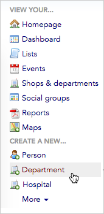
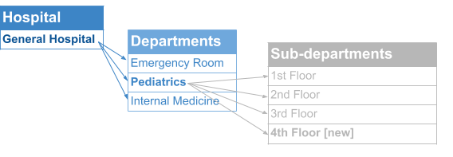
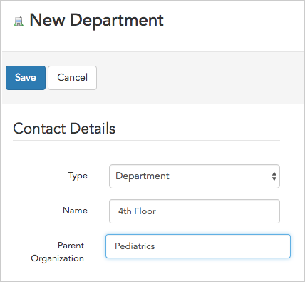

\[et\_pb\_section bb\_built="1" admin\_label="section"\]\[et\_pb\_row admin\_label="row" background\_position="top\_left" background\_repeat="repeat" background\_size="initial" \_builder\_version="3.0.105"\]\[et\_pb\_column type="4\_4"\]\[et\_pb\_text background\_position="top\_left" background\_repeat="repeat" background\_size="initial" \_builder\_version="3.0.106" background\_layout="light"\]

Shops, departments, or sub-departments (which are all broadly termed "organizations" by Broadstripes), are usually created in one of two ways:

- **during data import** using a worker spreadsheet with employment information
- **manually** (either before or after importing data) by clicking the link in the Broadstripes toolbar under the section labeled "**CREATE A NEW ..."**

This article will look specifically at creating new organizations manually, after data has been imported, as in the case where an existing shop is adding a new department or sub-department.

To learn about creating organizations _during_ import, see the [data import articles](https://help.broadstripes.com/help-articles/admin-tools/data-import-admin/data-import-overview/) of the knowledge base.

## Create an organization manually

In this example, we'll be adding a new sub-department called "**4th Floor**" to the **Pediatrics** department in our hospital structure.

###   Note

Since the way you build and label the tiers of your shop or department hierarchy is all customizable (ours is set up for a hospital with departments and sub-departments), your choices may look different than ours – even on the toolbar menu.

1. To start, click the appropriate organization link under the “**CREATE A NEW …**” section header in the left-hand navigation panel. We'll choose "**Department**."

Once you've added the new department (or other organization type), you need to specify a **Parent Organization**. To understand how that works, let's take a look at our shop structure:In our hierarchy, "**4th Floor**" is a sub-department of Pediatrics.

This means that when adding "**4th Floor**" as a new department, we need to specify "**Pediatrics**" as the “**Parent Organization**,” so that the 4th Floor department is placed _under_ Pediatrics along with the 1st, 2nd, and 3rd Floor sub-departments (and not placed on the same tier as Pediatrics, Internal Medicine, and Emergency Room).

If you were adding a new hospital, however, you would not need to specify a parent organization (since hospitals are at the top of the heirarchy structure).

\[caption id="" align="aligncenter" width="428"\] Give the department a name and specify its Parent Organization.\[/caption\]

1. Use the lower portion of the **New Department form** to record any other notes or information you want to track about the organization, department, or sub-department you are adding.
2. Click **Save** to add the new organization, department, or sub-department to your project.
3. **Add workers** using a bulk action. Since you've manually added this new sub-department after importing your worker lists, you'll need to assign workers to that employment using a **bulk action**. You can learn more about this in the [Bulk actions](https://help.broadstripes.com/v2018/docs/bulk-actions) section of the knowledge base.

\[/et\_pb\_text\]\[/et\_pb\_column\]\[/et\_pb\_row\]\[/et\_pb\_section\]
