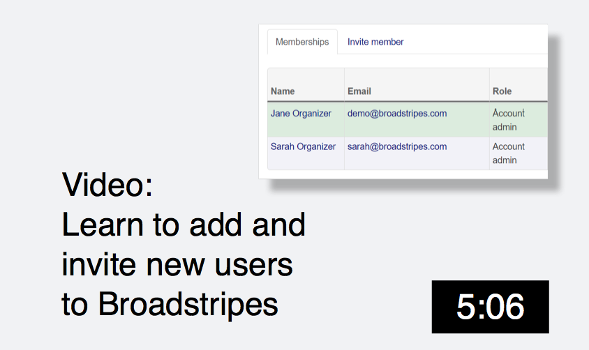

\[et\_pb\_section fb\_built="1" admin\_label="section" \_builder\_version="3.22" fb\_built="1" \_i="0" \_address="0"\]\[et\_pb\_row admin\_label="row" \_builder\_version="3.25" background\_size="initial" background\_position="top\_left" background\_repeat="repeat" \_i="0" \_address="0.0"\]\[et\_pb\_column type="4\_4" \_builder\_version="3.25" custom\_padding="|||" \_i="0" \_address="0.0.0" custom\_padding\_\_hover="|||"\]\[et\_pb\_text admin\_label="Admin video invite a user" \_builder\_version="3.27.4" custom\_margin="20px||20px||false|false" \_i="0" \_address="0.0.0.0"\]

### And and invite a new user

\[/et\_pb\_text\]\[/et\_pb\_column\]\[/et\_pb\_row\]\[/et\_pb\_section\]
