\[et\_pb\_section fb\_built="1" admin\_label="section" \_builder\_version="3.22"\]\[et\_pb\_row admin\_label="row" \_builder\_version="3.25" background\_size="initial" background\_position="top\_left" background\_repeat="repeat"\]\[et\_pb\_column type="4\_4" \_builder\_version="3.25" custom\_padding="|||" custom\_padding\_\_hover="|||"\]\[et\_pb\_text \_builder\_version="4.9.4" background\_size="initial" background\_position="top\_left" background\_repeat="repeat"\]

## Overview

#### Imports cannot be deleted or undone

If you've come to this page because your import had unexpected negative results, it's important for you to know that there's no easy way to undo an import once it's been run. However, it's likely we can still help you. Please contact Broadstripes support to talk through your options.

In this article, we'll take a look at where to see data import results at a glance as well as how to undergo a more in-depth post-import assessment.

- [Import statistics at a glance](#glance)
- [In-depth import assessment](#in-depth)

## Import info at a glance: The data imports page

After you run an import, Broadstripes computes some basic statistics like how many contacts were added, updated, or skipped, and whether anything in the import triggered errors. Broadstripes keeps a record of these details for every import in your project and presents it on a single page called **Data Imports**. Here's how to view this page and see data import results statistics at a glance:

1. First, you'll need to be logged in with **admin** **privileges** for the project.
2. Next, access **Data Imports** by clicking **Settings** > **Data imports** in the top-right right corner of any page.  
    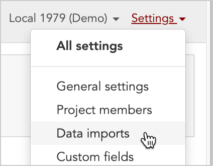
3. This takes you to the data imports index page, which lists **every data import in the project** in a grid-like list.

\[caption id="attachment\_24240" align="alignnone" width="2722"\]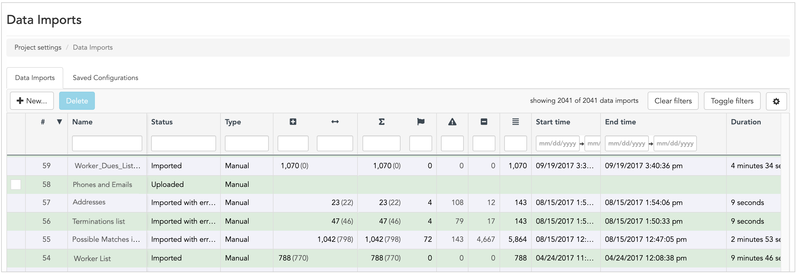 The **Data Imports page** lists all imports for a project.\[/caption\]

## Understanding the data imports page, column by column

Broadstripes computes and stores statistics about each import – for example, how many contacts were added, updated, or skipped, and whether anything in the import triggered errors. A summary of this data is listed on the main data imports page.

Here are the **column headers** we're going to be looking at: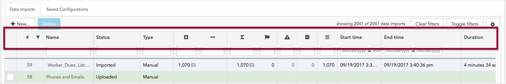

- The **checkbox** in the first column allows you **select** and **delete** an import. You can't delete an import once it's been run, so only uploaded or preprocessed imports will display this checkbox.
- **\#** This column contains the **automatically-generated number** that Broadstripes assigns to each import. The higher the number, the more recent the import. (**Note:** gaps in the numbering indicate where an import was created but later deleted.)
- **Name** (Optional) This column contains the **custom name** you gave your import during setup.
- **Status** The **current status** of the import (such as Uploaded, Imported, or Imported with errors)
- **Type** This column indicates whether the import was **created manually or automatically** (if you'd like to set up automated import, please get in touch with Broadstripes support personnel for detailed instructions.)
-   **Inserted count** This column shows the total number of rows that were added as **new records** into your project during the import.
-   **Matched count** This column shows the number of **records that were successfully matched** according to the match criteria configured prior to import.
- **Σ  Affected count** This column shows the total number of contacts that were **matched or added as new contacts** during the import.
-   **Warning count** This column shows the number of **warnings** that were triggered during the import (for instance, a row that matches multiple contacts already in the project will trigger a warning).
-   **Error count** This column shows the total number of rows that were **skipped due to an error** (for instance, when matching is used, a row that matches multiple existing contacts already in the project will be skipped and trigger an error).
-   **Skip count** This column shows the total number of rows that were **skipped because they did not match** (this applies only to imports that use matching).
-   **Total row count** This column shows the total **number of data rows in the import** file.
- **Scheduled to run** If you have an import that's **scheduled to run at a certain time in the future** (rather than immediately), this column shows that date and time.
- **Start time** This column shows when the **import began** **running**.
- **End time** This column shows when the **import finished running**.
- **Duration** This column shows **how long the import took to run**.
- **Created** This column shows when the import was **first created** (for instance when the import file was initially uploaded), and is unrelated to when or if the import has been run.
- **Created by** This column shows **who created** the import initially.
- **Updated** This column shows when the import was **last modified** in any way (for instance, or a new spreadsheet was uploaded or match criteria was changed).
- **Updated by** This column shows the **last person to make a change** to the import.

## Navigating (and customizing) the data imports page

By default, the data imports page lists every import in your project with the most recent import at the top of the list. Below are several ways you can interact with the data imports page to customize your view.

### Sort by column

Each import has a **unique ID number** (shown in the first column, labeled "#"). By default the imports will be listed by that number, in descending order, so that the most recent import will show at the top of the list.

However, you can easily **re-sort the list** of imports by any column.

**Click** any column's **header text** **area** to sort the list of imports by that column.  

An **arrow** will appear in the column header, indicating that a sort as been applied. **Click the header text area** again to reverse the sort order.  
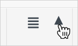  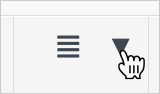

To return to **default** order**, click the "#"** in the **first column**.  

### Change column width or hide columns

You can also modify the layout to make columns **wider**, **narrower**, or **hidden** altogether.

To **change the width** of a column, **hover over** the column header until your cursor changes to a set of left-right arrows. Then **click and drag** to the desired width.  
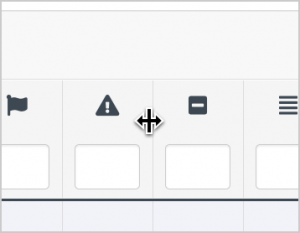

**Hover** until the cursor becomes a set of **left-right arrows**.To hide a column (or restore a hidden column back to view), **click the gear icon** on the right side of the tool bar.  
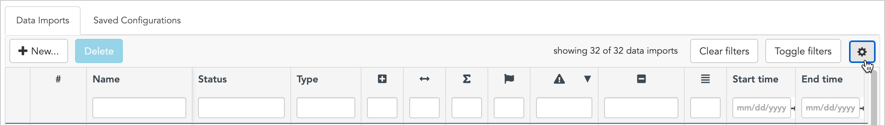

**Check the columns** you want to see and **uncheck** those you'd like to hide, then close the window using the **x** in the upper right corner.  
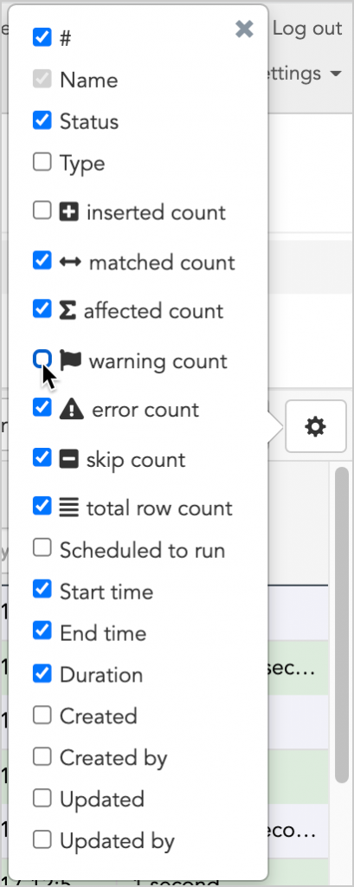

You'll see the changes immediately. You can return to this any time to hide or display additional columns as needed.

### Filter the imports list

You can also easily **filter the data import list** to view just the imports that meet certain criteria. Here's how:

1. Below the column headers, you'll see empty text boxes where you can type custom filter criteria. If you don't see these boxes, click "**Toggle filters**".  
    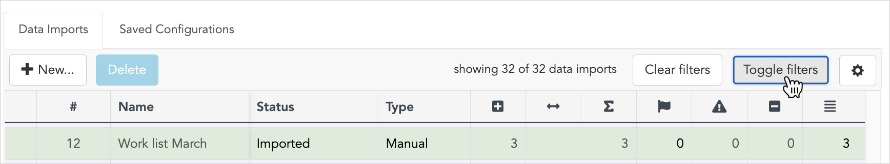
2. Next, simply **place your cursor in the text box** at the top of any column and **begin** **typing** what you want to want to see. In this example, we've typed "March" to see only import files containing that keyword.  
    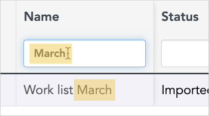
3. You can also filter the list in other ways.  
    Certain columns can be filtered by **date ranges:  
    **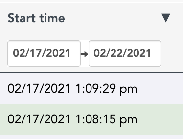
4. Or you can use **logic-based filters** on numeric columns.  
    For instance, below we've typed **"**<**30"** to show any imports with values less than thirty in the selected column:  
    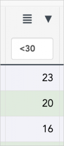

### Understanding column values with parentheses

Another detail worth pointing out is that while some of the column values are presented as a single number, you may also see cases where there's a number followed by another number **in parentheses**.

You can see this in the example below where the value is written "**463 (462)"**:  
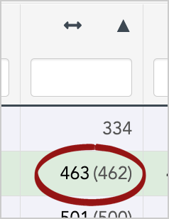

Pairs of numbers written this way provide information about the number of contacts for that column both currently _and_ at the time the import was run.

In the example above, Broadstripes is showing you that the **original import** **affected** **463** records in the project. However, one of those contacts has since been deleted, so there are only **462** **affected** **records still in the project** at this time. In other words, "463 (462)" translates to  "463 total affected records at the time of import (462 total affected records currently in the project)".

## Get an in-depth view of your data import results

So far, we've looked at how to understand and manipulate what's displayed on the data import page. Now we'll take a closer look at analyzing the results of a single import in greater depth.

### View all records affected by an import

First, a feature you might find useful: most of the statistics on the data import page aren't just numbers – they're also **hyperlinks**. This means you can **click** on any statistic to see a **complete list of the actual records** it represents in the project.

For instance, to see which records were successfully matched during the import, you can click the number "**334**" in the **Matched count** column for import **#11**.  

As soon as you click, Broadstripes will open a **search results page** that lists all **334 contacts**.

In the upper left of the search results page, you can see that a filter has been applied to show only the **matched records** in **import #11** (or, in search terms, "import = import 11 matched").

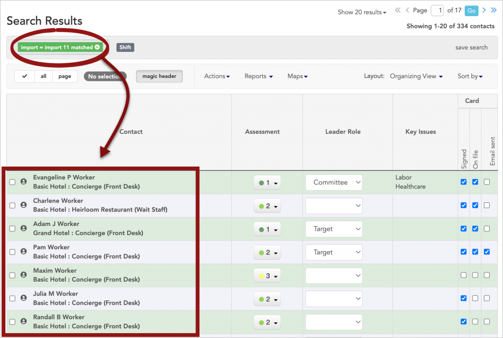

### Assess an import in detail

There are times you might want to see more than just basic statistics shown on the main data import page. For instance, if you want to view specific error messages, review field mappings, matched fields, or other assessments in-depth, you can do that by opening the import's **detail page**. Here's how:

1. To get started, from the Data Imports page, just **click** on the **import's name.  
    **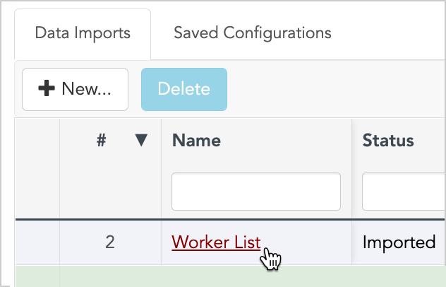
2. The **import detail page** will open.
3. **Note:** In this example, we're looking at the detail page for a data import that has already been run and has a status of "**Imported**". The detail page will look different if the import has not yet been run (for instance imports with the status "Uploaded" or "Prepocessed").
4. In the upper part of the page, you'll see some **basic details** about the import.  
    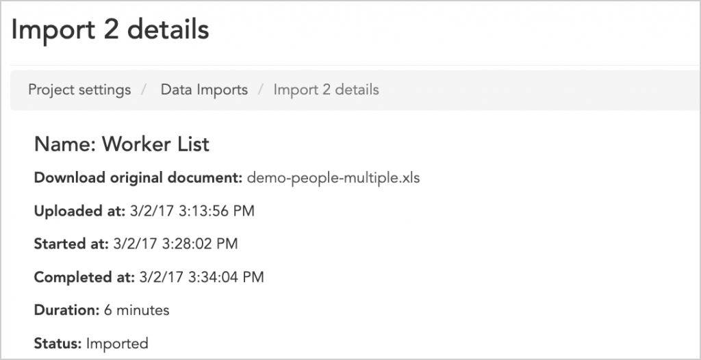

- **Download** a local copy of the import spreadsheet by clicking on the **original document file name**.  
    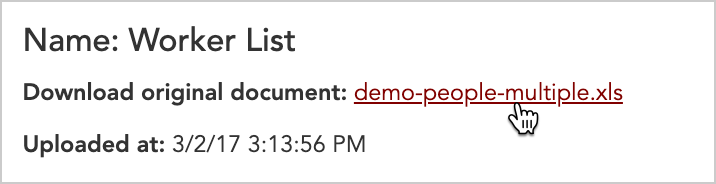
- **Uploaded at** displays when the import spreadsheet was initially uploaded into Broadstripes.
- **Started at,** **Completed at**, and **Duration** show when the import was run and how long it took to complete.
- **Status** shows the current state of the import. The status "**Imported**" means that the import has already been run, in contrast to "**Preprocessed**" and "**Uploaded**" imports that haven't been run yet.

1. Below this, you'll see the **configuration settings** for the import.  
    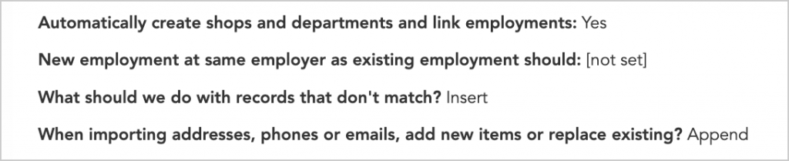

- **Automatically create shops and departments...** indicates whether or not you opted to have **shop structure **created** automatically** by Broadstripes during import.
- **New employment at same employer...** shows what Broadstripes did if the import included a new employment record for an existing contact.
- **What should we do with records that don't match?** this setting applies only to imports that use matching, and shows whether records with no match are **skipped** (not imported into the project) or **inserted** (imported into the project as new records).
- **When importing addresses...** shows whether Broadstripes **replaced** a contact's address, phone or email information with imported records of that same type, or if it retained all existing information, and **appended** the imported address, phone, and email records as additional new records.

1. The next section is called **Data Field Mappings Used** and it displays **each field** in the import spreadsheet, listed individually in rows.  
    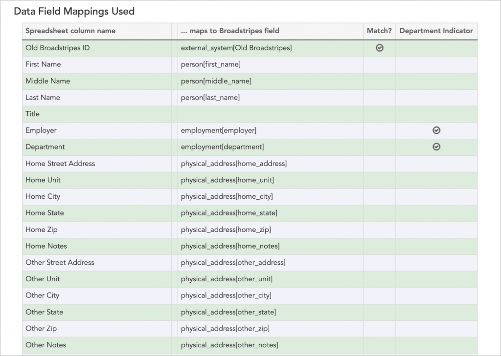

- **Spreadsheet column name** will show the **column name** from the spreadsheet.
- **...maps to Broadstripes field** shows the **Broadstripes field** that the spreadsheet column was mapped to (blanks in this column indicate that the import column was "skipped" or not imported into the project).
- **Match?** shows fields that were used to **match the imported data** with data that already exists in the project. Matched fields are indicated with a check. Note that not all imports use matching, so this column is commonly empty.
- **Department Indicator**: During the import process, you can opt to have Broadstripes automatically create a department structure or "turf structure" for your project based on shops, departments, sub-departments, or other tiers of division at your workplace. A check in this column indicates that Broadstripes found **department-related data in that field**, and used it to create your turf structure. You can view a project's full turf structure in Broadstripes by clicking the "Shops & depts" link on the left-hand toolbar on any page.  
    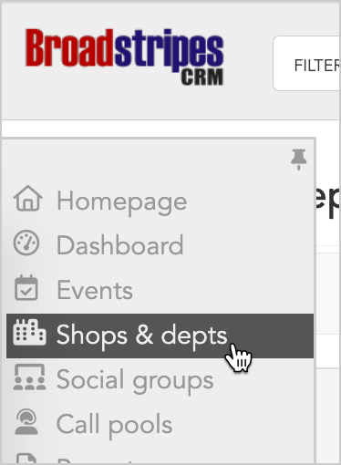

1. In the next section, **Results from preview,** you can see the same information that Broadstripes displays directly after an import is pre-processed (this is the last step before actually running an import).  
    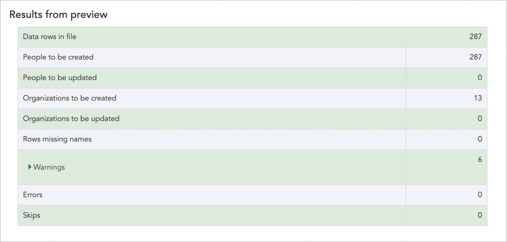
2. In addition to information about how many records will be affected by the import, you can also click on "**Warnings"** to expand the pane and see a detailed explanation for each warning triggered by preprocessing.  
    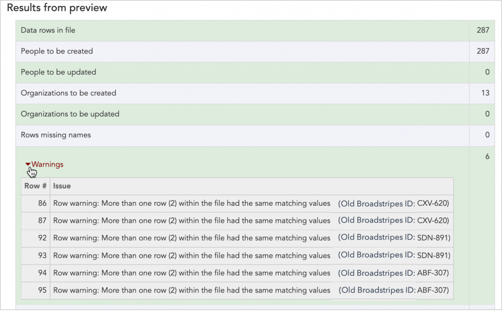
3. The last section, **Results from import,** shows statistics for the completed import, including total new (**inserted**) contact records and **matched** contacts.  
    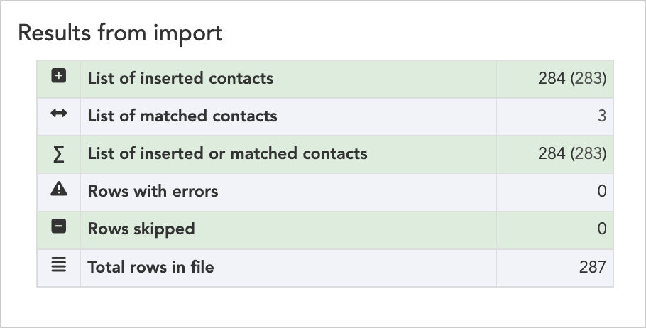
4. **Click** any hyperlinked number to **view the contact records** that comprise the total.  
    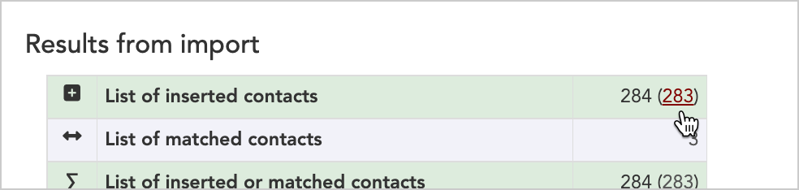

## Run a custom search to see records from a certain import

Above, we showed you how to click any hyperlinked number on the data import index page to see the all of the contact records affected by an import. You can also incorporate import-related keywords to run your own custom searches in Broadstripes' search builder, including complex [searches with multiple rules](https://help.broadstripes.com/help-articles/using-broadstripes/search/search-with-multiple-rules/). Here's how:

1. In this example, let's say that we want to see any contacts from **import 34** employed as **concierges**. (Remember that you can find the import number for any import on the Data Import page in the column marked "**#**")
2. In the search builder, we'd start by searching for contacts where "**Import" – "contains the text**" – **"import 34"  
    **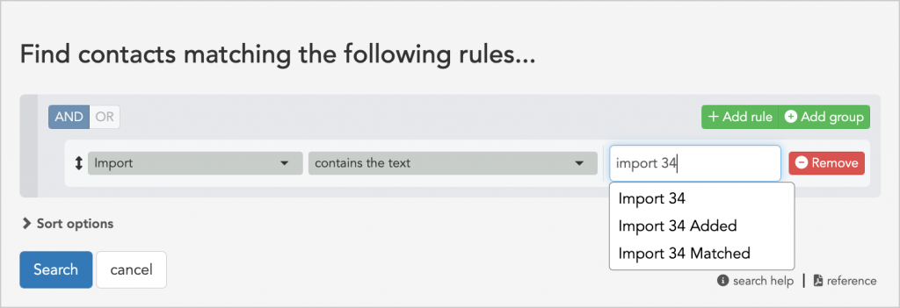  
    **Note:** If we wanted to narrow down the types of records we were searching for to see only matched records from import 34, we could instead search for **"import 34 Matched".** Or, to see only new records created by the import, we could search using the keywords **"import 34 Added"**.
3. Next, we'd add a second rule to show that we also want the contacts where "**Employer** **(in or below)" – "contains the word(s)" – "concierge"**  
      
    
    ## 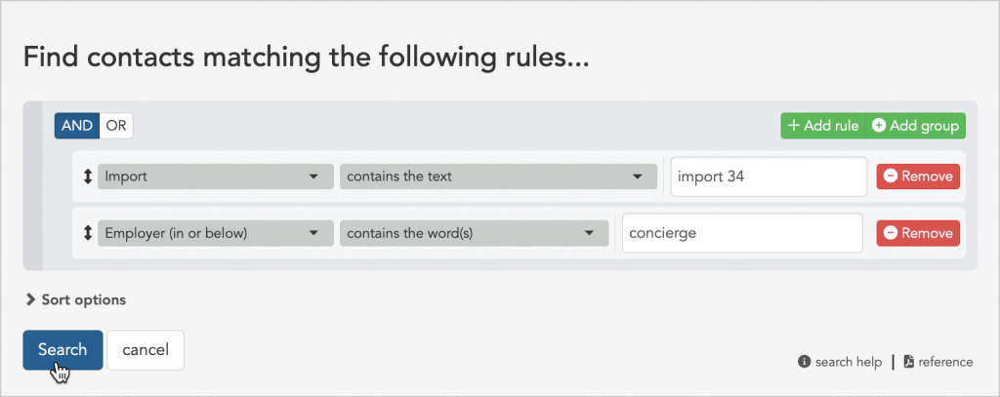
    
4. When we click search, we'll see all of the contacts who meet our criteria.  
    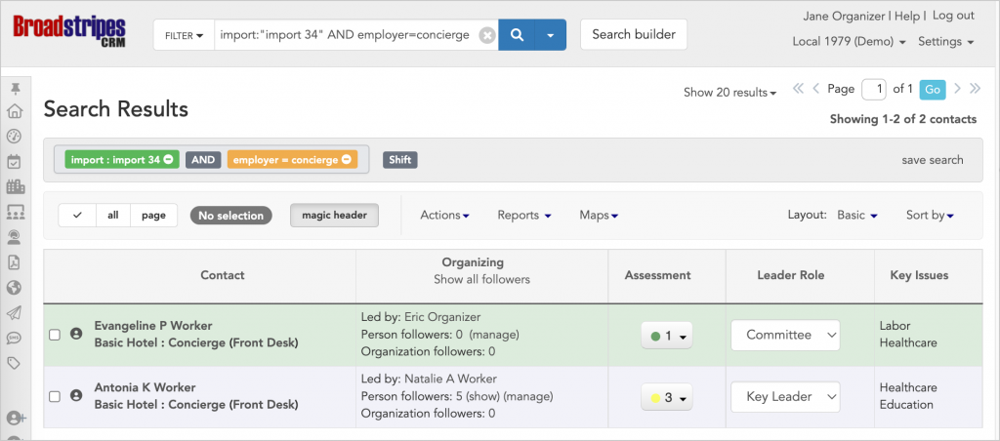

\[/et\_pb\_text\]\[/et\_pb\_column\]\[/et\_pb\_row\]\[/et\_pb\_section\]
