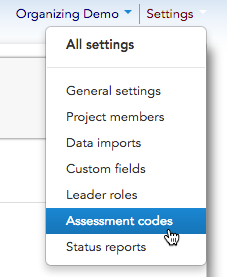
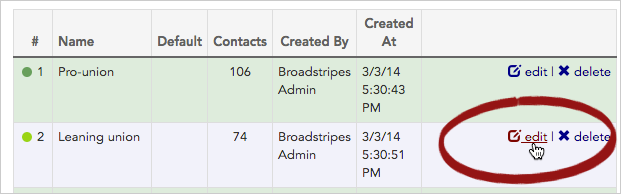
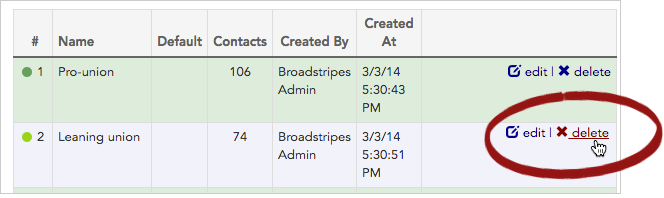
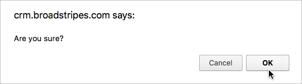

\[et\_pb\_section fb\_built="1" admin\_label="section" \_builder\_version="3.0.47"\]\[et\_pb\_row admin\_label="row" \_builder\_version="3.0.105" background\_size="initial" background\_position="top\_left" background\_repeat="repeat"\]\[et\_pb\_column type="4\_4" \_builder\_version="3.0.47" parallax="off" parallax\_method="on"\]\[et\_pb\_text \_builder\_version="3.0.106" background\_size="initial" background\_position="top\_left" background\_repeat="repeat"\]

## Overview

An essential piece of any organizing campaign is figuring out where the workers stand in relation to the campaign's goals.

This is usually done using a numeric assessment scale, with 1 indicating strong support, and the highest number in the scale (usually 5) indicating hostility. The 5-point scale is useful because it gives you a neutral position (3) and two "leaning" options (2 and 4).

Broadstripes makes it easy to set up assessment codes to match your campaign's style. You can create as many codes as you want, and supply descriptive text for each.

#### What's the difference between "Assessment codes," "Assessments," and "Codes"?

Absolutely nothing! "Assessment codes," "Assessments," and "Codes" all refer to the exact same piece of employment information in Broadstripes; it's just a matter of how it is labeled.

In your [general settings](https://help.broadstripes.com/help-articles/admin-tools/project-settings/general-settings/), you can choose whether you want Broadstripes to refer to the numbers on the assessment scale as "Codes" or "Assessments," and you can go back to your general settings to change this label at any time.

## Configure a new assessment code

1. Go to **Settings > Assessment** **codes**
2. Click on the button to add **\+ New Code**
3. Add a **code number** (most projects use codes 1-5, but you can have as many or as few if you want).  
    **Note:** Assessment codes do need to be numbers, and you can't use "0"
4. Give the code a short one- or two-word **description** that will appear on-screen and in reports (optional).
5. If you want a certain assessment to be selected automatically when your end users are entering a new contact in Broadstripes, check **Is Default**.
6. Click **Save Code**. You'll be returned to the **assessment index page** where all your assessments are listed.
7. Repeat until you've added all of the assessments on your scale. Note that colors are automatically assigned to the different codes.
8. At the bottom of the assessment index page, check **Display timeline details dialog when code is changed from the drop-down?** if you would like your users to be prompted to add a timeline note each time they change a worker's assessment.
9. Your finished assessments might look something like this:

## Edit or delete your assessment codes

### Edit

1. To **edit** an assessment code, click the  **edit** link at the end of the row for the code you want to change.

1. Make the changes you want, and click the **Save Code** button.
2. You'll be returned to the **assessment code index page** where you can see your changes.

### Delete

1. To permanently **delete** an assessment code, click the **delete** link at the end of the row for the code you want to remove.

1. Confirm that you want to delete the assessment by clicking **OK** when prompted.

1. The assessment code will be removed from your project, and all contacts who were previously assigned that code will have no code (i.e. their assessment field will now be blank).

\[/et\_pb\_text\]\[/et\_pb\_column\]\[/et\_pb\_row\]\[/et\_pb\_section\]
