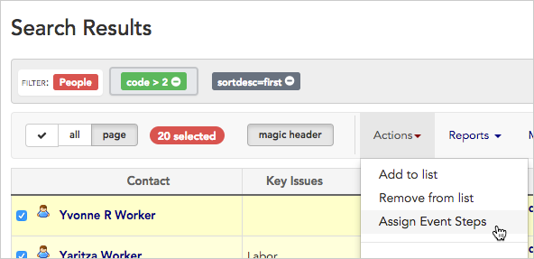
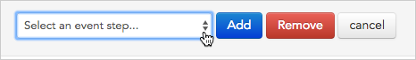
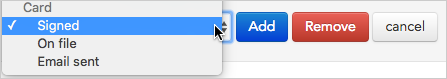

\[et\_pb\_section fb\_built="1" \_builder\_version="3.22"\]\[et\_pb\_row \_builder\_version="3.25" background\_size="initial" background\_position="top\_left" background\_repeat="repeat"\]\[et\_pb\_column type="4\_4" \_builder\_version="3.25" custom\_padding="|||" custom\_padding\_\_hover="|||"\]\[et\_pb\_text \_builder\_version="4.4.8" hover\_enabled="0"\]

# Action: Assign event steps

* * *

## Set event steps

When you are checking off an event or an event step for multiple contacts at once, using an action can be a great time-saver. (If you are new to events, check out the [Events](https://help.broadstripes.com/help-articles/using-broadstripes/customize/create-events-to-track-goals/) overview article for more information.)

For this example, we'll show how to check off signed cards for a group of contacts we visited last week.

1. First, we'll run a search for people on our house visit list. Then, from the **Search Results** page, we'll [select the contacts](https://help.broadstripes.com/help-articles/using-broadstripes/working-with-search-results/selecting-deselecting-contacts/) who have just signed their cards. (If you need help running a search, check out the [Create and save a search](https://help.broadstripes.com/help-articles/using-broadstripes/customize/create-and-save-a-search/) article.)
2. With the contacts selected, we'll go to the **Actions** drop-down menu and choose **Assign Event Steps**.
3. When prompted to select an event step, we'll choose the **Card > Signed** step and click **Add**.  
     
4. Broadstripes will automatically update all of the contact records that we selected to show that their cards are signed. A **pop-up box** will appear to confirm our update.

## Unset (uncheck) an event step

If you want to uncheck (rather than check) an event step for a group of contacts all at once, you can do that from the actions drop-down menu, too. In this example, we have a list of people who were accidentally marked as having signed cards. We need to correct their records to show that they haven't yet signed a card.

1. Again, we'll start by running a search. From the **Search Results** page, we'll [select the contacts](https://help.broadstripes.com/help-articles/using-broadstripes/working-with-search-results/selecting-deselecting-contacts/) we need to correct. (If you need help running a search, check out the [Create and save a search](https://help.broadstripes.com/help-articles/using-broadstripes/customize/create-and-save-a-search/) article.)
2. With the contacts selected, we'll go to the **Actions** drop-down menu and choose **Assign Event Steps**.

1. When prompted to select an event step, we'll choose the **Card > Signed** step. 

1. Finally, we'll click **Remove** to unset (uncheck) the Card > Signed event step.
2. Broadstripes will automatically update all of the contact records that we selected to show that their cards are no longer signed. A **pop-up box** will appear to confirm our update.

\[/et\_pb\_text\]\[/et\_pb\_column\]\[/et\_pb\_row\]\[/et\_pb\_section\]
