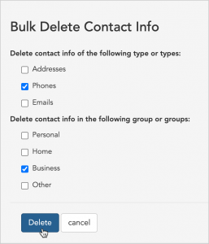

\[et\_pb\_section fb\_built="1" \_builder\_version="3.22"\]\[et\_pb\_row \_builder\_version="3.25" background\_size="initial" background\_position="top\_left" background\_repeat="repeat"\]\[et\_pb\_column type="4\_4" \_builder\_version="3.25" custom\_padding="|||" custom\_padding\_\_hover="|||"\]\[et\_pb\_text \_builder\_version="4.4.8" hover\_enabled="0"\]

# Delete contact info

* * *

## Delete address, phone, and email information from contact records

You can use bulk actions to **permanently delete certain contact information from a contact or group of contacts** from your Broadstripes project. You can delete all types of contact info (addresses, phones and emails) from all groups (personal, business, home and other) or choose a combination of types and groups.

Being able to delete certain contact info can be useful when you make a mistake during your import – for instance importing cell phone numbers as home phones. It might also be used in a case where you want to remove all business phone numbers to avoid accidentally tipping off management to your organizing plans by contacting a person at work.

For this example, we'll show how to permanently delete business phone numbers for a group of workers.

1. We'll start by running a search. From the **Search Results** page, we'll [select the workers](https://help.broadstripes.com/help-articles/using-broadstripes/working-with-search-results/selecting-deselecting-contacts/) whose business numbers we are deleting. (If you need help running a search, check out the [Create and save a search](https://help.broadstripes.com/help-articles/using-broadstripes/customize/create-and-save-a-search/) article.)
2. With the contacts selected, we'll go to the **Actions** drop-down menu and choose **Delete contact info** (you may need to **scroll down** the page to see this option).\[caption id="attachment\_23451" align="aligncenter" width="511"\] You may need to scroll down to see the **Delete contact info** in the drop down menu**.**\[/caption\]
3. Next, we'll check **Phones** as the **contact type** and select **Business** as the **group** and click **Delete**.
4. Broadstripes will automatically queue the process of deleting the selected contact info. A **pop-up box** will appear to confirm the deletion is queued. No further action is needed.

\[/et\_pb\_text\]\[/et\_pb\_column\]\[/et\_pb\_row\]\[/et\_pb\_section\]
