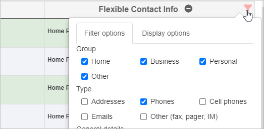
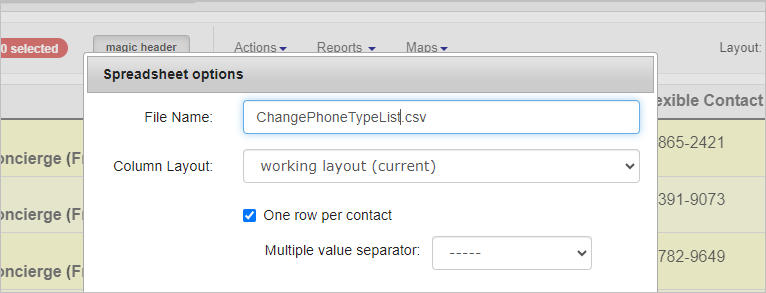
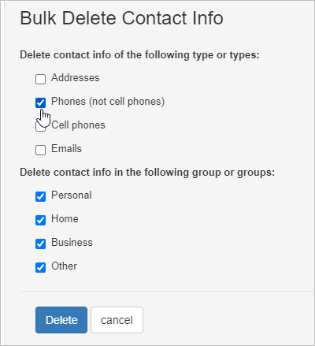
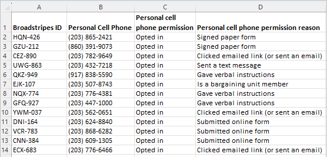
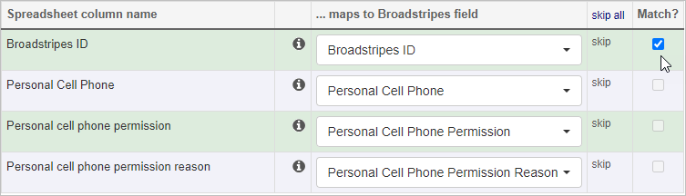

On occasion, you will need to change phone numbers from one phone type to a different phone type (eg, Home phone to cell phone). When you need to switch many phone numbers, changing the phone types (or other phone metadata) one by one could become tedious. There is a more efficient way to change phone types in bulk by downloading contacts and importing updated contact info back into Broadstripes. This can be useful when changing phone types and messaging permissions for texting.  Here is an example of how to change phone types (and other metadata) in bulk:

1. Add a Flexible Contact Info column to your layout that includes only "Phones" (not "Cell phones"). This should be the only column in your search layout besides **Contact.** 
2. Select the contacts that you want to update.
3. Download the data to a spreadsheet. You can download a CSV or an XLSX. Be sure to use your current working layout and select the **One row per contact** checkbox. 
4. Delete the old phone numbers using the **Actions** menu and select **Delete contact info** from the dropdown list. When the **Bulk Delete Contact Info** panel appears, select **Phones**. You can also choose specific phone groups to delete if applicable. Click **Delete.** 
5. Edit the downloaded spreadsheet and make the following changes:
    1. Change the column header from "Personal Phone" to "Personal Cell Phone" (If you are using other types of phone groups like Business Phone, also insert Cell into the column header.)
    2. Add a column named "Personal cell phone permission" with the text "Opted in" in each row
    3. Add a column named "Personal cell phone permission reason" with one of the following reasons in each row:
        - - Signed paper form
            - Submitted online form
            - Clicked emailed link (or sent an email)
            - Sent a text message
            - Gave verbal instructions
            - Is a bargaining unit member
            - Set in external system
    4. You can delete all other columns except the **Broadstripes ID** column.
6. [Import the new spreadsheet](https://help.broadstripes.com/help-articles/admin-tools/data-import-admin/import-a-spreadsheet/) into Broadstripes and be sure that the columns match in the **Define data mappings** section. 

Once the data import is complete, your contacts will be updated with a new phone type and messaging permissions.
