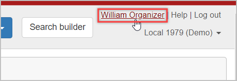
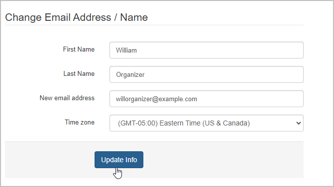

You may need to change the email address that you use to log into Broadstripes and receive communications. (Can no longer access email, email has been compromised, etc.)

Users can change the email that is associated with their user login on their personal settings page. On your personal settings page, you have the option to change the way you use Broadstripes, including your SMS notification number, email address, password, and other preferences.

This article will take you through the steps of how to update your email inside the app:

1. Log in to Broadstripes with the old email address. Click on your name in the top right corner. (next to **Help** and **Log out**) This will take you to your personal settings page. 
2. Navigate to the section labeled "**Change Email Address / Name**". In this section, you can change your name, email address, and preferred time zone. 
3. Enter your new email address in the designated field and click **Update Info.**

Your email address will be updated, and you can now use the new email address to log in and receive communications from  Broadstripes.
