\[et\_pb\_section fb\_built="1" admin\_label="section" \_builder\_version="3.22" fb\_built="1" bb\_built="1" \_i="0" \_address="0"\]\[et\_pb\_row admin\_label="row" \_builder\_version="3.25" background\_size="initial" background\_position="top\_left" background\_repeat="repeat" \_i="0" \_address="0.0"\]\[et\_pb\_column type="4\_4" \_builder\_version="3.25" custom\_padding="|||" \_i="0" \_address="0.0.0" custom\_padding\_\_hover="|||"\]\[et\_pb\_text \_builder\_version="3.27.4" background\_size="initial" background\_position="top\_left" background\_repeat="repeat" \_i="0" \_address="0.0.0.0"\]

## Intro

If the Broadstripes “**relationship**” function is enabled for your project, you have the ability to track special relationships between individual workers. You can choose between a number of defined relationship types such as “Friend” or “Neighbor.”

Once you’ve recorded these connections between workers, you can start to see visually how the people in a shop are interconnected using the “relationship tree” view. 

In this article, we’ll look at how to **create new relationships** and **work with existing relationships**.

A few other things we’ll cover:

- How to [search for contacts by their relationships](#search-by-relationship) 
- How to [see relationship information in your search results layout](#relationship-information-in-your-search-results-layout) 
- How [relationships differ from social groups](#relationships-social-groups)

## Video: Relationships

\[/et\_pb\_text\]\[et\_pb\_text admin\_label="Working with relationships" \_builder\_version="3.27.4" custom\_margin="20px||20px||false|false" global\_module="22581" saved\_tabs="all" \_i="0" \_address="0.0.0.1"\]

[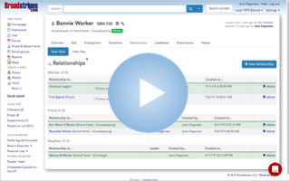](https://vimeo.com/359601582)

### Working with relationships

\[/et\_pb\_text\]\[et\_pb\_text \_builder\_version="3.27.4" background\_size="initial" background\_position="top\_left" background\_repeat="repeat" \_i="2" \_address="0.0.0.2"\]

## Create a new relationship or view an existing relationship

For this example, we'll show how to add a new relationship between two coworkers to show that they are neighbors. Here's how:

1. From the **search results panel**, hover over the worker's name and **click** the **looking glass icon**.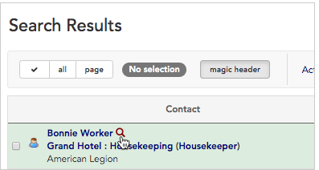
2. **Click** the **relationship tree** **icon**.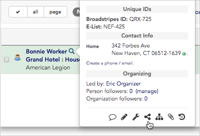
3. By default, you’ll see any **existing relationships** listed in the **table view** on the **relationship index page**.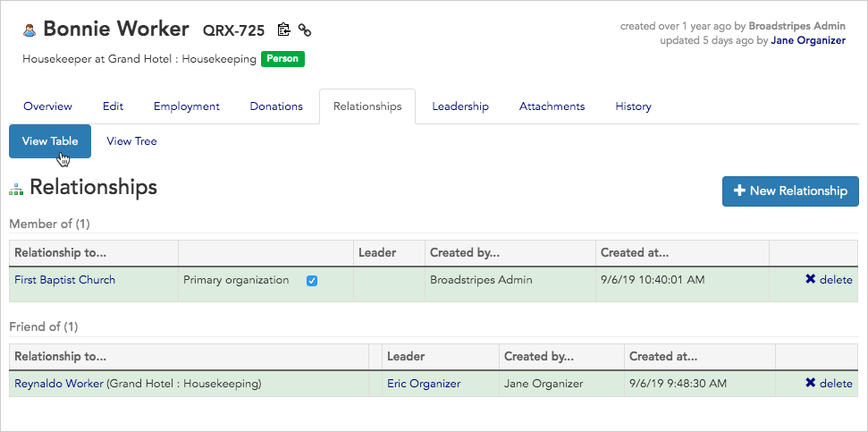
4. Each **type of relationship** is shown in a separate section. Relationships can show ties between two individual people (for instance Bonnie and Reynard), or between a person and an organization (like Bonnie and the First Baptist Church).
5. Now we’ll create a new relationship. Click the "**\+ New Relationship"** **button**.
6. We'll choose "**Neighbor of**" from the **relationship type** **drop down menu**. (If you don’t see the relationship type you’re looking for, talk to your Broadstripes point person).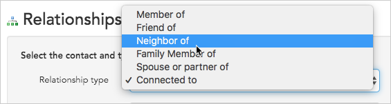
7. In the **related contact box**, type the **name** of the **worker** or **organization** with whom you want to create the new relationship. As you type, you’ll see a **list of options** to choose from.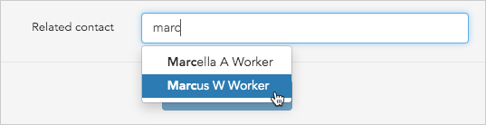

#### What if the contact is not on the list?

If you don’t see the choice you want on this list, it means that contact is not in Broadstripes yet. You’ll need to first add that contact to Broadstripes, then come back to this screen to create the Relationship (learn more about adding a contact in the [Add a Shop or Organization](https://help.broadstripes.com/help-articles/using-broadstripes/working-with-contact-records/add-a-shop-or-department/) or [Add a Person](https://help.broadstripes.com/help-articles/using-broadstripes/working-with-contact-records/add-a-new-person/) articles). 

8. Once you've chosen the relationship type and related contact, click the "**Create relationship" button** to save the new relationship.
9. You'll see the new relationship on the **relationship index page.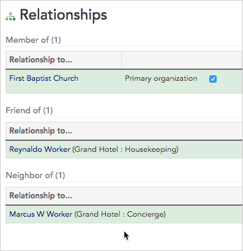**

## View complex relationships with the tree viewer

Getting a sense of how your workers are interconnected can be confusing. The tree viewer simplifies that.

1. To see relationships between workers visually, click the **View t****ree** tab near the top of the page.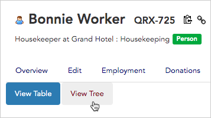
2. The **tree view** will open. You'll see your contact at the center of the tree. In this example, we see Bonnie Worker at the center of the tree and each of Bonnie's direct relationships (Marcus, Reynaldo and First Baptist Church) connected by a separate branch.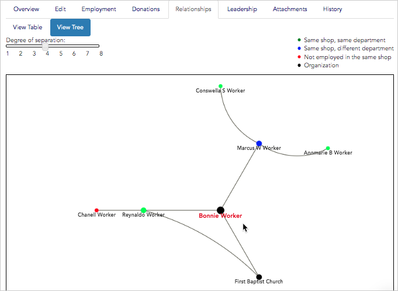
3. By default, Broadstripes will also show the relationships under Bonnie's direct relationships – that is, her contacts' relationships – up to eight **degrees of separation**. In the example below, you can see Marcus's relationships to Conswella and Annmarie, which have two degrees of separation from Bonnie.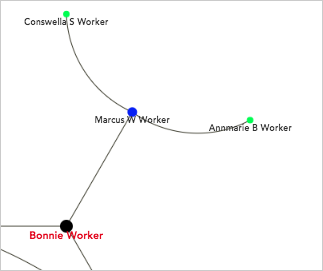
4. You can adjust your view to see fewer **degrees of separation** using the **slider**. We'll move the slider to "**1**" to see only those contacts who are related directly Bonnie.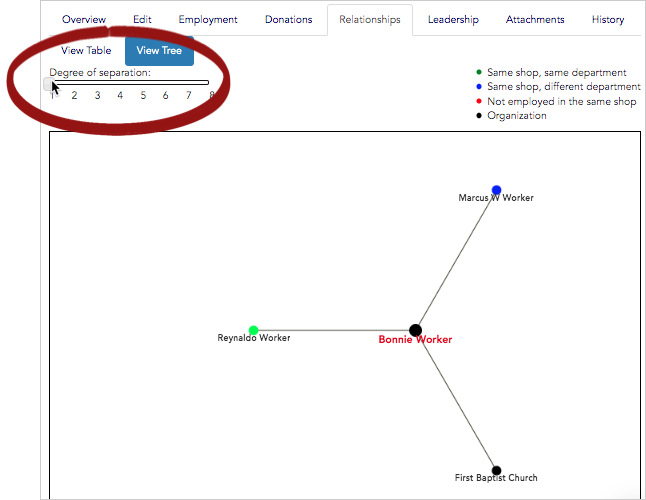
5. You can also use the tree view to navigate between contact records. **Click** on any **contact's name** to jump directly to that contact's own **relationship tree** and see additional information about them.

## Choose a contact's primary organization relationship

If you use the relationships function to track relationships between **workers** and **organizations**, you can tag one organization as "**primary**." Here's how:

1. From the **relationship index page,** locate the relationship you want to mark as **primary**. Note that the relationship must be between a worker and an organization, not two workers.
2. Check the box next to the text **"Primary organization."**
3. You'll now see this organization listed under the contact's name in search results.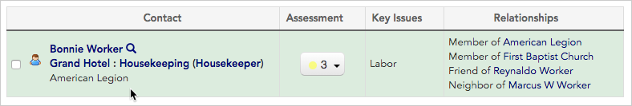

## Search for contacts by relationship

Once you've created relationships between contacts, it's simple to find anyone related to any other person or organization using the **search builder**.

1. For this example, we'll search for anyone who is a neighbor of Bonnie.
2. Start by clicking the **"Search builder"** **button** at the top of the page.
3. Use the **drop down menu** to choose **"Neighbor of"** as the **relationship type** under the "**Relationships" keyword group**. 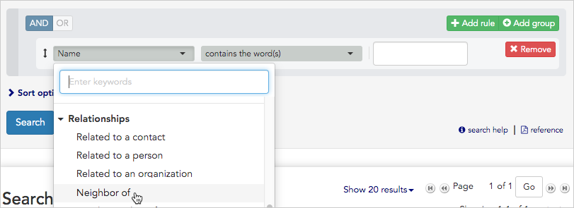
4. In the next **drop down menu,** select **"contains the word(s)."**
5. Then type "**Bonnie"** to limit the results to only those people who are Bonnie's neighbors.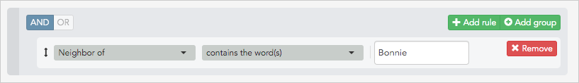
6. Click **"Search."**
7. Everyone who is Bonnie's neighbor will appear in the **Search Results** panel.
8. You can also run broader searches to see more relationships. For instance, to run a search to see anyone who is a neighbor of anyone else, modify the search by choosing **"Neighbor of"** and **"has any value."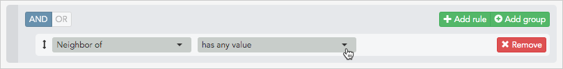**
9. To see contact with any relationship of any kind, search for **"Related to a contact"** and **"has any value."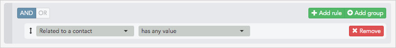**
10. In the next step, we'll look at how to modify your **search results layout** to display information about relationships.

## Add relationship details to a search results layout

Seeing how contacts are related to each other can be very useful for your organizing campaign. Here's how to display relationship information each time you view search results.

1. From the **Search Results** panel, click the **Layout** drop down menu and choose **"Modify layout..."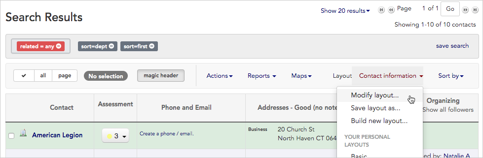**
2. **Click once** on **"Relationships"** to include the column in your layout. It will turn from gray to a bright color and will be added to the left side of the layout builder.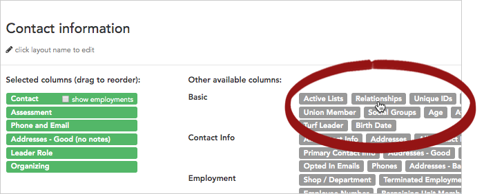
3. **Drag and drop "**Relationships"**** to change its position in the search results matrix:
    - The column name at the **top** of the layout builder will be the first column on the **left** when your search results are displayed, while column name at the **bottom** will display as the furthest to the **right**.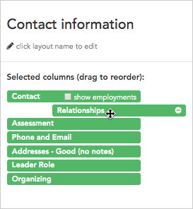
4. Once your layout is modified, you can either choose **apply** the new layout just once, or **save and run it**.
    - Click **Apply without saving** to simply apply the layout once to your current search results. This will re-display the results with the new column, but won’t permanently save any of the changes you’ve made to the layout.
    - Click **Save changes** to overwrite the saved layout with the modifications you’ve just made. You’ll see the changes each time you choose this layout.
5. **Relationship details** will now appear on your **Search results** panel.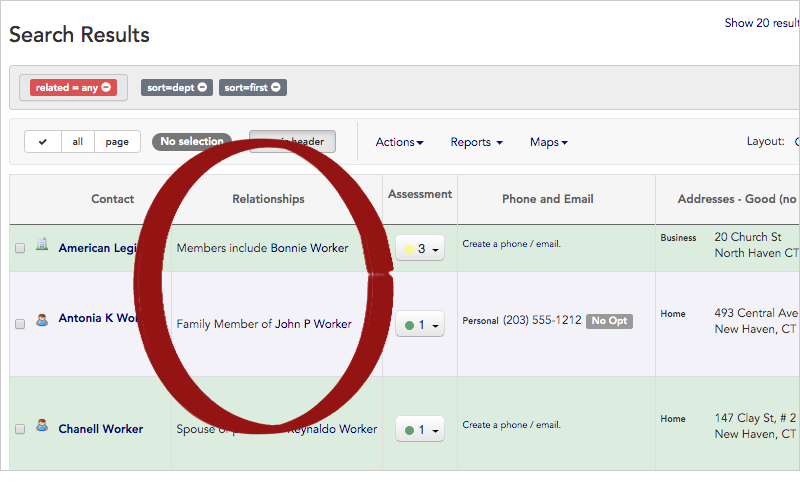
6. Learn more about working with layouts in the [Create and save a layout](https://help.broadstripes.com/help-articles/using-broadstripes/customize/save-a-layout/) article.

## How relationships differ from social groups

Now that you've learned about creating and working with relationships, you may be wondering when it's best to use them. If you also use Broadstripes' social groups function, you may have questions about how social groups and relationships differ.

Simply put, it's best to:

- **use relationships when** you want to show specific types of _individual_ connections (person to person, or person to org).
- **use social groups when** you want to keep track of temporary group dynamics or unique social connections (like people who share a lunch break or Knicks fans).

Some more ways relationships and social groups differ:

- Unlike with relationships, which have specific types set by an admin, you can create as many social groups as you want, and delete them when they're no longer useful.
- Once you've set up social groups, you have the option to tag leaders. With leaders in place, social groups can become a tool for building organizing structures in Broadstripes, a layer of functionality not possible with relationships.

You can read the [social groups article](https://help.broadstripes.com/help-articles/using-broadstripes/customize/create-social-groups/) to learn more about creating and working with social groups.

\[/et\_pb\_text\]\[/et\_pb\_column\]\[/et\_pb\_row\]\[/et\_pb\_section\]
