To use the Call center, you will need to create a script for callers to follow. You will be using a scripting language/pseudo-code to give instructions to the app on how to direct callers.

## Plan your call flow

Before you write your script, it is best practice to create a flowchart first so that you can plan how you want your script to function. You can do this by hand or using specialty software. Your flow-chart should look something like this:

<iframe style="border: 0px #ffffff none;" src="https://help.broadstripes.com/wp-content/uploads/2023/08/script-call-center.svg" name="Call Center Flowchart" width="960px" height="1200px" frameborder="1" marginwidth="0px" marginheight="0px" scrolling="no" allowfullscreen="allowfullscreen"></iframe>

Once you've created your flowchart and have finalized how you want your call center script to function, you can create the actual script. In this article, we will explain the different parts of the script:

## Supplemental

The supplemental section is where you will define the custom fields that will appear at the bottom of every Call Center page during a call. For this example,  "Best time to call" and "Phone number" are fields we want visible throughout the call and, therefore, defined in the supplemental section.

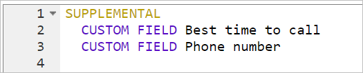

There may be some instances in which you do not want to use the default label of a custom field. You can change the label of the field to something more meaningful in the supplemental section. In the following image, you will see that the same custom fields, "Best time to call" and "Phone number,"  will be on the call center pages. With the "LABEL" instruction, you may change the change the way a custom field is displayed.

\[caption id="attachment\_26281" align="aligncenter" width="570"\]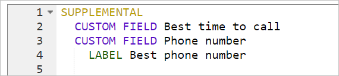 The call center will now display the custom field as "Best phone number" instead of "Phone number", because of the "LABEL" instruction.\[/caption\]

 

## Node

A node is considered a page in your call center. The script really starts with this first "NODE". Nodes can be named anything the script creator likes. In the picture below, the user has named the node "Start."

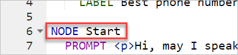

After you start your first node, you will want to provide instructions or dialogue for your callers. You will do this with a PROMPT instruction. In the example below, the script directs the caller to indicate whether they've reached the person.  If they have reached the person, they can start the pitch. If not, they can click a button to choose one of the other possible call OUTCOMEs. The node should be indicated with a "NODE" instruction.

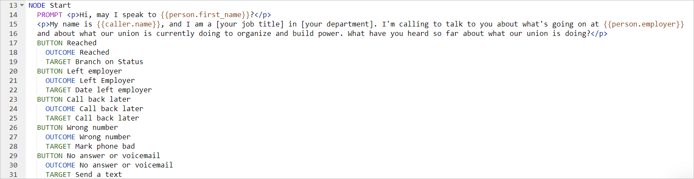

## Buttons

When callers choose a button, the selection triggers an action, such as moving to another page, setting an event step, or indicating the status of a call (OUTCOME). Buttons are defined and named with the instruction "BUTTON" followed by the name of the button. In the example above, you will find 5 buttons, "Reached, Left employer, Call back later, Wrong number, Mark phone bad,  and No answer or voicemail." These buttons will be displayed on the right side of the screen for the caller.

\[caption id="attachment\_26372" align="aligncenter" width="1024"\]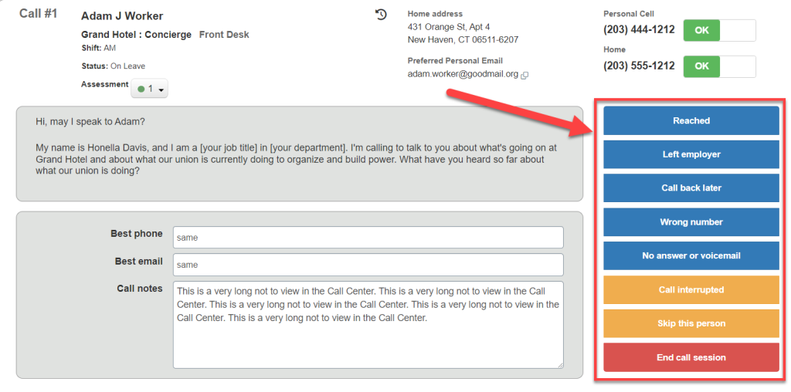 Full view of a node in the call center\[/caption\]

The buttons that are defined in your script will be blue. Blue buttons will only be visible in the node where you defined them.

Buttons that are built-in will be green, yellow, or red. Built-in buttons include "Call interrupted, Skip this person, Continue, Previous Question, Call complete, and End call session." They also have preset targets and/or outcomes. There is one exception to these color standards. The Continue button (NEXT instruction) will be blue (instead of green) if the node has other user-defined buttons in it.

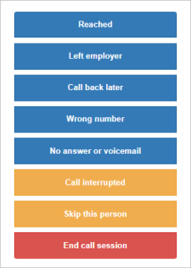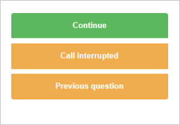

 

There is one exception to these color groupings. The Continue button (NEXT instruction) will be blue (instead of green) if there are other buttons in the same node that are user-defined.

## Outcome

In the following script snippet, the BUTTON instruction is followed by an OUTCOME instruction.  The outcome instruction directs the script to mark a call with a specific outcome status. The name of the outcome is followed by the OUTCOME instruction. In the image below, the outcome has been named "Wrong number," and the call will be marked "Wrong number" when the button is selected. 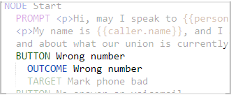

The outcome will determine if a person is removed from the call queue for future calls within that call pool. The outcome status will be recorded on the worker's contact timeline, along with a timestamp of the call occurrence. 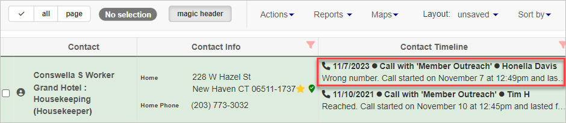

It is recommended that you name an outcome something meaningful for your project. The app does have pre-defined outcomes that are associated with the buttons "Skipped this person" and " Call Interrupted."

## Target

The TARGET instruction directs the script to another node (page). In the script snippet below, TARGET is used in two places to direct the caller to different nodes. 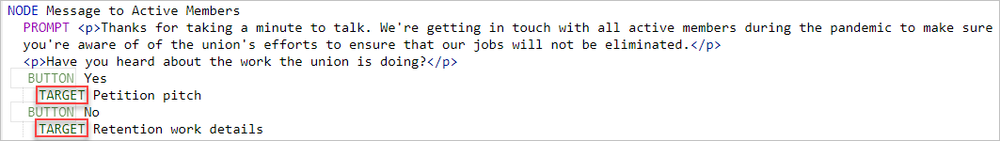The first TARGET directs the caller to the node named "Petition pitch." The second TARGET directs the caller to the node named "Retention work details."

## Data Field References

You may use parts of existing data in Broadstripes in your call center script. For example, in the following script snippet, the script creator uses double curly brackets to reference:

- the first name of the person being called {{person.first\_name}}
- the name of the caller  {{caller.name}}
- the name of the employer of the person being called  {{person.employer}} 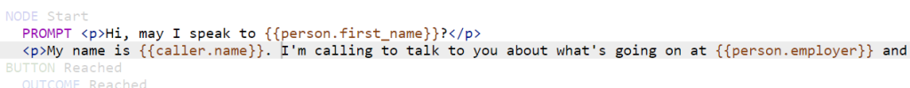

The {{entity.data\_field}} format is used for referencing fields that are built into the app (e.g., First name, Last name, employer, etc., **is there a list?**). The entity can be either the **person** being called or the **caller**.

\[caption id="attachment\_26502" align="aligncenter" width="1373"\] The script references the **built-in** "Employer" field and "Left Employer Date" **custom field**.\[/caption\]

You may also want to reference the values of custom fields in your call center script. In the next code snippet, the script creator uses the double curly brackets AND square brackets to reference a custom field.

The {{person.custom\_fields.\[custom field name text\]}} format is used specifically for custom fields.  Although this is similar to referencing a built-in field, there are key differences that you must remember when making your script:

- A custom field reference will only apply to the person being called
- The name of the custom field must be enclosed within square brackets followed by the word text, e.g., **\[left employer date text\]**
- The custom field name MUST be in all lowercase, even if the custom field's name contains capital letters.

## Conditional Instruction

You can make your script behave differently if the call recipient meets different criteria than another. This can be accomplished with a conditional statement. In the code snippet below, there is a conditional statement named "Branch on status". The beginning of this statement starts with the word "CONDITION".

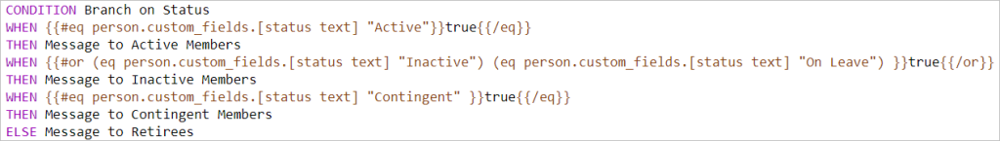

On the second line of the condition, you will define WHEN to perform a certain action. In the snippet above, WHEN {{#eq person.custom\_fields.\[status text\] "Active"}}true{{/eq}} tells the script to check the custom field, "Status" to see if it has the value of "Active". If this condition is true, the script will continue to the THEN on the next line. The THEN instruction tells the script to go to the node named "Message for Active Members". If the Status custom field does not equal "Active", then this condition is false, and the script will go to the very next line that includes a WHEN(or sometimes ELSE). In the second occurrence of WHEN in the snippet, there are two conditions that are checked. If either of these conditions is true, the script will go to the THEN instruction. You may check to see if either of two conditions are true by using **#or.**  In the WHEN condition below, the two possible conditions start with **#or** and are closed with **/or** to complete the listing of conditions. If Status = "Inactive" or if Status = "On Leave," the script will continue to the THEN on the next line, which takes the caller to the node called "Message to Inactive Members."

IS there a #and??

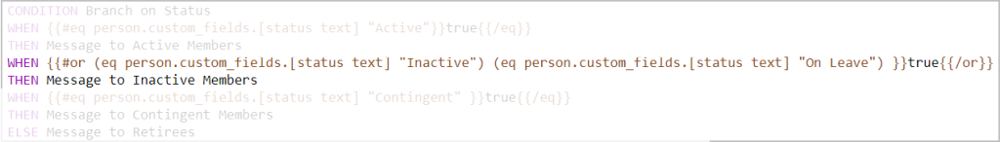

ELSE may be used as a "catch-all" for any other values that don't match your conditions. In the example below, the script will first evaluate if a person has a Status of "Active." If this is true, the caller will be directed to the "Message to Active Members" node. If this is false, the person's Status will evaluated to see if "Contingent." If the status is "Contingent," the caller will be directed to the "Message to Contingent Members" node. If the person's status is neither "Active" nor "Contingent," the caller must be directed to do something else. The ELSE instruction directs the caller to the "Message to Retirees" node for any other value in the Status custom field.

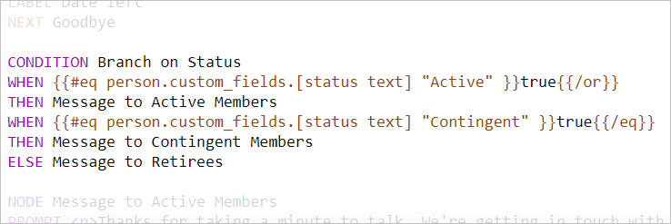

## Script Instructions

In this table, you will find all the different instruction keywords that you may use in a call center script and the function of each.

\[table id=19 /\]

 

## Styling your Call center

it is recommended that you use HTML tags to ensure that instructions are presented in a way that makes sense for your callers. You can use paragraph, break, emphasis, and other style tags to modify the way the caller sees the call center script. In the image below, you will find a few examples of how call center text can be modified.

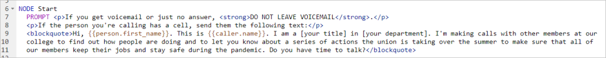

In the image above, The first two sentences are wrapped in paragraph tags. (**
** **
**) As the name suggests, any text within those tags will be defined as one paragraph. Browsers automatically add a single blank line before and after each 
 element. The image also includes strong tags (<strong></strong>) in the first sentence to indicate important text. Blockquote tags (<blockquote></blockquote>) are used to used in this example to differentiate text that should be used in an SMS message.

You can use most text-related HTML tags in your call center script.
