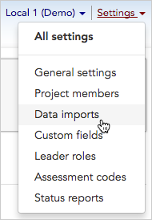
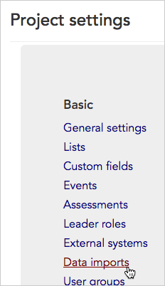
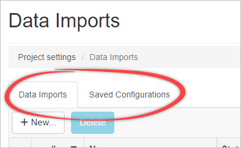
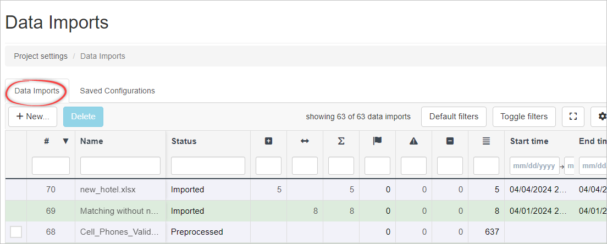
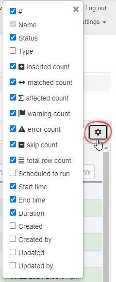
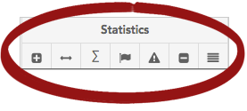
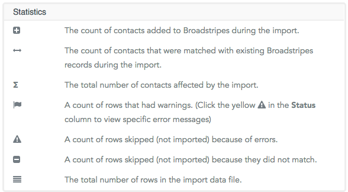
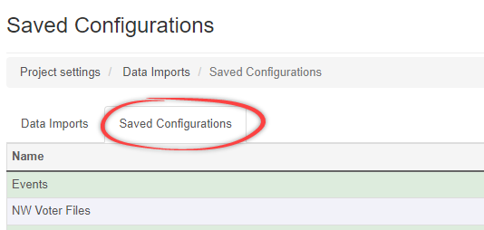
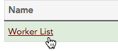
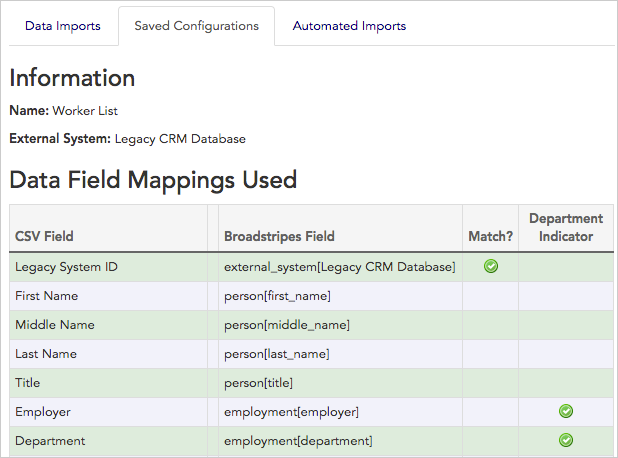

Need to import data?

**If you are looking for step by step help on how to import data** into your Broadstripes project for the first time, you'll want to check out the [Import Overview](https://help.broadstripes.com/help-articles/admin-tools/data-import-admin/data-import-overview/) article. (The article below focuses on how to work with the data imports index page to see import status and history.)

## Intro

Whether you have used data import only once (when you initially [brought your worker list into Broadstripes](https://help.broadstripes.com/help-articles/admin-tools/data-import-admin/import-a-spreadsheet/)), or you do regular re-imports from other databases to keep your Broadstripes project updated, you can manage all data import tasks and history from the **data imports** page.

1. To get started, you can access **data imports** in one of two ways: Click **Settings** > **Data imports** in the upper right corner of any page.

Or, from the **Project settings page**, click the **Basic > Data imports** link.

1. The **Data imports index page** will open. You can view and manage all aspects of your project's past and future imports from the two tabs on this page (**Data Imports** and **Saved Configurations** ). Learn more about each of these tabs below. 

## Data Imports tab

Clicking the **Data Imports** tab opens the **Data Imports index page**, which lets you view details about all in-process or completed data imports.

## 

### How to read the data imports index page

The data imports index page is laid out like a spreadsheet, with a row for each data import, and columns for specific information about that import. You may choose which information columns are displayed on the index page by clicking the gear on the right side of the column display. Check the columns that you want visible on the page. 

#### #

This column will display the import number associated with the import. This can be used for searching, e.g. import = "Import 62", import = "Import 36 Added", import = "Import 49 Matched".

#### Name

This column displays the descriptive name that was given to the import when it was first created. In cases where an import was not given a name, the actual file name will be displayed (for instance, "workers\_local\_1.xls")

#### Status

This column shows the file's current stage:

- **Uploaded** file has been uploaded, but not preprocessed or imported
- **Preprocessed** file has been uploaded, fields have been mapped, and the data import preview has been run, but file has not been imported.
- **Imported w/errors** file has been imported, and errors have been recorded (we'll cover how to see these errors later)
- **Imported** file has been imported, and no errors were found

#### Type

This column will indicate if a import is manual or automated

#### Statistics

This section is divided into seven columns.

#### Scheduled to run

This will display the time at which the import will run, if scheduled for later.

#### Start time, End time, Duration

These columns display the start/end time, date, and duration of the import.

#### Created, Created by, Updated, Updated by

The "Created" and "Created by" columns display the time of creation and the user who created the import. The "Updated" and "Updated by" columns display the time an import was updated and the user who updated it if applicable.

### Import new data

You can also import new data from this page by clicking the **\+ Import Data** button. To read complete instructions on how to import a new data file, go to the [Data import](../../data-import-admin/data-import-oveview/) section of the knowledge base.

## Saved Configurations tab

Clicking the Saved Configurations tab opens the Saved Configurations index page. 

### What is a saved configuration?

During the process of preparing a new file to be imported into Broadstripes, admins have the option to save their specifications – including field mappings, matched fields, and other aspects of how the file's data will be handled as it is imported. Broadstripes stores these specifications in what's called a "**Saved Configuration**".

Saved configurations are especially useful when you're importing data from an external system and plan to re-import it in the future. Using a saved configuration means the re-imported data will be handled exactly the same way it was handled when it was first imported.

The **Saved Configurations tab** shows any configurations you've saved in the past. The configurations are listed alphabetically by name, and the external system the configuration is tied to is also noted (in the **External System column**).

You can view the details of any saved configuration listed.

1. Click on the name of the configuration to open the configuration.

1. A page will open showing the complete configuration details, including which fields in the import file (labeled "**CSV field**") are mapped to which fields in Broadstripes (labeled "**Broadstripes Fields**".

You can also see whether the fields are matched (indicated by a checkmark in the "**Matched?**" column), and if the field is used for creating the shop structure (indicated by a checkmark in the "**Department Indicator**" column).

1. You cannot edit a saved configuration, but you can always create new configurations during the data import process. See the [Import a spreadsheet](../../data-import-admin/import-a-spreadsheet/) article for more details.
