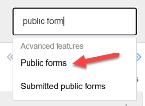
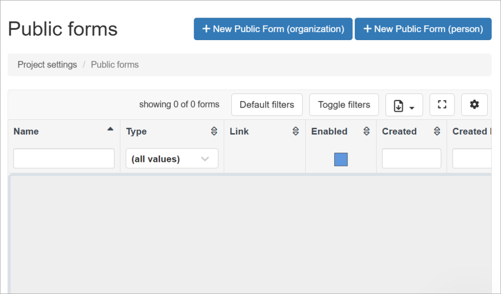
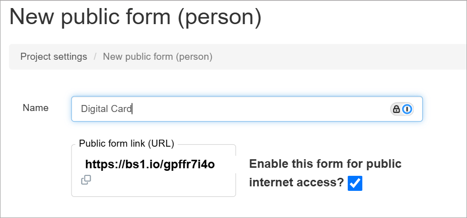

## Public forms creation

On the first page in this series, the [public forms overview page](https://help.broadstripes.com/help-articles/admin-tools/public-forms/public-forms-overview/), we looked at some of the different ways public forms could be used.

In this documentation, we'll create a public form to capture signed digital cards submitted by the members of a bargaining unit. To accomplish this we will need to:

1. Navigate to the Public forms page.
2. Click the New Public Form button for a person.

**NOTE:** Before you start, think about whether the form you want to build will, when submitted, create or update a person record or an organization record (i.e. a shop or department) in Broadstripes. In most cases, public forms are used to create or update people, not organizations. Therefore, this documentation describes the creation of a digital card public form for a person.

## Create a new public form

To create a public form, you must be an admin in your project. As with most admin-only functionality, Broadstripes' **Public forms** page is accessible via the Settings dropdown in the upper right corner of your screen.

1. Click **Settings** and then type "Publice forms" in the filter input box. Click the "Public forms" option. 
2. On the Public forms page, click the **New Public Form (person)** button. (If you were creating a form to create or update an organization, you would, of course, click **New Public Form (person)** button. As mentioned above, most forms are set up to create or update person records, so that's what we'll be describing here.) 
3. You should now see the Public form editor form.

## Name and enable a public form

The next step in building our form is to name it and to enable the form (where we left off in the last section) in the public form editor.

1. Type the name of your form into the "Name" field input box.
    
    ## 
    
2. Ensure the  **"Enable this form for public internet access?"** checkbox is checked. **If this is not checked, the form will become inactive. Anyone who uses the permanent URL associated with this public form will not be able to complete the form.** 
3. At this point, you might want to click the "Save" button. This will take you back to the main **Public forms** page, but it will ensure that your form is saved under the name you want.

Your form has been created and is ready to be customized. The next step is to indicate which fields you want on your form. The best place to start is the "Standard fields" tab.

The following articles discuss the functional details of each tab on the public form editor.

- [The "Standard fields" tab](https://help.broadstripes.com/help-articles/admin-tools/public-forms/standard-fields-tab-in-public-form/)
- [The "Timeline" tab](https://help.broadstripes.com/help-articles/admin-tools/public-forms/timeline-tab/)
- [The "Employment" tab](https://help.broadstripes.com/help-articles/admin-tools/public-forms/employment-tab/)
- [The "Form content" tab](https://help.broadstripes.com/help-articles/admin-tools/public-forms/form-content-tab/)
- [The "Email" tab](https://help.broadstripes.com/help-articles/admin-tools/public-forms/email-tab/)
- [The "Other options" tab](https://help.broadstripes.com/help-articles/admin-tools/public-forms/other-options-tab/)
- [Viewing and downloading public forms](https://help.broadstripes.com/help-articles/admin-tools/public-forms/viewing-and-downloading-public-forms/)
