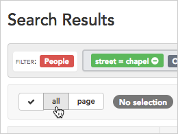
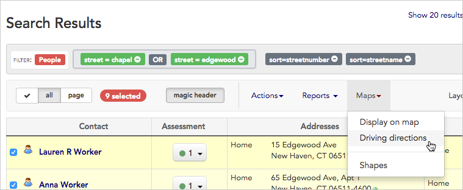

\[et\_pb\_section bb\_built="1" admin\_label="section"\]\[et\_pb\_row admin\_label="row" background\_position="top\_left" background\_repeat="repeat" background\_size="initial" \_builder\_version="3.0.105"\]\[et\_pb\_column type="4\_4"\]\[et\_pb\_text background\_position="top\_left" background\_repeat="repeat" background\_size="initial" \_builder\_version="3.0.106" background\_layout="light"\]

1. Start by running a **search** to filter for just the contacts you want to include on your map.
2. For this example, we used the **advanced search** to show us any contacts who live on Chapel Street or Edgewood Avenue, two streets we plan to visit for our campaign. (Learn more about creating custom searches like this in the [Create and save a search](https://help.broadstripes.com/help-articles/using-broadstripes/customize/create-and-save-a-search/) article).
3. When your search results appear, click **all** to select all the results in the list below.
4. All contacts will be selected (indicated by a check next to their name). Uncheck any person you want to _exclude_ from your map.
5. Once your contacts are selected, click the **Maps** drop-down list from the toolbar and choose **Driving directions**.
6. Broadstripes will open a new window showing the location of your contacts on a map.
7. You can add your **starting address** in the text box in the upper-left to generate full driving instructions from your current location, then click **update map**.
8. Click the  **printer-friendly** icon above the map to print the **turn-by-turn directions**, or use the **page down** keyboard command to view them on-screen at the bottom of the page.
    
    \[caption id="attachment\_2271" align="aligncenter" width="613"\] Click "printer friendly" to print the turn-by-turn directions.\[/caption\]

\[caption id="attachment\_2272" align="aligncenter" width="637"\] Scroll to the bottom of the page or use the "page down" keyboard command to see the driving directions on-screen.\[/caption\]

\[/et\_pb\_text\]\[/et\_pb\_column\]\[/et\_pb\_row\]\[/et\_pb\_section\]
