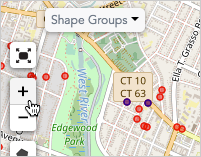

\[et\_pb\_section fb\_built="1" admin\_label="section" \_builder\_version="4.16" global\_colors\_info="{}"\]\[et\_pb\_row admin\_label="row" \_builder\_version="4.16" background\_size="initial" background\_position="top\_left" background\_repeat="repeat" global\_colors\_info="{}"\]\[et\_pb\_column type="4\_4" \_builder\_version="4.16" custom\_padding="|||" global\_colors\_info="{}" custom\_padding\_\_hover="|||"\]\[et\_pb\_text \_builder\_version="4.19.4" background\_size="initial" background\_position="top\_left" background\_repeat="repeat" hover\_enabled="0" global\_colors\_info="{}" sticky\_enabled="0"\]

View and assess your project's contacts by location on a map.

## View all your people on a map

1. Start by clicking the **Maps** link on the navigation panel.  
    

1. Clicking this link takes you to Broadstripes' **Maps** page. By default, you'll see the location of every contact in your project pinpointed on the map that appears.
2. You can change the way contacts are marked by clicking the blue buttons in the left-hand panel: **markers, dots** or **heat**.

\[caption id="" align="alignnone" width="740"\] Here, all contacts are shown with dots.\[/caption\]

\[caption id="" align="alignnone" width="730"\] Here are the same contacts shown as a heat map.\[/caption\]

1. You can hide all these contacts from appearing on the map by clicking again on the selected marker type (markers, dots, or heat) to **deselect** it.

\[caption id="" align="aligncenter" width="253"\] Click the selected marker type again to deselect it. When no marker type is selected, the contacts will be hidden (and won't appear on the map).\[/caption\]

1. For a better look, you can zoom in or out using the **zoom controls** on the left-hand side of the map, or with the **plus** and **minus keys** on your keyboard.

## View your people with a search

Running a search from the maps page will find a specific group of contacts according to any criteria you choose — then display them on the map.

For this example, we'll use the map to decide where to start a card drive. We'll run a search to find where the highest density of unsigned cards is, and target that area first.

1. We'll start by running a recent search for everyone in our project who hasn't yet signed a card. (Learn more about creating custom searches like this in the [Create and save a search](https://help.broadstripes.com/help-articles/using-broadstripes/customize/create-and-save-a-search/) article).

1. After running our "unsigned card" search, the map now shows an additional group of contacts, indicated by **purple dots**. By default, each search is given its own color, and the results are layered over what was already displayed on the map (unless you choose to hide a group of contacts, as explained above).

1. If we want to see just the contacts in the "unsigned card" search, we can hide the other contacts (explained above) or **remove** them from the map by clicking the  icon.

\[caption id="" align="alignnone" width="253"\] Click the minus icon to remove a group of contacts from appearing on the map.\[/caption\]

1. Once you are seeing only the contacts you need, clicking **markers** can be especially useful for seeing the highest number of contacts in an area at a glance.

\[caption id="" align="alignnone" width="687"\] Contacts are shown with markers: Broadstripes automatically groups and displays a count of contacts in each section of the map.\[/caption\]

1. After deciding where to start my card drive, I can use Broadstripes' **driving directions** feature to help me get house-by-house directions for my visits. Read the [Get driving directions for your list](https://help.broadstripes.com/help-articles/using-broadstripes/get-started/get-driving-directions-for-your-list/) article for more help.

## View people using shapes and shape groups

Another useful way to see a group of contacts by their location is using the **shapes** feature. A shape is an area of the map that collects groups of people inside saved, user-defined boundaries.

1. Start by clicking the **Shape Groups** drop-down menu in the upper left-hand corner of the map.

1. Choose the shape group you want displayed on the map by **checking it**.

\[caption id="" align="alignnone" width="509"\] Check the shape group(s) you want to view on the map.\[/caption\]

1. The map will instantly display all the shapes in the selected shape group.
2. Each shape is defined by an outline and a unique color. To get detailed information about the people located inside a shape, just hover over the map and click anywhere in the shape.

\[caption id="" align="alignnone" width="525"\] Click a shape to see more details.\[/caption\]

1. You can learn more about shapes in the [Working with shapes](https://help.broadstripes.com/help-articles/using-broadstripes/maps/working-with-shapes/) article.

\[/et\_pb\_text\]\[/et\_pb\_column\]\[/et\_pb\_row\]\[/et\_pb\_section\]
