\[et\_pb\_section fb\_built="1" admin\_label="section" \_builder\_version="3.22" custom\_padding="0px|||||"\]\[et\_pb\_row admin\_label="row" \_builder\_version="3.25" background\_size="initial" background\_position="top\_left" background\_repeat="repeat" custom\_padding="0px|||||"\]\[et\_pb\_column type="4\_4" \_builder\_version="3.25" custom\_padding="|||" custom\_padding\_\_hover="|||"\]\[et\_pb\_text \_builder\_version="4.9.4" background\_size="initial" background\_position="top\_left" background\_repeat="repeat" hover\_enabled="0" sticky\_enabled="0"\]

## Overview

Sometimes an organizing team will include activists or volunteers who aren't well-known to the team's leadership or who, for other reasons, simply shouldn't have full access to the project's data. When this is the case, you can turn on Broadstripes' **"Limited Visibility"** feature in your project. 

When the limited visibility feature is **"on"**, project admins can still see all the records in the project, but **basic users** can only see the people and organizations you make **"visible"** to them. This article covers managing basic users' visibility settings. If you'd like to learn how to turn on the limited visibility feature or the [temporary visibility feature](https://help.broadstripes.com/help-articles/admin-tools/project-settings/temporary-visibility/), check out the [General settings](https://help.broadstripes.com/help-articles/admin-tools/project-settings/general-settings/) article.

## View your basic users' limited visibility settings

1. To get started, access **Memberships.**  
    Click **Settings** > **Project members** in the upper right corner of any page.  
    [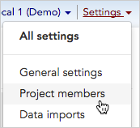](https://help.broadstripes.com/wp-content/uploads/2018/03/2bfe115-SettingsProjSettingProjMemmenu.png)

1. The **Members index page** will open, showing all of the people who have been invited to be part of your Broadstripes project.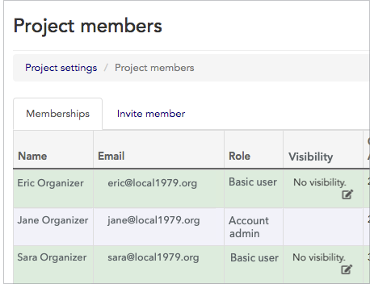

1. From the index page, you can see a range of information about each member (or invited member) laid out in a grid. We'll be looking at just a few of the first columns:
    - **Name** of the member. Visibility is defined individually for each member.
    - **Role** of the member. Limited visibility only applies to the **Basic user** role; see the [Edit user permissions](https://help.broadstripes.com/help-articles/admin-tools/running-a-project-admin/user-and-membership-overview/) section of the Users and Membership article to learn how to assign or re-assign roles.
    - **Visibility** the shops, departments, sub-departments and/or people visible to the member in that row. This column is only shown if you have turned on the **"Limited Visibility"** feature in your project (see the Limited Visibility section of the [General settings](https://help.broadstripes.com/help-articles/admin-tools/project-settings/general-settings/) article for more information about turning on this feature).
    - If you're interested in learning about the **"Temporary vis. (past 2 wks)"** column, please read the [Temporary visibility article.](https://help.broadstripes.com/help-articles/admin-tools/project-settings/temporary-visibility/)

## Assign limited visibility: define what each basic user can see

By default, no shops or people will be visible to a basic user when limited visibility is on. **Limited visibility** controls the organizations and people **"visible"** to basic users.

Limited visibility is assigned:

- on a **project-by-project** basis (if you have multiple projects, you can have limited visibility activated in some projects but leave it inactive in others. If limited visibility is not activated, all basic users in the project will be able to view all people)
- within a project, visibility is assigned on a **user-by-user** basis (for projects where limited visibility has been activated, you'll need to assign what is visible to each user individually)

What determines visibility? On the **Memberships page** for the project, admins can define what a basic user can see in two ways:

- [Visibility by shop and department](#by_shop)
- [Visibility by custom search](#by_search)

### Visibility by shop and department

The **simplest way** an admin can define what a user sees is by assigning them specific **shops** or **departments**.

#### Visibility will be inherited by sub-departments

Keep in mind that when you assign visibility to a shop that has **departments** or **sub-departments** under it, the visibility will cascade down to include all those entities below it.

_Example:  
_A basic user is assigned **"Big Shop."** This means the user will see the organization record for **Big Shop** itself, all of the records for all of Big Shop's **departments** and **sub-departments**, and all the **people** who work anywhere within Big Shop.

If the user is not assigned Big Shop, but only **"Department A"** inside Big Shop, they will see **Department A**, any **sub-departments**, and the **people** who work anywhere within Department A and its sub-departments. They will not see "**Department B**" or "**Department C**" or anyone who works there.

As an admin, you can assign as many shops or departments as you want to be visible to a user. The shops and departments you've assigned will appear in a list in the **"Visibility" column** of the member's row in the **Memberships table**. 

### How to assign visibility by shop, department or sub-department

1. From the **Members index page**, find the member whose visibility you are assigning.
2. Click the **edit icon** in the **Visibility** column for that member.  
    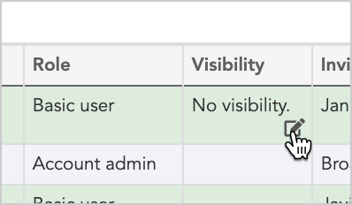
3. In the dialog box that opens, go to **"Add a shop or department"** and begin to **type** the **name of the shop, department, sub-department** that you'd like to make visible to the user. You'll see a list of options appear as you type.
4. **Click** to select the option you want to make visible to the user. As soon as you select it, the shop or department will appear in the list in the center of the dialog box.  
    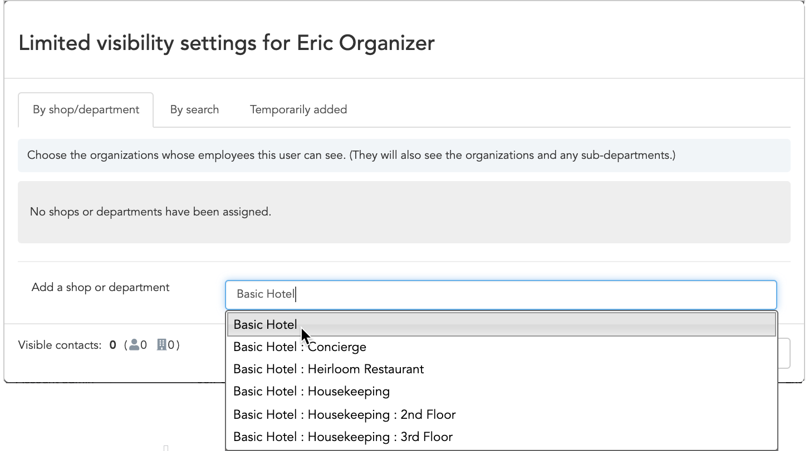
5. If you'd like to make multiple shops, departments, or sub-departments visible to the user, **repeat** this selection process, typing the next name into the box and then selecting it from the list.
6. As the shops are added, in the lower left corner of the window you'll see a **running total** of the visible contacts in bold, as well as totals broken out into people and shops.  
    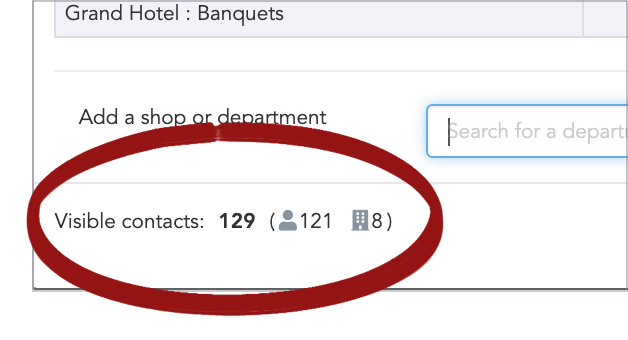
7. When you are done selecting all the shops and departments you want to make visible to the user, click to **Save** your changes.  
    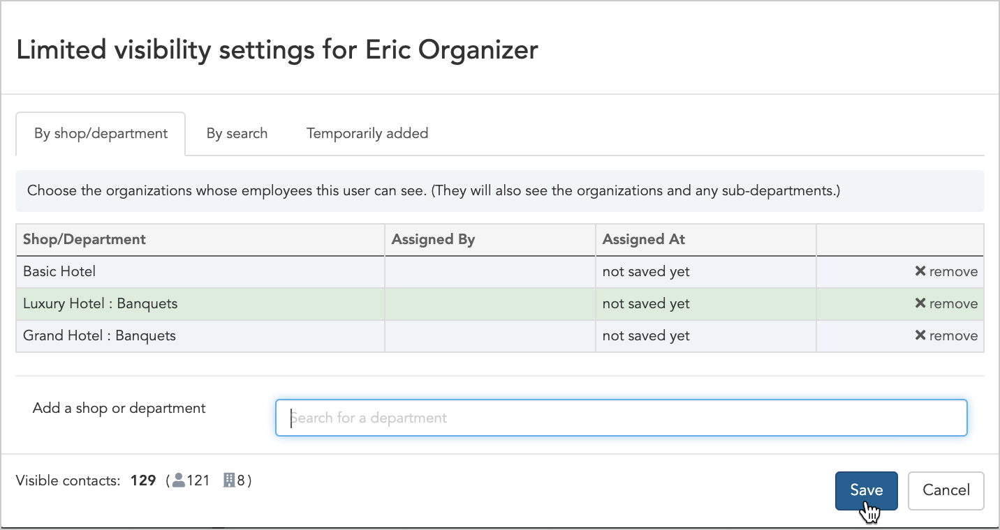
8. Now, under the **Visibility** column for the user, you'll see the visible shops and departments listed along with the total number of visible contacts.  
    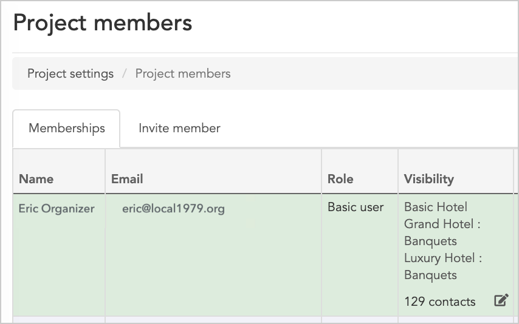

### Visibility by custom search

The limited visibility feature lets you assign visibility based on a custom search. You can search on any field in the project, including custom fields, and you can combine search criteria using AND/OR operators to create highly-customized searches.

### How to assign visibility by custom search

1. From the **Members index page**, find the member whose visibility you are assigning.
2. Click the **edit icon** in the **Visibility column** for that member.  
    
3. In the dialog box that opens, click the **"By search"** tab.  
    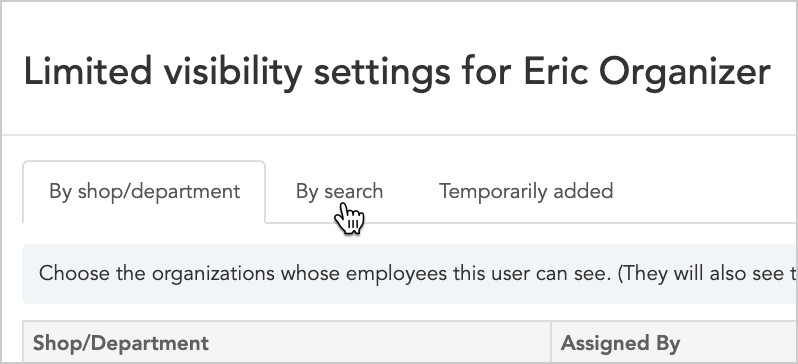
4. On the tab that opens, you'll see a **search builder** box.  
    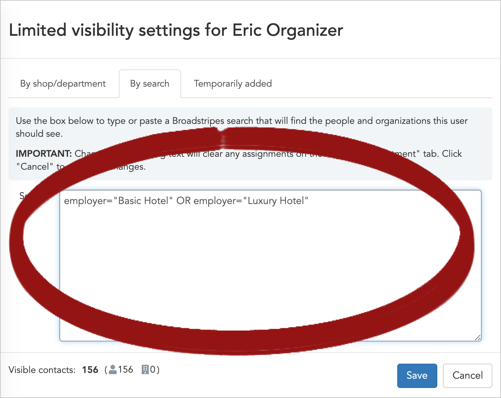
5. The box may have text in it, or it may be empty:
    - If you have previously assigned visibility for the user on the **"By shop/department"** tab, you'll see that the search builder box is already populated with that search criteria.
    - The box will be **empty** if you have never assigned visibility to the user before.

####  Limiting visibility "By search" will override "By shop/department" visibility assignments

Keep in mind that the search text saved on the **"By search"** tab will always be used in place of any previous visibility assignments. This means that if you previously made assignments using the **"By shop/department"** tab, they will be cleared out if you go to the **"By search"** tab and create and save a new search there.

If you make a mistake, or decide you don't want to change visibility assignments using a custom search, just click **"Cancel"** to undo any changes and exit the search-building tab.

1. For this example, let's say that we had previously used the **"By shop/department"** tab to assign visibility to two shops (**Basic Hotel** and **Luxury Hotel)**. Now we want to limit what the user sees even more, so that they only see the people who work at the **Front Desk** at those shops.
    
    Here's what the search text would look like before we started to customize it. Note that there is text in the search box because of the assignments made previously on the **"By shop/department"** tab):  
    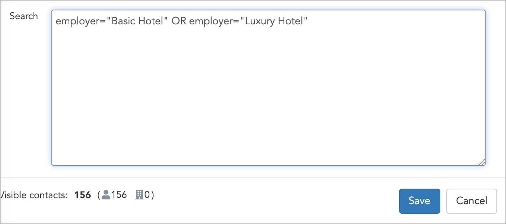
    
    Now we'll start **typing** in the **search builder box** to build the custom search. Here's our final custom search text – it will to allow the member to see only the **Front Desk** workers at either **Basic** _or_ **Luxury Hotel**.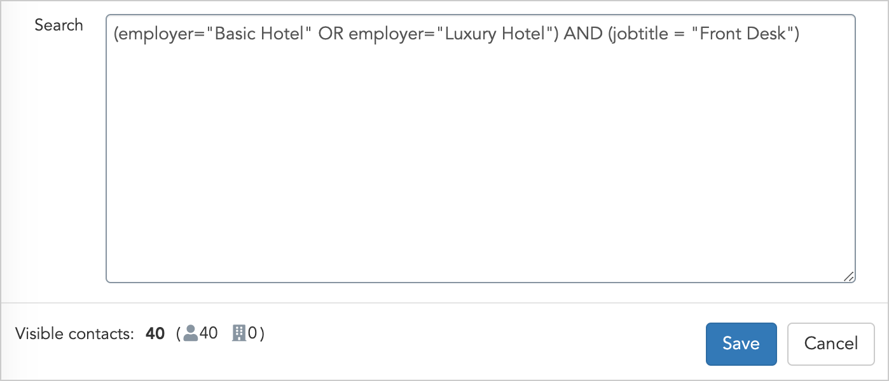
    
2. If you need more help on building searches like this, this [printable PDF](https://crm.broadstripes.com/broadstripes-search-reference-v1.0.pdf) explains Broadstripes’ **search terms** and **syntax** and lists some of the most common fields used in searches along with examples of searches you are likely to use. You can also learn more about building searches that use AND/OR clauses in the in the [Custom Search Builder](https://help.broadstripes.com/help-articles/using-broadstripes/search/search-builder-build-an-advanced-search/) article.

#### Search text tip: Use Broadstripes' search builder

Building a limited visibility search is a little different from using Broadstripes' search builder because you need to write the search using text only.

If you're familiar with the search builder, but having a hard time writing a text-only search, here's a tip that could help: Use the Search Builder to create the text for you.

First, you'll need to leave the limited visibility window and open Broadstripes' search builder by clicking the **Search builder** button at the top of the window. Then, use the search builder to create the exact search you're trying to make. Next, click **Search** to run the search. Finally, when the search results appear, **copy** the text string in the search box at the top of the page.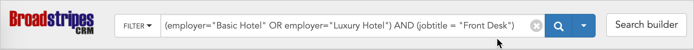

Back on the **limited visibility** page, you can **paste** this text into the search box and **save** your work.

1. Once you've saved your search, you'll be returned to the **Membership index page**. In the **Visibility** column, you'll see that there is now a **custom search** assigning visibility for this member. You can also see the **total** number of visible contacts.  
    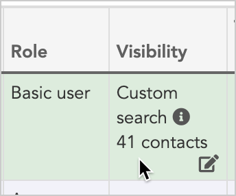
2. If you **hover** over the  **info icon**, the text of the saved search will appear for you to review.  
    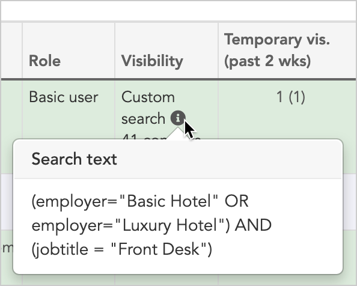

\[/et\_pb\_text\]\[/et\_pb\_column\]\[/et\_pb\_row\]\[/et\_pb\_section\]
