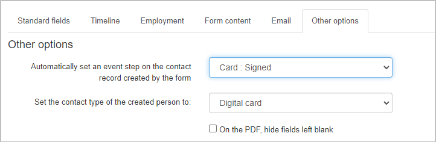
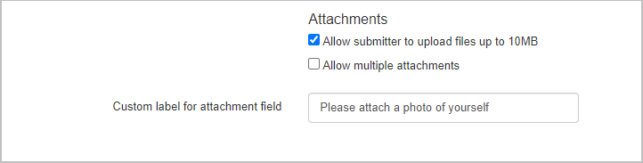

## Overview

The **Other Options** tab allows you to further customize your public form by setting event steps, selecting contact types, adjusting the PDF output, and enabling file attachments. This article will guide you through enabling and configuring these options:

1. To get started, select the **Other options** **tab** in the [public form editor](https://help.broadstripes.com/uncategorized/standard-fields-tab-in-public-form/).
2. In the **Automatically set an event step on the contact record created by the form** drop-down menu, select an event step that will automatically be applied to the contact record upon form submission. You can choose from any event steps currently in your project. If you need to create a new event, refer to [this article](https://help.broadstripes.com/help-articles/admin-tools/data-tools-admin/creating-an-event/) for instructions.
3. Next, select the contact type that will be created or matched when the form is submitted. The data submitted in the form will be created as this contact type. Keep in mind that both new and merged records will be converted to this contact type. __
4. If you prefer not to show any fields that were left blank on the form, check the **On the PDF, hide fields left blank** box. This will remove any empty fields from the final PDF.
5. Check the **Allow submitter to upload files up to 10 MB** box to let users attach files to the form submission. Supported file types include:
    - Most image/video files
    - MS Office files
    - OpenOffice files
    - PDF
    - Plain text To permit multiple file uploads (with a total size limit of 10 MB), check the **Allow multiple attachments** box. You can also enter a descriptive label for the attachment field to inform form submitters about what kind of file(s) they should upload.

Once you’ve configured the options, click **Save** to finish customizing your public form.

- [Create a new contact type](https://help.broadstripes.com/help-articles/admin-tools/public-forms/first-step/) 
- [The "Standard fields" tab](https://help.broadstripes.com/help-articles/admin-tools/public-forms/standard-fields-tab-in-public-form/)
- [The "Timeline" tab](https://help.broadstripes.com/help-articles/admin-tools/public-forms/timeline-tab/)
- [The "Employment" tab](https://help.broadstripes.com/help-articles/admin-tools/public-forms/employment-tab/)
- [The "Form content" tab](https://help.broadstripes.com/help-articles/admin-tools/public-forms/form-content-tab/)
- [The "Email" tab](https://help.broadstripes.com/help-articles/admin-tools/public-forms/email-tab/)
- [Viewing and Downloading public forms](https://help.broadstripes.com/help-articles/admin-tools/public-forms/viewing-and-downloading-public-forms/)
