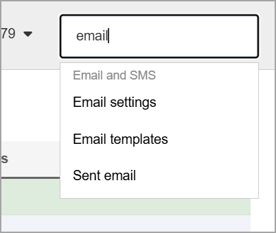
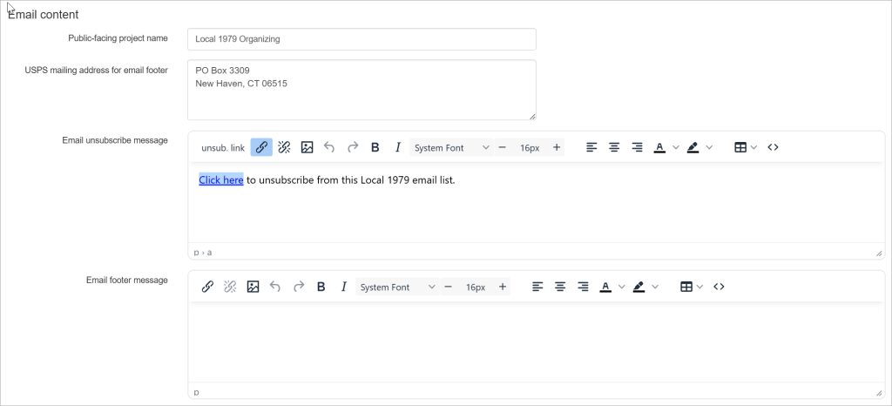

Broadstripes allows you to set your project's outgoing email settings and designate a default outgoing email address when sending correspondence from Broadstripes. This will be available for users on the bulk email panel in the From dropdown menu and will be the email from which Public forms will be sent.

You can easily add/edit your outgoing email settings from the Settings menu in the top right corner of the app. Here's how:

Click **Email settings** in the **Settings** dropdown menu. 

On the Outgoing Email Settings page, you may create the following properties for your project:

#### **Outgoing email addresses**

Project admins may validate default email addresses for general use in the project. The domain of the emails that are used must be authenticated with our email provider. To authenticate your domain or for more information, please reach out to support@broadstripes.com

 

#### **Universal BCC addresses**

Email addresses added as a Universal BCC address will receive copies of emails sent from the project that exceed the specified recipient threshold. These BCCs will not be reflected in the recipient count.

#### **Email Content**

- **Public-facing project name** (how the name of your project will appear to the recipient)
- **USPS mailing address for email footer** (It is good practice to include your mailing address to avoid being flagged as spam in recipients' inbox)
- **Email unsubscribe message** (Optional: customize the unsubscribe message for emails sent from the project.)d
- **Email Footer HTML** (Optional, project-specific HTML inserted in the email footer to meet special compliance requirements) 

Once you have defined your settings as needed, be sure to click **Save**.
