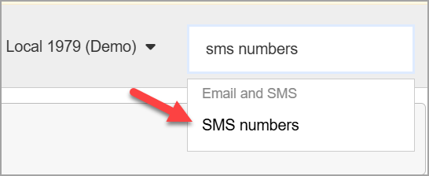
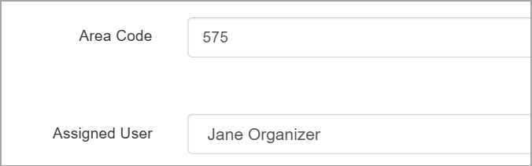
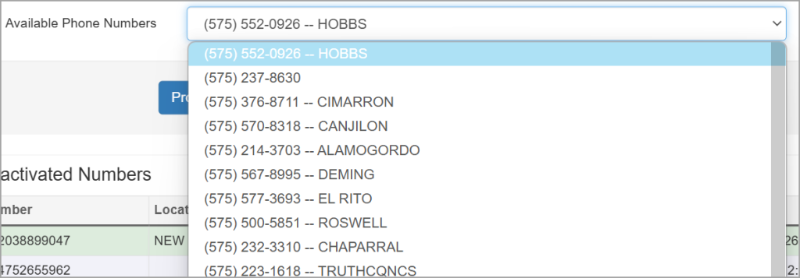

To send text messages in Broadstripes, users will need a virtual SMS number to send from. A project admin can create and assign a number to any user with the messaging permission to send text messages.

Here's how:

1. Go to the Settings dropdown menu in the top right and type SMS numbers in the input box.
2. Click the **SMS numbers** option. 
3. On the SMS Numbers page, click the **Add a number button**.
4. Enter an area code from which your number will be generated. You should enter an area code that would make sense for your project and potential message recipients. 
5. Select the user to whom you want to assign the number in the user field.
6. Choose a phone number from the options in the Available Phone Numbers dropdown menu. 
7. Click **Provision.**

You will now see your newly provisioned number as an option in the Bulk Text panel on the search results page.
