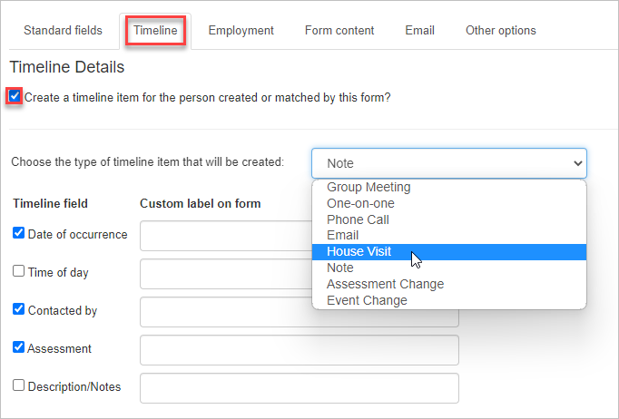
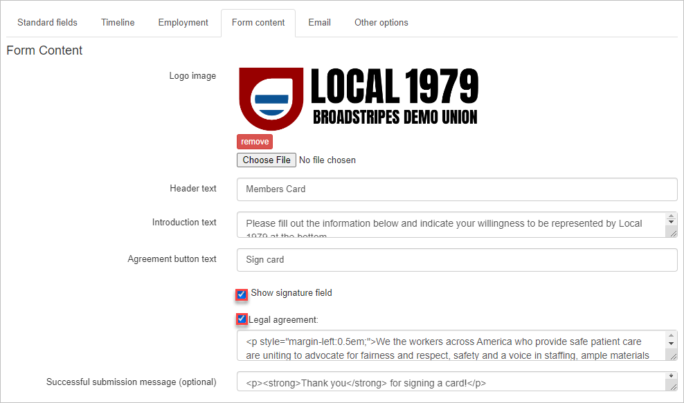
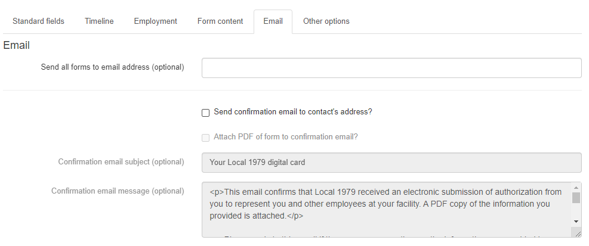
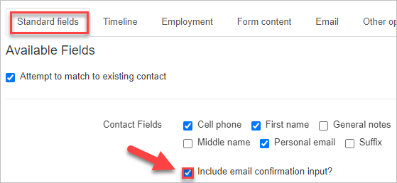
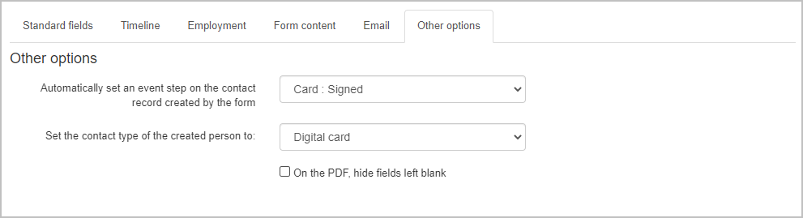
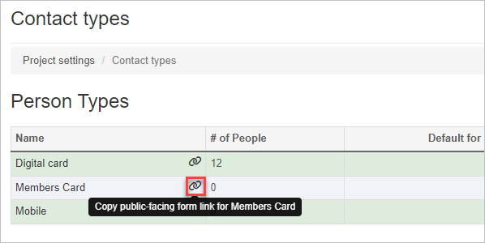
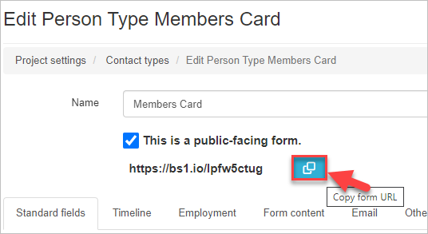

\[et\_pb\_section fb\_built="1" admin\_label="section" \_builder\_version="4.16" global\_colors\_info="{}"\]\[et\_pb\_row admin\_label="row" \_builder\_version="4.16" background\_size="initial" background\_position="top\_left" background\_repeat="repeat" global\_colors\_info="{}"\]\[et\_pb\_column type="4\_4" \_builder\_version="4.16" custom\_padding="|||" global\_colors\_info="{}" custom\_padding\_\_hover="|||"\]\[et\_pb\_text content\_last\_edited="off|desktop" admin\_label="Text" \_builder\_version="4.19.4" background\_size="initial" background\_position="top\_left" background\_repeat="repeat" hover\_enabled="0" custom\_css\_main\_element="||||||" global\_colors\_info="{}" sticky\_enabled="0"\]

Broadstripes allows users to create and distribute online forms where data can be captured and recorded directly into Broadstripes.  This is great for

In this article, we'll take a look at the Public form and how you may use it, including:

- Creating the public form
- Distributing the Public form
- Matching form submissions
- Viewing Public forms

Let's start by creating a simple Public form.

## Create a public form

1. On the Settings page, select **Contact types.**
2. For this example, we'll create a new Person contact type, Members. _You can create a form for any existing contact type or create a new contact type._
3. When the editor page opens for Members, select the checkbox that says, **"This is a public-facing form."******You will notice that a URL and additional tabs are now available to customize your Public Form.
4. The  
      
    
    ### Standard fields tab
    
    is where you will choose the fields that will appear on your form. Select the select fields you want and drag and drop to reorder the appearance.  You will also indicate which fields will be required to complete a submission. If a user leaves a required blank, they will receive a warning and will not be allowed to submit the form.  You will also notice another checkbox under "Available Fields" that is labeled "Attempt to match to existing contact." This will make public form submissions that match existing contacts merge information into the same record rather than creating another record.
    
5. On the
    
    ### Timeline tab
    
    you can opt to create a timeline entry on a matching or newly created record when a form is submitted. Here you will indicate what type of timeline entry will be created and what type of details will be included(Date of occurrence, Time of day, Contacted by, Assessment, and Description/Notes.)  
    
6. On the
    
    ### Employment tab
    
    , you will select whether an employment relationship will be created for each form submission. When **"Create an employment for the person created or matched by this form?"** is selected, the record connected to the form submission will be associated with an employer. You will also choose the method by which employment will be identified and matched. The form recipient will be able to choose via tiered dropdowns, an external system, or autocomplete(Broadstripes will match existing shops/departments to recipients' input.)   A form can be set to automatically send the employer a copy of the recipient's form submission. Select the checkbox marked "**Send a separate email to the employer?"** if you want to alert an employer of an employee-related event, such as new union membership. You can create a custom email subject and body message for the employer's email.  , 
    
7. On the Form content tab, you can add additional content and fields to your form. You can upload your organization's logo, which will appear at the top of your public form. The Header text will be displayed just below your logo, with the Introduction text following. Customize your form submission button with a call to action. Submitters will be able to sign the form using their mouse or finger if you selct the "Show signature field" checkbox. You also have the option of including a section for a legal agreement that a recipient must check before submitting the public form. In the "Successful submission message field," create a message that will appear after the recipient submits a public form. This can be a simple thank you or additional information.
8. On the Email tab, enter an email address in the "Send all form to email address" field to send a copy of completed public forms to. You can send copies of completed forms to leads, organizers or whoever you choose.  You can also send a confirmation email to the submitter by checking the “Send confirmation email to contact’s address?” box. Once the box has been checked, you can create a custom confirmation email subject and message for the recipient. In addition you can send the contact a printable PDF version of their public form submission by checking “Attach PDF of form to confirmation email?”
9. 
10. You may require a user to confirm their email address by clicking the “Include email confirmation input?” box located on the Standard fields tab.
11. On the Other options tab, you can choose to have an event step set on the contact’s record when a public form is submitted. Select your event step from the first dropdown menu. You can also select what contact type will be created in the app when the form is submitted.Sometimes a recipient will not enter information into every field on your form. You can choose not to show those empty fields on the PDF that is created by clicking the “On the PDF, hide fields left blank.”
12. When you have finished customizing your public form, be sure to click the “Save” button. Your form is ready to go!

## Distribute a public form

Now that your public form is saved and ready, it’s time to get it to your recipients.  You can grab the URL or your public form on the contact types page.

Or inside the form editor page. Just click the link icon, and your public form URL will be copied to your device’s clipboard.

The URL will take the recipient directly to the public form for completion. Share it via bulk [text](https://help.broadstripes.com/help-articles/using-broadstripes/working-with-search-results/bulk-actions-send-sms-text-message/), [email](https://help.broadstripes.com/help-articles/using-broadstripes/working-with-search-results/bulk-actions-send-email/) or any method you choose.

## Viewing Public forms

You can view completed forms in the app by going to Settings – All settings. Just beneath Contact types, click on Forms submitted. This will take you to a list of any submitted forms in your project. If you are looking for a specific public form, you can perform a search for attachments with the form name, ie attachment = “Member Cards”.

## Downloading Public Forms

You may view the pdf(s) created by a public form submission. From the search results page, select the contacts that you want forms from. Go the **Reports** dropdown menu and select **Attachments**. A zip folder will be generated with the requested forms.

_\*Note: This report will download all the attachments for each contact._

\[/et\_pb\_text\]\[/et\_pb\_column\]\[/et\_pb\_row\]\[/et\_pb\_section\]
