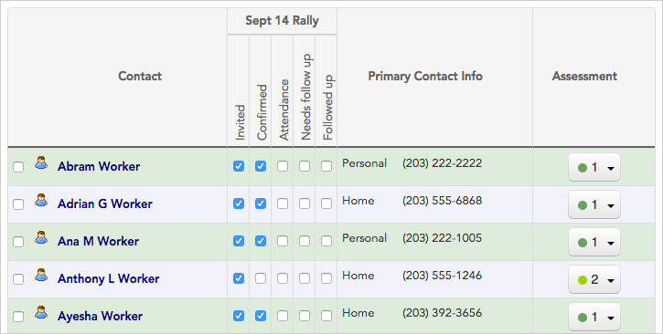
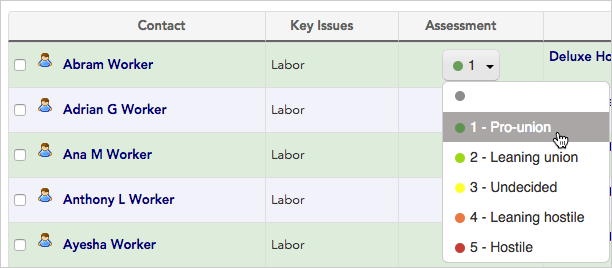
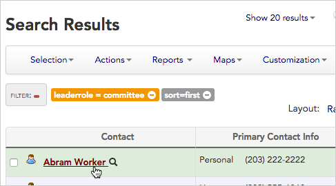
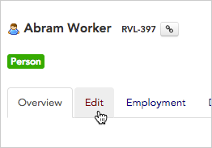
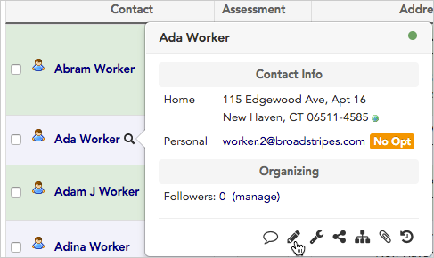
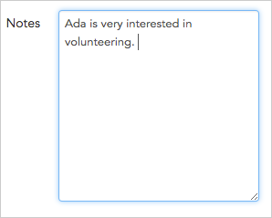
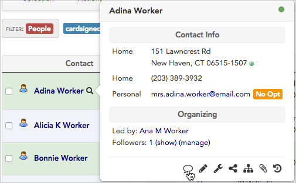
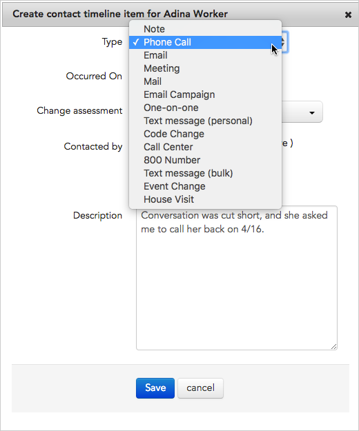

\[et\_pb\_section fb\_built="1" admin\_label="section" \_builder\_version="3.22"\]\[et\_pb\_row admin\_label="row" \_builder\_version="3.25" background\_size="initial" background\_position="top\_left" background\_repeat="repeat"\]\[et\_pb\_column type="4\_4" \_builder\_version="3.25" custom\_padding="|||" custom\_padding\_\_hover="|||"\]\[et\_pb\_text \_builder\_version="4.4.8" background\_size="initial" background\_position="top\_left" background\_repeat="repeat" hover\_enabled="0"\]

## Overview

When you join an organizing project, you'll use Broadstripes to record organizing information as you collect it.

With Broadstripes, you won't need to go to a special data-entry screen to record all that info — you can update any records you see on-screen at any time.

This article will walk you through recording a range of organizing information for contact records that _already exist in Broadstripes:_

- [Check offs](https://help.broadstripes.com/help-articles/using-broadstripes/get-started/record-your-organizing-info#section-record-a-check-off)
- [Assessments](https://help.broadstripes.com/help-articles/using-broadstripes/get-started/record-your-organizing-info#section-record-an-assessment)
- [Detailed information about a contact or conversation](https://help.broadstripes.com/help-articles/using-broadstripes/get-started/record-your-organizing-info#section-record-a-detailed-conversation)
- [Notes](https://help.broadstripes.com/help-articles/using-broadstripes/get-started/record-your-organizing-info#section-using-notes-and-contact-timeline-entries)

Entering a _new_ person or _new_ organization in Broadstripes will be covered in another article.

## Get started: run a search and apply a layout

Recording information is always easiest if you aren't wading through necessary pages and fields just to get to the things that are pertinent to your work. That's where searches and layouts come in. Broadstripes' searches and layouts work together to provide a completely customized, spreadsheet-style interface to your organizing data.

A **search** filters the contacts that are displayed by the criteria you choose, while a **layout** determines which data columns are displayed for those contacts.

Most users find it easiest to record info like this:

- **run a search** to display just the records you want to work with
- **apply a layout** to display the exact information (contact information, assessments, events, etc.) that you plan to record or update for those records. From there, you can add or edit that information at any time.

How to run a search and apply a layout are covered in their own articles:

- [Search by workplace](https://help.broadstripes.com/help-articles/using-broadstripes/search/search-by-workplace/) (for custom searches: [Create and save a search](https://help.broadstripes.com/help-articles/using-broadstripes/customize/create-and-save-a-search/))
- [Choose a layout](https://help.broadstripes.com/help-articles/using-broadstripes/get-started/choose-a-layout/)

Once you have the records you want to work with on-screen, you can start recording your organizing information right away.

## Record a check-off

The simplest type of organizing information that Broadstripes can record is a **check-off**. Check-offs are easy and incredibly versatile for all types of organizing. Some examples of what to do with a check-off:

- Turn out members to an event
- Record whether someone has signed a union card
- Track petition signatures
- Track meeting attendance
- Track one-on-one meetings

Check-offs are often considered a **step** in one of the custom **events** that have been set up for your project, and can be added to any saved layout. If you're joining an existing project, there should already be **events, event steps,** and **layouts** created for your project. If that's not the case, you can talk with your project administrator or learn about creating them in the [Create and save a layout](https://help.broadstripes.com/help-articles/using-broadstripes/customize/save-a-layout/) and [Create an event](https://help.broadstripes.com/help-articles/using-broadstripes/customize/create-events-to-track-goals/) articles.

\[caption id="" align="aligncenter" width="725"\] Check-offs are used here to show who's been invited and confirmed attendance to the September 14th rally.\[/caption\]

## Record an assessment

**Assessments** are an essential tool for keeping track of who has been organized on a push or idea.

Assessments are good for keeping track of opinions rather than more concrete data points. With assessments, this is done using a numeric assessment scale, with 1 indicating strong support, and the highest number in the scale (usually 5) indicating hostility. Assessments are more nuanced than event steps because they require you to assign each worker a numeric ranking along a continuum rather than show their support with a simple yes/no checkbox.

Some examples of how to use assessments include:

- Recording what workers think about a union (for instance, during a card check)
- Keeping track of worker approval of a contract draft
- Tracking worker political opinions during election season

\[caption id="" align="aligncenter" width="612"\] Assign an assessment code to each worker to gauge overall support.\[/caption\]

Recording assessments can also be very useful for creating targeted lists of workers:

- if you want to reconfirm all your "lean yeses" for a dues vote, you could create a list of only those workers who are a "2 - Leaning union."
- if you didn't want to waste your time convincing those who strongly oppose, but wanted to talk to everyone else, you could create a list of everyone _except_ "5 - Hostile".

## Record a detailed conversation

Sometimes your conversations with workers will produce detailed information about them that you'll want to preserve for future use. Here's how to record that info, even if it's not displayed in your layout.

1. To enter detailed information about a worker, start by clicking on their **name** (if their record is not already on-screen, [Search for them by name](https://help.broadstripes.com/help-articles/using-broadstripes/search/search-by-name/) ).

\[caption id="" align="aligncenter" width="487"\] Click the name of a contact to open their complete record.\[/caption\]

1. When their record opens, click the **Edit tab**.

1. **Scroll down** to the section that holds the type of information you want to update, such as **Contact information**. Enter the new information and click **Save**.
2. You may need to open additional tabs from the worker's record, depending on the information you're recording:
    - for **employment information**, use the **Employment tab**.
    - to add a **timeline note** (for instance, to **record details of an email** or **phone conversation**), scroll to the bottom of the **Overview tab**.

## Using notes and contact timeline entries

Sometimes the information you get in a detailed conversation won't fit neatly into any built-in or custom field. In that case, it is best to take advantage of Broadstripes' notes functions. There are two different types of free-form notes that you can enter in Broadstripes:

- Notes
- Contact timeline entries

### Notes

The **Notes** function is best used to capture information that is _always relevant_ when an organizer talks to a worker, for instance:

- "Wife is a supervisor."
- "Speaks Creole and English fluently, knows some Spanish."
- "Ring bell and go around to back door."

To add a note:

1. Start by clicking on the  **looking glass icon** next to their **name** (if their record is not already on-screen, [Search for them by name](https://help.broadstripes.com/help-articles/using-broadstripes/search/search-by-name/) ).
2. Click the  **edit icon** to open their record.

\[caption id="" align="aligncenter" width="487"\] Click the edit icon to open their complete record and enter a note.\[/caption\]

1. When their record opens, **scroll down** to the **Notes** section. Type your note in the notes text box, then scroll to the bottom of the page and click **Save** to record the note.

### Contact Timeline entries

Information that is _fleeting_ should not be put in Notes. That type of information should go in the **Contact Timeline**. Since contact timeline entries are more likely to get buried as the timeline grows, they are best used for time-sensitive information related to specific visits, meetings, or campaigns.

Examples of timeline entries:

- "Hector talked to about healthcare campaign during a one-on-one, and he said he had mixed feelings."
- "Talked to Alejandro's sister. She said he would be very interested in talking about the union and told me Tuesday is a good day to find him."
- "On vacation until Thursday 4/15, do not knock."
- "Expressed dismay at contract proposal in committee meeting — please follow up one-on-one."

Timeline entries allow you to choose from one of a few entry **types** (including Note, House visit, One-on-one, Meeting, Phone call, etc.)

Create a contact timeline entry:

1. To make a new timeline entry for a contact, start by clicking on the  **looking glass icon** next to their name (if their record is not already on-screen, [Search for them by name](https://help.broadstripes.com/help-articles/using-broadstripes/search/search-by-name/) ).
2. A pop-up box opens, showing information about the contact. Click the  **icon** at the bottom of the pop-up to add a **new timeline entry**.

\[caption id="" align="alignnone" width="505"\] Click the comment icon to add a new timeline entry.\[/caption\]

1. When the **Create contact timeline item form** opens, choose which **Type** of record you want from the drop-down list, then enter the detailed information you're recording in the **Description** text box.

1. Click **Save** to create the timeline entry.

\[/et\_pb\_text\]\[/et\_pb\_column\]\[/et\_pb\_row\]\[/et\_pb\_section\]
