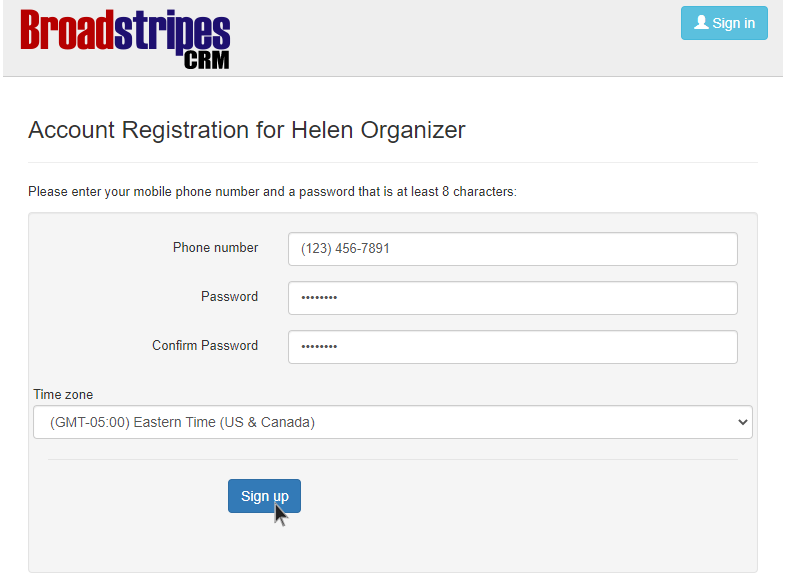

\[et\_pb\_section fb\_built="1" admin\_label="section" \_builder\_version="4.16" global\_colors\_info="{}"\]\[et\_pb\_row admin\_label="row" \_builder\_version="4.16" background\_size="initial" background\_position="top\_left" background\_repeat="repeat" global\_colors\_info="{}"\]\[et\_pb\_column type="4\_4" \_builder\_version="4.16" custom\_padding="|||" global\_colors\_info="{}" custom\_padding\_\_hover="|||"\]\[et\_pb\_text \_builder\_version="4.19.4" background\_size="initial" background\_position="top\_left" background\_repeat="repeat" hover\_enabled="0" global\_colors\_info="{}" sticky\_enabled="0"\]

## Welcome to Broadstripes!

Getting started with Broadstripes is simple. It all begins when your Broadstripes administrator creates your account and emails you an invitation to join. You'll follow the link in that email to set a password and log in to the app. Here's how:

1. When your user account is created, you'll receive an email from your Broadstripes's administrator with a subject line like **"Jane Organizer has invited you to use Broadstripes."**
2. **Open** the invitation email.
3. You'll see a message that says **"To complete your registration, please visit the link below and create a password."** Click that **link**.
4. Clicking the link will open a browser window to a Broadstripes registration form where you'll **enter your phone number**, choose your new **password** and **specify your time zone**. You must **confirm** your password by typing it a second time.

Choose a secure password that's at least **eight characters long**, and contains **at least one punctuation mark** or **numeric character**. Passwords are case-sensitive.

1. Once you've chosen your password and time zone, click **Sign up**, and your new account will be created. From there, you'll be logged in, and automatically taken to your Broadstripe's homepage.
2. Registration is complete!

\[/et\_pb\_text\]\[/et\_pb\_column\]\[/et\_pb\_row\]\[/et\_pb\_section\]
