* * *

## Overview

Broadstripes enables you to automate report generation either once at a future date or on specified recurring schedules. You can set reports to run daily (including business days only), weekly, or monthly. Moreover, these reports can be automatically emailed to your team members.

This guide will provide step-by-step instructions on scheduling status reports and search results reports in Broadstripes.

## Scheduling a Status report (admins only)

To schedule a status report, you must first navigate to the edit page for the report.

1. Click the "Settings" dropdown menu link in the upper right-hand corner of the Broadstripes window.
2. From the dropdown menu, select "Status reports." This action will direct you to the page displaying the status report definitions for your project. 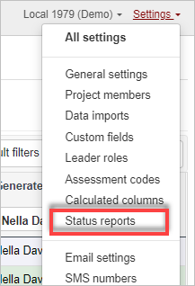
3. Navigate to the specific status report you want to schedule and click on "schedule" in its respective row. (If you don't have a report to schedule, you will need to [create a status report](https://help.broadstripes.com/help-articles/using-broadstripes/lists-and-reports/status-reports-overview/).) 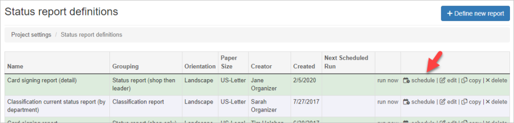
4. A pop-up box will appear with the scheduling options.
    
    - For a one-time report scheduled in the future, choose "one time" and enter the desired date and time for report generation. 
    - To set up a recurring report, select "on a recurring schedule." This selection will reveal a section where you can specify how often the report should run. Options include daily, weekdays only, weekly, or monthly. Additionally, provide a name for the schedule, which you'll use for reference on the Scheduled Jobs page. 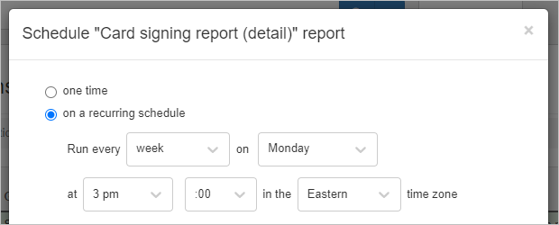
    
    After choosing the frequency, select the specific day(s) and time for the report to run, as outlined in the table below. \[table id=9 /\]
    
    ### Automatically email a scheduled status report
    
5. Once the generation frequency is set, decide on the format for the generated report (PDF or XLSX).
6. Optionally, you can have the report automatically emailed to project members or user groups upon generation. Use the dropdown menus to select the recipients who should receive the report via email whenever it runs as per the schedule. 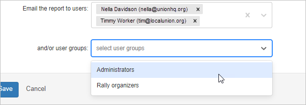
7. Save your selections. You can view your scheduled report job by accessing the Scheduled Jobs page in the left navigation panel.

* * *

## Scheduling a Search results report

Search results reports may be scheduled for one-time generation at a future time or recurring generation. A one-time report uses static search results set during scheduling. Recurring reports are dynamic and fetch search results at the time of report generation.

Search results list reports can also be scheduled to run and be emailed to you and other users. Here's how:

1. 1. 1. Run your desired search and select the contacts you want to download.
        2. Go to the Reports dropdown menu. 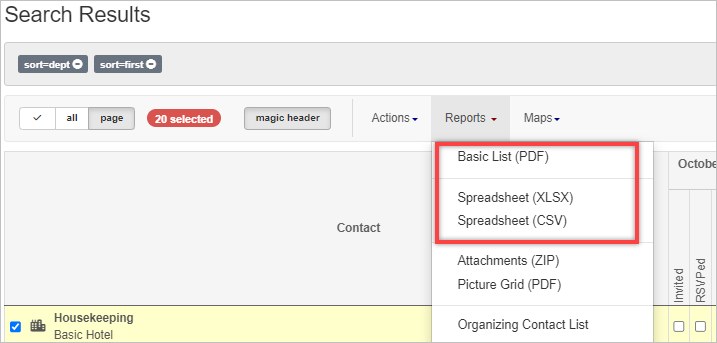 You may schedule a [Basic List (PDF)](https://help.broadstripes.com/help-articles/using-broadstripes/lists-and-reports/basic-lists-pdf/), [Spreadsheet (XLSX), or Spreadsheet (CSV)](https://help.broadstripes.com/help-articles/using-broadstripes/lists-and-reports/basic-lists-spreadsheet/).
        3. When you select the type of report you want to generate, a pop-up box will appear with your report options.
        4. Check the "Enable schedule" checkbox at the bottom of the pop-up.  Clicking **Enable schedule** will make scheduling options appear.
        5. Choose the desired schedule for generation.
            
            - For a one-time report scheduled in the future, choose "one time" and enter the desired date and time for report generation. 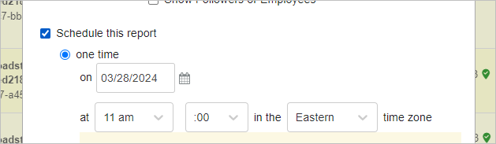
            - To set up a recurring report, select "on a recurring schedule." This selection will reveal a section where you can specify how often the report should run. Options include daily, weekdays only, weekly, or monthly. Additionally, provide a name for the schedule, which you'll use for reference on the Scheduled Jobs page. 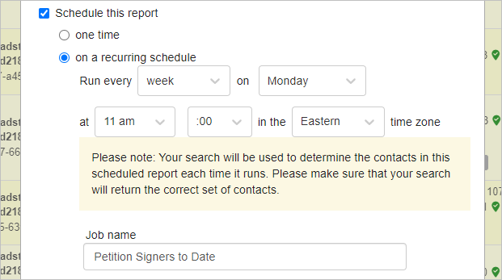
            
            After choosing the frequency, select the specific day(s) and time for the report to run, as outlined in the table below. \[table id=9 /\]
            
            ### Automatically email a scheduled search results report
            
        6. You can also email the report to project members or user groups post-generation. From the dropdown menus, select the project members and/or user groups you want to receive the report. The individual users and user groups you choose will receive an email with the report attached every time the report runs on the schedule.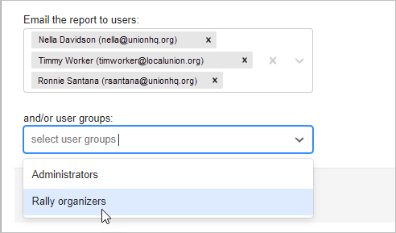
            
        7. Click the "Schedule" button to enable your scheduled report.

Reports will be available on the Reports page on the day(s) and time that you selected. You may view all your reports by going to the left navigation panel and selecting Reports. 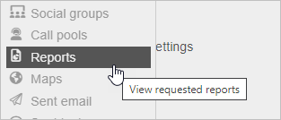

* * *

 

### Canceling a scheduled report

To cancel a scheduled report:

1. 1. Access the Scheduled Jobs link located in the left navigation panel.
        
        \[caption id="attachment\_26792" align="aligncenter" width="215"\]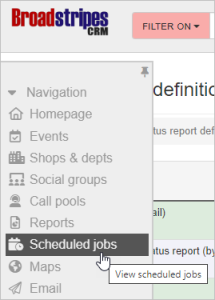 The Scheduled Jobs link is on the left navigation panel.\[/caption\]
    2. Click **delete** on the corresponding row of the scheduled report you want to cancel. A pop-up box will prompt you to confirm your choice to delete the report schedule. Click "OK" to complete the cancellation. 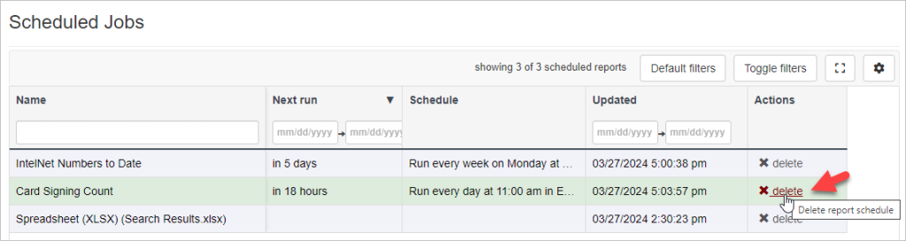Once confirmed, your report will no longer run on a schedule.
